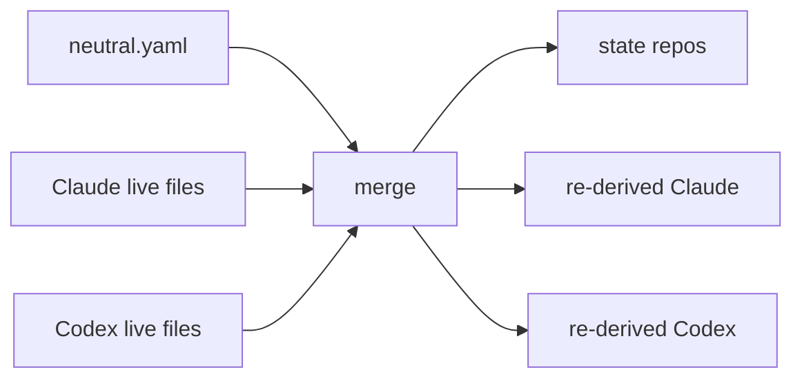

# Chameleon

**One neutral config for Claude Code and Codex CLI, with round-trip merge in both directions.**

Chameleon keeps a repo-backed neutral YAML file as the source of truth for
your AI coding setup, but it does not pretend the live agent configs are
read-only. Claude and Codex can still mutate their own files at runtime. On
the next merge, Chameleon detects that drift, reconciles it back into neutral,
and re-derives every other target.

That makes Chameleon the reconciliation layer between:

- operator-authored neutral config
- Claude Code's live files
- Codex CLI's live files
- login-time background merges

Today Chameleon ships built-in targets for Claude Code and Codex CLI. The
plugin system is designed so more targets can join the same loop.

## What it manages

Current built-in targets:

- Claude: `~/.claude/settings.json` and the `mcpServers` slice of `~/.claude.json`
- Codex: `~/.codex/config.toml` and `~/.codex/requirements.toml`

Chameleon stores its own state in XDG locations:

- neutral config: `~/.config/chameleon/neutral.yaml`
- state root: `~/.local/state/chameleon/`
- per-target state repos: `~/.local/state/chameleon/targets/<target>/`
- last-known-good neutral snapshot: `~/.local/state/chameleon/neutral.lkg.yaml`
- operator notices: `~/.local/state/chameleon/notices/`

Each target gets a small local git repo. Those repos are not decoration; they
are how Chameleon remembers last-applied state, computes drift, restores a
target, and keeps a timeline of what was merged.

## Why this exists

Claude and Codex overlap enough that maintaining both configs by hand gets old,
but they are not the same system.

- Some settings are truly shared and should propagate across tools.
- Some settings are target-specific and should survive round-trip without being
  flattened away.
- Some settings conflict and need an operator decision.
- Some merges need to happen unattended at login, without blocking your shell.

Chameleon handles those cases with a neutral schema, per-target codecs,
pass-through bags for target-only data, and an explicit conflict model instead
of silent overwrite.

## Core workflow



The merge reads four sources for each logical key:

- `N0`: last-known-good neutral
- `N1`: current neutral file
- per-target live values
- any stored prior resolution for the same conflict path

If everything agrees, the merge is silent. If they do not, Chameleon either:

- accepts the uniquely newest changed source with `latest`
- resolves interactively on a TTY
- applies a non-interactive strategy
- exits non-zero when unattended resolution is unsafe

## Quick start

Chameleon is a `uv` project. Use `uv run`, not bare `python` or `pytest`.

```sh
uv sync
uv run chameleon init
```

`init` bootstraps `neutral.yaml` if missing, then runs a merge with the
equivalent of "keep target-local drift".

Edit the neutral file:

```yaml
schema_version: 1

identity:
  reasoning_effort: high
  model:
    claude: claude-sonnet-4-7
    codex: gpt-5.4

directives:
  system_prompt_file: ~/.config/chameleon/AGENTS.md

capabilities:
  mcp_servers:
    memory:
      transport: stdio
      command: npx
      args:
        - -y
        - "@modelcontextprotocol/server-memory"

environment:
  variables:
    CI: "true"
```

Then apply it:

```sh
uv run chameleon merge
```

Plain `chameleon merge` defaults to `latest`: if exactly one newest changed
source can be proven, Chameleon takes it. On an interactive TTY, ambiguous
conflicts fall through to the resolver prompt. Off a TTY, ambiguity exits
non-zero rather than guessing.

## What a merge actually does

`chameleon merge` is not just "render YAML into JSON and TOML".

It:

1. Reads live target files.
2. Disassembles them back into neutral-shaped fragments.
3. Compares those fragments against current neutral and last-known-good neutral.
4. Detects conflicts at the neutral-key level.
5. Resolves them interactively or non-interactively.
6. Re-assembles target files.
7. Writes live files and state repos.
8. Updates last-known-good neutral.
9. Clears stale transaction markers after a clean run.

If nothing changed, the summary is `merge: nothing to do`.

## Conflict behavior

This is the part that matters.

### Interactive merge

On a TTY, `uv run chameleon merge` opens an interactive resolver when needed.
For each conflicting key, it shows:

- last-known-good neutral (`N0`)
- current neutral (`N1`)
- each changed target value

You can choose:

- neutral
- one target
- last-known-good
- target-specific preservation
- skip

Interactive decisions are stored in `neutral.resolutions`. If the same
conflict shape appears again, Chameleon can replay the prior decision instead
of prompting every time. If the values drift enough to invalidate the old
decision hash, it re-prompts and shows the old decision as context.

### Non-interactive strategies

For unattended runs:

```sh
uv run chameleon merge --on-conflict=latest
uv run chameleon merge --on-conflict=fail
uv run chameleon merge --on-conflict=keep
uv run chameleon merge --on-conflict=prefer-neutral
uv run chameleon merge --on-conflict=prefer-lkg
uv run chameleon merge --on-conflict=prefer=claude
uv run chameleon merge --on-conflict=prefer=codex
```

Meaning:

- `latest`: take the uniquely newest changed source; fail if ambiguous
- `fail`: stop on conflict
- `keep`: leave unresolved cross-target drift in place
- `prefer-neutral`: current neutral wins
- `prefer-lkg`: revert to last-known-good neutral
- `prefer=<target>`: one target wins

`adopt <target>` is a convenience wrapper for `merge --on-conflict=prefer=<target>`.

## Login and dotfiles integration

Chameleon is built for login-time sync.

The intended model is:

- dotfiles pull/install happens first
- Chameleon runs last
- clean merges produce no output
- ambiguous conflicts explain themselves before prompting on an interactive shell

The repo ships recipes for:

- `docs/login/launchd.md`
- `docs/login/systemd.md`
- `docs/login/zlogin.md`

The unattended form is:

```sh
uv run chameleon merge --on-conflict=latest --quiet --no-warn
```

For a repo-backed neutral in dotfiles, pass it explicitly:

```sh
uv run chameleon merge \
  --neutral "$DOTFILES_DIR/chameleon/neutral.yaml" \
  --on-conflict=latest \
  --quiet \
  --no-warn
```

If a clean merge changes that checked-in neutral file, it is left as a normal
dirty working-tree change. Chameleon never commits or pushes for you.

If Git reports a conflict in `chameleon/neutral.yaml`, resolve the Git conflict
first. Then rerun `chameleon merge` so the merged neutral spreads to Claude and
Codex.

If Chameleon itself sees an ambiguous conflict on an interactive login, it
prints a short preamble explaining the neutral, Claude, and Codex sources before
asking you to choose. In a non-interactive service, the same ambiguity exits
non-zero and should be resolved by rerunning `chameleon merge` from a shell.

## CLI

### `init`

```sh
uv run chameleon init
uv run chameleon init --dry-run
```

Creates a minimal neutral file if needed, then runs an initial merge.

### `merge`

```sh
uv run chameleon merge
uv run chameleon merge --dry-run
uv run chameleon merge --verbose
uv run chameleon merge --quiet --no-warn
uv run chameleon merge --profile deep-review
uv run chameleon merge --on-conflict=prefer=codex
```

- `--dry-run` emits unified diffs for files it would write
- `--verbose` prints state paths, registered targets, pending notices /
  transactions, per-target warning counts, and merge id
- `--quiet` suppresses the summary line and dry-run diff output
- `--no-warn` suppresses end-of-merge `LossWarning` errata
- `--profile <name>` applies a named overlay from `profiles`

### `status`

```sh
uv run chameleon status
```

Shows whether neutral exists, whether each target is clean or drifting, and
whether there are pending notices or unresolved transactions. Exit code is `1`
if anything is dirty or pending.

### `diff`

```sh
uv run chameleon diff
uv run chameleon diff claude
uv run chameleon diff codex
```

Shows unified diff from state-repo `HEAD` to the live target file(s). Exit code
matches git-style diff behavior: `0` clean, `1` drift, `>1` error.

### `log`

```sh
uv run chameleon log claude
uv run chameleon log codex
```

Shows the per-target state-repo history.

### `adopt`

```sh
uv run chameleon adopt claude
uv run chameleon adopt codex
```

Resolve every conflict in favor of the chosen target, then propagate that back
through neutral and out to the other targets.

### `discard`

```sh
uv run chameleon discard claude
uv run chameleon discard codex --yes
```

Restore live target files from the state-repo `HEAD`. This is intentionally
guarded: off a TTY you must pass `--yes`.

For partial-owned files, Chameleon only rewrites the keys it owns. Today that
matters for `~/.claude.json`, where it preserves keys outside `mcpServers`.

### `validate`

```sh
uv run chameleon validate
```

Schema-validates `neutral.yaml`.

### `doctor`

```sh
uv run chameleon doctor
uv run chameleon doctor --notices-only
uv run chameleon doctor --clear-notices
```

Shows Chameleon version, resolved paths, pending operator notices, and unresolved
transaction markers from interrupted merges.

### `targets`

```sh
uv run chameleon targets list
```

Lists built-in and plugin-provided targets discovered through the
`chameleon.targets` entry point.

### `resolutions`

```sh
uv run chameleon resolutions list
uv run chameleon resolutions clear
uv run chameleon resolutions clear 'identity.model[claude]' --yes
```

Inspects or clears stored interactive conflict decisions.

## Neutral schema

The neutral schema is centered in `src/chameleon/schema/`. It has eight
top-level domains:

- `identity`
- `directives`
- `capabilities`
- `authorization`
- `environment`
- `lifecycle`
- `interface`
- `governance`

Plus:

- `profiles`: named overlays applied with `merge --profile <name>`
- `targets.<target>.items`: pass-through bag for target-only features
- `resolutions`: stored conflict decisions

The rule is simple: codecs adapt to the neutral schema. They do not redefine
it.

## Round-trip guarantees

Round-trip is the design center.

For settings Chameleon claims, the goal is:

```text
from_target(to_target(x)) == canonicalize(x)
```

When a target has features the other target cannot represent, Chameleon does
not silently drop them. It uses one of two escape hatches:

- typed `LossWarning`s for genuinely lossy cross-target translations
- per-target pass-through under `targets.<target>.items`

Examples in the current implementation:

- plugin and marketplace state is reconciled across targets rather than
  flattened to one side
- target-specific extras can survive under `targets.claude.items` or
  `targets.codex.items`
- interrupted merges leave transaction markers instead of disappearing into logs

## Repository-backed workflow

The local state repos are a core part of the operator workflow:

- `status` checks drift against them
- `diff` shows what changed since `HEAD`
- `log` gives you a timeline
- `discard` restores from `HEAD`
- merges commit new snapshots with a merge id trailer

This gives Chameleon a memory that is stronger than "last file on disk", while
still staying local and inspectable.

## Plugin targets

New targets register through the `chameleon.targets` entry point.

At a minimum a plugin provides:

- a `Target` class
- an assembler with file routing
- eight codec classes, one per neutral domain
- vendored `_generated.py` models derived from the upstream schema

See `docs/plugins/authoring.md`.

## Development

Install dependencies:

```sh
uv sync
```

Before calling work complete, all four local gates must pass:

```sh
uv run ruff check
uv run ruff format --check
uv run ty check
uv run pytest
```

The default pytest run excludes the longer fuzz suite. Run it explicitly with:

```sh
uv run pytest -m fuzz
```

The repo also carries integration tests that pin the important operator-facing
behavior:

- exemplar end-to-end round-trip
- byte-stable idempotency across repeated merges
- login recipe docs staying aligned with the real CLI
- schema drift against vendored upstream models

CI runs the four standard gates on macOS and Linux, across Python 3.12 and
3.13.

## Schema sync

Generated codec models under `src/chameleon/codecs/*/_generated.py` are vendored
artifacts. Do not hand-edit them.

When you intentionally refresh an upstream schema:

```sh
uv run --group schema-sync python tools/sync-schemas/sync.py claude
uv run --group schema-sync python tools/sync-schemas/sync.py codex
```

The Codex sync uses the pinned upstream revision from
`tools/sync-schemas/pins.toml`.

## Status

Chameleon is pre-1.0 and still tightening parity edges, but the current shape
is already practical:

- repo-backed neutral config
- bidirectional Claude/Codex reconciliation
- unattended login-time merge hooks
- interactive conflict resolution with stored decisions
- plugin target expansion path

## License

MIT. See `LICENSE`.
