# Chameleon V0 Implementation Plan

> **For agentic workers:** REQUIRED SUB-SKILL: Use superpowers:subagent-driven-development (recommended) or superpowers:executing-plans to implement this plan task-by-task. Steps use checkbox (`- [ ]`) syntax for tracking. **This plan is not phase-ordered.** It's a directed acyclic dependency graph; pick any task whose predecessors are complete. The "Topology" section below shows the graph, the parallel lanes, and the joint points.

**Goal:** Build the V0 Chameleon CLI: a typed, MIT-licensed Python tool that maintains a YAML neutral configuration and bidirectionally synchronizes it with Claude Code (`settings.json`, `.mcp.json`, `~/.claude.json`) and OpenAI Codex CLI (`config.toml`, `requirements.toml`) using per-target git state-repos, a four-source merge engine, A-or-B conflict resolution, and codegen-grounded type safety.

**Architecture:** Source-of-truth is the operator's YAML neutral file. Each target has its own git state-repo at `$XDG_STATE_HOME/chameleon/targets/<target>/` whose working tree mirrors the live target files. The single `merge` operation consolidates four change sources per neutral key (`N₀` last-known-good, `N₁` current neutral, plus `Tᵢ` per target's live file), classifies conflicts, applies A/B resolution, re-derives all targets, and commits one structured commit per state-repo with a stable merge-id for transactional recovery. All API surfaces are typed Pydantic models or enums; codecs operate on typed slices of upstream-canonized `_generated.py` models (Claude from `schemastore.org` Draft-07 JSON Schema, Codex from `codex-rs` Rust types via `schemars`), and the disassembler routes by typed field-path traversal (no string lookups).

**Tech Stack:** Python ≥3.12, hatchling build, uv-managed dev workflow. Runtime: pydantic ≥2, ruamel.yaml, tomlkit, platformdirs, rich. Dev: pytest 8, hypothesis, ruff ≥0.15, ty ≥0.0.34. Schema-sync: datamodel-code-generator ≥0.27 + (for Codex regen only) cargo + Rust toolchain. Subprocess `git` for state-repos. fcntl-based file locking for partial-ownership writes.

**Reference design spec:** `docs/superpowers/specs/2026-05-05-chameleon-design.md` (commit `3ee3cb2`).

---

## Topology

The plan is a DAG of 45 tasks. Every task carries a slug (`scaffold-meta`, `claude-codec-identity`, …) and an explicit `Depends on:` list. A worker may begin any task whose predecessors are complete; multiple tasks with cleared predecessors run in parallel. There is no waterfall — the lane structure below shows what runs side-by-side and where lanes converge.

### Dependency graph

```mermaid
graph TD
    classDef foundation fill:#dbeafe,stroke:#1e40af,color:#000
    classDef io fill:#dcfce7,stroke:#166534,color:#000
    classDef codegen fill:#fef3c7,stroke:#92400e,color:#000
    classDef schema fill:#fce7f3,stroke:#9f1239,color:#000
    classDef protocol fill:#e0e7ff,stroke:#3730a3,color:#000
    classDef codec fill:#fae8ff,stroke:#6b21a8,color:#000
    classDef state fill:#fee2e2,stroke:#991b1b,color:#000
    classDef merge fill:#cffafe,stroke:#155e75,color:#000
    classDef cli fill:#f1f5f9,stroke:#1e293b,color:#000
    classDef docs fill:#fef9c3,stroke:#854d0e,color:#000
    classDef release fill:#fed7aa,stroke:#9a3412,color:#000
    classDef joint fill:#fff,stroke:#000,stroke-width:3px,color:#000

    %% Foundation lane (mostly sequential)
    F1[scaffold-meta]:::foundation --> F2[scaffold-pyproject]:::foundation
    F2 --> F3[scaffold-package]:::foundation
    F3 --> F4[types-primitives]:::foundation
    F4 --> F5[types-constants]:::foundation
    F4 --> F6[types-audit]:::foundation

    %% I/O lane: 3 fully parallel
    F2 --> IY[io-yaml]:::io
    F2 --> IJ[io-json]:::io
    F2 --> IT[io-toml]:::io

    %% Codegen lanes: Claude is short, Codex is longer (Rust toolchain)
    F2 --> CGS[codegen-skeleton]:::codegen
    CGS --> CGC[codegen-claude]:::codegen
    CGS --> CGB[codegen-codex-binary]:::codegen
    CGB --> CGR[codegen-codex-run]:::codegen

    %% Schema lane: 5 domains parallel, then overlay, then neutral
    F5 --> SI[schema-identity]:::schema
    F5 --> SD[schema-domains]:::schema
    F5 --> SDF[schema-deferred]:::schema
    F4 --> SO[schema-overlay]:::schema
    SI --> SO
    SD --> SO
    SDF --> SO
    SO --> SN[schema-neutral]:::schema

    %% Codec/target protocols
    F4 --> CP[codec-protocol]:::protocol
    F5 --> CP
    CP --> RTP[registries-and-target-protocol]:::protocol
    RTP --> SDT[schema-drift-test]:::protocol

    %% Claude codec lane: 5 codecs fully parallel (after their deps)
    CP --> CCI[claude-codec-identity]:::codec
    CGC --> CCI
    SI --> CCI
    CP --> CCD[claude-codec-directives]:::codec
    CGC --> CCD
    SD --> CCD
    CP --> CCC[claude-codec-capabilities]:::codec
    CGC --> CCC
    SD --> CCC
    CP --> CCE[claude-codec-environment]:::codec
    CGC --> CCE
    SD --> CCE
    CP --> CCS[claude-codec-stubs]:::codec
    CGC --> CCS
    SDF --> CCS

    %% Codex codec lane: 5 codecs fully parallel
    CP --> XCI[codex-codec-identity]:::codec
    CGR --> XCI
    SI --> XCI
    CP --> XCD[codex-codec-directives]:::codec
    CGR --> XCD
    SD --> XCD
    CP --> XCC[codex-codec-capabilities]:::codec
    CGR --> XCC
    SD --> XCC
    CP --> XCE[codex-codec-environment]:::codec
    CGR --> XCE
    SD --> XCE
    CP --> XCS[codex-codec-stubs]:::codec
    CGR --> XCS
    SDF --> XCS

    %% Assemblers: JOIN points for each side
    CCI --> CA{{claude-assembler}}:::joint
    CCD --> CA
    CCC --> CA
    CCE --> CA
    CCS --> CA
    RTP --> CA
    IJ --> CA

    XCI --> XA{{codex-assembler}}:::joint
    XCD --> XA
    XCC --> XA
    XCE --> XA
    XCS --> XA
    RTP --> XA
    IT --> XA

    %% Drift test consumes assemblers' wired-up codec sets
    CA --> SDT
    XA --> SDT

    %% State lane (mostly parallel internally)
    F4 --> SP[state-paths]:::state
    F3 --> SG[state-git]:::state
    F4 --> ST[state-transaction]:::state
    IT --> ST
    F4 --> SL[state-locks-notices]:::state
    IT --> SL

    %% Merge lane
    F4 --> MC[merge-changeset]:::merge
    F5 --> MC
    MC --> MR[merge-conflict-and-resolve]:::merge
    MR --> ME{{merge-engine}}:::joint
    CA --> ME
    XA --> ME
    SP --> ME
    SG --> ME
    ST --> ME
    SL --> ME
    SN --> ME
    IY --> ME

    %% CLI lane
    ME --> CLS[cli-skeleton]:::cli
    CLS --> CLI[cli-init-polish]:::cli

    %% Docs lane (combined task — touches all three artifact classes)
    SN --> DOC[docs-login-plugins-schema]:::docs

    %% Release lane
    CLI --> AT{{acceptance-test}}:::joint
    DOC --> AT
    AT --> RT[release-tag]:::release
```



### Lanes of parallelism

The lanes are working units of independent activity. Within a lane, tasks may further parallelize (5-way for the codec lanes, 3-way for I/O); between lanes, tasks are independent unless an edge crosses lane boundaries.

| Lane | Tasks | Internal parallelism | Cross-lane joins |
|---|---|---|---|
| **Foundation** | scaffold-meta → scaffold-pyproject → scaffold-package → types-primitives → (types-constants ‖ types-audit) | mostly sequential; types-audit can run alongside types-constants | feeds every other lane |
| **I/O** | io-yaml ‖ io-json ‖ io-toml | 3-way fully parallel | io-json → claude-assembler; io-toml → codex-assembler, state-transaction, state-locks-notices; io-yaml → merge-engine |
| **Codegen-Claude** | codegen-skeleton → codegen-claude | sequential | feeds all 5 Claude codecs |
| **Codegen-Codex** | codegen-skeleton → codegen-codex-binary → codegen-codex-run | sequential; **slowest path** (Rust toolchain + cargo build) | feeds all 5 Codex codecs |
| **Schema** | (schema-identity ‖ schema-domains ‖ schema-deferred) → schema-overlay → schema-neutral; schema-passthrough merged into schema-overlay | 3 parallel domains then 2 sequential joins | schema-identity/domains/deferred → matching codecs on each target; schema-neutral → merge-engine + docs |
| **Protocols** | codec-protocol → registries-and-target-protocol → schema-drift-test | sequential | codec-protocol → all 10 codecs; registries → both assemblers; drift-test consumes assemblers |
| **Claude codecs** | claude-codec-{identity, directives, capabilities, environment, stubs} | 5-way fully parallel | all five → claude-assembler |
| **Codex codecs** | codex-codec-{identity, directives, capabilities, environment, stubs} | 5-way fully parallel | all five → codex-assembler |
| **State** | state-paths ‖ state-git ‖ state-transaction ‖ state-locks-notices | 4-way parallel after their respective deps | all four → merge-engine |
| **Merge** | merge-changeset → merge-conflict-and-resolve → merge-engine | sequential | merge-engine consumes both assemblers + state + schema-neutral + io-yaml |
| **CLI** | cli-skeleton → cli-init-polish | sequential | feeds acceptance-test |
| **Docs** | docs-login-plugins-schema | single task touching three artefact classes | feeds acceptance-test |
| **Release** | acceptance-test → release-tag | sequential | terminal |

### Joint points

A joint is a task whose predecessors come from multiple lanes. These are the synchronization barriers — work has to land in **every** predecessor lane before the joint can begin.

| Joint | Task | Lanes that must converge first |
|---|---|---|
| J1 | `types-constants` | Foundation complete (single-lane join, but everything past here forks) |
| J2 | `codec-protocol` | types-primitives + types-constants (the foundation finishes paying interest) |
| J3 | `claude-assembler` | 5-way fan-in: all five Claude codecs + registries-and-target-protocol + io-json |
| J4 | `codex-assembler` | 5-way fan-in: all five Codex codecs + registries-and-target-protocol + io-toml |
| J5 | `merge-engine` | **The big join.** Both assemblers + all four state tasks + schema-neutral + io-yaml + merge-conflict-and-resolve. 9 predecessors. |
| J6 | `acceptance-test` | cli-init-polish + docs-login-plugins-schema. The last sanity gate before tagging. |

### Topological order (earliest-start scheduling)

This is one valid execution order assuming infinite parallelism. Tasks at the same stage have no inter-dependencies; tasks below a stage strictly require some predecessor at or above that stage. Numbering reflects "if you only had one worker, here's a defensible serial order." With multiple workers, anything in the same stage can run side-by-side.

| Stage | Task slug | Predecessors |
|---|---|---|
| 1 | `scaffold-meta` | (none) |
| 2 | `scaffold-pyproject` | scaffold-meta |
| 3 | `scaffold-package` | scaffold-pyproject |
| 4 | `types-primitives` | scaffold-package |
| 5a | `types-constants` | types-primitives |
| 5b | `types-audit` | types-primitives |
| 5c | `codegen-skeleton` | scaffold-pyproject |
| 5d | `io-yaml` | scaffold-pyproject |
| 5e | `io-json` | scaffold-pyproject |
| 5f | `io-toml` | scaffold-pyproject |
| 5g | `state-git` | scaffold-package |
| 6a | `schema-identity` | types-constants |
| 6b | `schema-domains` | types-constants |
| 6c | `schema-deferred` | types-constants |
| 6d | `codec-protocol` | types-primitives, types-constants |
| 6e | `codegen-claude` | codegen-skeleton |
| 6f | `codegen-codex-binary` | codegen-skeleton |
| 6g | `state-paths` | types-primitives |
| 6h | `merge-changeset` | types-primitives, types-constants |
| 7a | `schema-overlay` | schema-identity, schema-domains, schema-deferred, types-primitives |
| 7b | `registries-and-target-protocol` | codec-protocol |
| 7c | `codegen-codex-run` | codegen-codex-binary |
| 7d | `state-transaction` | types-primitives, io-toml |
| 7e | `state-locks-notices` | types-primitives, io-toml |
| 7f | `merge-conflict-and-resolve` | merge-changeset |
| 8a | `schema-neutral` | schema-overlay |
| 8b | `claude-codec-identity` | codec-protocol, codegen-claude, schema-identity |
| 8c | `claude-codec-directives` | codec-protocol, codegen-claude, schema-domains |
| 8d | `claude-codec-capabilities` | codec-protocol, codegen-claude, schema-domains |
| 8e | `claude-codec-environment` | codec-protocol, codegen-claude, schema-domains |
| 8f | `claude-codec-stubs` | codec-protocol, codegen-claude, schema-deferred |
| 8g | `codex-codec-identity` | codec-protocol, codegen-codex-run, schema-identity |
| 8h | `codex-codec-directives` | codec-protocol, codegen-codex-run, schema-domains |
| 8i | `codex-codec-capabilities` | codec-protocol, codegen-codex-run, schema-domains |
| 8j | `codex-codec-environment` | codec-protocol, codegen-codex-run, schema-domains |
| 8k | `codex-codec-stubs` | codec-protocol, codegen-codex-run, schema-deferred |
| 9a | `claude-assembler` | claude-codec-{identity,directives,capabilities,environment,stubs}, registries-and-target-protocol, io-json |
| 9b | `codex-assembler` | codex-codec-{identity,directives,capabilities,environment,stubs}, registries-and-target-protocol, io-toml |
| 9c | `docs-login-plugins-schema` | schema-neutral |
| 10 | `schema-drift-test` | registries-and-target-protocol, claude-assembler, codex-assembler |
| 11 | `merge-engine` | merge-conflict-and-resolve, claude-assembler, codex-assembler, state-paths, state-git, state-transaction, state-locks-notices, schema-neutral, io-yaml |
| 12 | `cli-skeleton` | merge-engine |
| 13 | `cli-init-polish` | cli-skeleton |
| 14 | `acceptance-test` | cli-init-polish, docs-login-plugins-schema |
| 15 | `release-tag` | acceptance-test |

**Critical path** (longest dep chain to V0): `scaffold-meta → scaffold-pyproject → codegen-skeleton → codegen-codex-binary → codegen-codex-run → codex-codec-identity → codex-assembler → merge-engine → cli-skeleton → cli-init-polish → acceptance-test → release-tag` (12 tasks). The Codex codegen path is the slow lane because it needs cargo + Rust to fetch and build codex-rs as a dependency. If Rust toolchain is unavailable, the critical path detours through codegen-claude and the Codex codegen becomes a parallel late-binding step.

**Maximum simultaneity** is reached at stage 8: up to **11 tasks in flight at once** (the schema-neutral on top of one path, plus 5 Claude codecs and 5 Codex codecs all parallel). A subagent-driven runner with concurrency 11 would burn through stage 8 in a single wave.

---

## File Structure

Files this plan creates or modifies (annotated by task slug):

```
chameleon/
├── .gitignore                                       scaffold-package
├── LICENSE                                          scaffold-package
├── README.md                                        scaffold-package
├── AGENTS.md                                        scaffold-package
├── CLAUDE.md → AGENTS.md (symlink)                  scaffold-package
├── pyproject.toml                                   scaffold-package
├── uv.lock                                          scaffold-pyproject (committed)
├── src/chameleon/
│   ├── __init__.py                                  scaffold-package
│   ├── cli.py                                       scaffold-package + cli-skeleton
│   ├── _types.py                                    types-primitives / types-constants
│   ├── schema/
│   │   ├── __init__.py                              types-primitives / types-constants
│   │   ├── _constants.py                            types-primitives / types-constants
│   │   ├── identity.py                              schema lane
│   │   ├── directives.py                            schema lane
│   │   ├── capabilities.py                          schema lane
│   │   ├── environment.py                           schema lane
│   │   ├── authorization.py                         schema-deferred (stub model + xfail)
│   │   ├── lifecycle.py                             schema-deferred (stub)
│   │   ├── interface.py                             schema-deferred (stub)
│   │   ├── governance.py                            schema-deferred (stub)
│   │   ├── profiles.py                              schema lane
│   │   ├── passthrough.py                           schema lane
│   │   └── neutral.py                               schema lane
│   ├── io/
│   │   ├── __init__.py                              io lane
│   │   ├── yaml.py                                  io lane
│   │   ├── json.py                                  io lane
│   │   └── toml.py                                  io lane
│   ├── codecs/
│   │   ├── __init__.py                              codec/target protocols
│   │   ├── _protocol.py                             codec/target protocols
│   │   ├── _registry.py                             codec/target protocols
│   │   ├── claude/
│   │   │   ├── __init__.py                          codec/target protocols
│   │   │   ├── _generated.py                        codegen-claude / codegen-codex-run (GENERATED)
│   │   │   ├── identity.py                          claude codecs
│   │   │   ├── directives.py                        claude codecs
│   │   │   ├── capabilities.py                      claude codecs
│   │   │   ├── environment.py                       claude codecs
│   │   │   ├── authorization.py                     claude-codec-stubs
│   │   │   ├── lifecycle.py                         claude-codec-stubs
│   │   │   ├── interface.py                         claude-codec-stubs
│   │   │   └── governance.py                        claude-codec-stubs
│   │   └── codex/
│   │       ├── __init__.py                          codec/target protocols
│   │       ├── _generated.py                        codegen-claude / codegen-codex-run (GENERATED)
│   │       ├── identity.py                          codex codecs
│   │       ├── directives.py                        codex codecs
│   │       ├── capabilities.py                      codex codecs
│   │       ├── environment.py                       codex codecs
│   │       ├── authorization.py                     codex-codec-stubs
│   │       ├── lifecycle.py                         codex-codec-stubs
│   │       ├── interface.py                         codex-codec-stubs
│   │       └── governance.py                        codex-codec-stubs
│   ├── targets/
│   │   ├── __init__.py                              codec/target protocols
│   │   ├── _protocol.py                             codec/target protocols
│   │   ├── _registry.py                             codec/target protocols
│   │   ├── claude/
│   │   │   ├── __init__.py                          assemblers
│   │   │   └── assembler.py                         assemblers
│   │   └── codex/
│   │       ├── __init__.py                          assemblers
│   │       └── assembler.py                         assemblers
│   ├── merge/
│   │   ├── __init__.py                              merge engine
│   │   ├── changeset.py                             merge engine
│   │   ├── drift.py                                 merge engine
│   │   ├── conflict.py                              merge engine
│   │   ├── resolve.py                               merge engine
│   │   └── engine.py                                merge engine
│   └── state/
│       ├── __init__.py                              state lane
│       ├── paths.py                                 state lane
│       ├── git.py                                   state lane
│       ├── transaction.py                           state lane
│       ├── locks.py                                 state lane
│       └── notices.py                               state lane
├── tools/
│   └── sync-schemas/
│       ├── pins.toml                                codegen lanes
│       ├── sync.py                                  codegen lanes
│       ├── upstream/
│       │   └── claude.schema.json                   codegen lanes (vendored)
│       └── codex/
│           ├── Cargo.toml                           codegen lanes
│           ├── Cargo.lock                           codegen lanes (committed)
│           └── src/main.rs                          codegen lanes
├── tests/
│   ├── conftest.py                                  scaffold-package
│   ├── test_smoke.py                                scaffold-package
│   ├── typing_audit.py                              types-primitives / types-constants
│   ├── unit/                                        from types-primitives onward
│   ├── property/                                    Claude+Codex codec lanes
│   ├── golden/                                      Claude+Codex codec lanes/I
│   ├── conflicts/                                   merge engine
│   ├── recovery/                                    state lane
│   ├── concurrency/                                 state lane
│   ├── integration/                                 cli lane
│   └── schema_drift/                                codec/target protocols
├── docs/
│   ├── superpowers/specs/2026-05-05-chameleon-design.md  (already committed)
│   ├── superpowers/plans/2026-05-05-chameleon-v0.md      (this plan)
│   ├── login/launchd.md                             docs + release
│   ├── login/systemd.md                             docs + release
│   ├── login/zlogin.md                              docs + release
│   ├── plugins/authoring.md                         docs + release
│   └── schema/neutral.schema.json                   docs + release (generated)
└── skills/
    └── README.md                                    scaffold-package
```

---

### Task: `scaffold-meta` — top-level meta files (LICENSE, .gitignore, README, AGENTS.md, CLAUDE.md, skills/README.md)

**Depends on:** (none — initial scaffolding)

**Files:**
- Create: `LICENSE`
- Create: `.gitignore`
- Create: `README.md`
- Create: `AGENTS.md`
- Create: `CLAUDE.md` (relative symlink → `AGENTS.md`)
- Create: `skills/README.md`

- [ ] **Step 1: Write LICENSE (MIT)**

```
MIT License

Copyright (c) 2026 Robert Waugh

Permission is hereby granted, free of charge, to any person obtaining a copy
of this software and associated documentation files (the "Software"), to deal
in the Software without restriction, including without limitation the rights
to use, copy, modify, merge, publish, distribute, sublicense, and/or sell
copies of the Software, and to permit persons to whom the Software is
furnished to do so, subject to the following conditions:

The above copyright notice and this permission notice shall be included in all
copies or substantial portions of the Software.

THE SOFTWARE IS PROVIDED "AS IS", WITHOUT WARRANTY OF ANY KIND, EXPRESS OR
IMPLIED, INCLUDING BUT NOT LIMITED TO THE WARRANTIES OF MERCHANTABILITY,
FITNESS FOR A PARTICULAR PURPOSE AND NONINFRINGEMENT. IN NO EVENT SHALL THE
AUTHORS OR COPYRIGHT HOLDERS BE LIABLE FOR ANY CLAIM, DAMAGES OR OTHER
LIABILITY, WHETHER IN AN ACTION OF CONTRACT, TORT OR OTHERWISE, ARISING FROM,
OUT OF OR IN CONNECTION WITH THE SOFTWARE OR THE USE OR OTHER DEALINGS IN THE
SOFTWARE.
```

- [ ] **Step 2: Write .gitignore**

```
__pycache__/
*.py[cod]
*.egg-info/
build/
dist/
.venv/
.pytest_cache/
.ruff_cache/
.ty_cache/
.hypothesis/
.coverage
htmlcov/
.vscode/
.idea/
.DS_Store
target/
```

(`uv.lock` is intentionally NOT ignored — committed for reproducibility. `target/` is for the codex-side Rust binary build artefacts under `tools/sync-schemas/codex/`.)

- [ ] **Step 3: Write README.md**

```markdown
# Chameleon

> One neutral configuration; many AI coding agents. Bidirectional.

Chameleon transpiles a single neutral YAML configuration into Claude Code's
`settings.json` and OpenAI Codex CLI's `config.toml` (and back again),
detecting drift when an agent edits its own configuration at runtime,
prompting the operator to resolve conflicts, and re-deriving every other
agent's view so the operator's intent stays consistent across tools.

## Status

Early V0. Implements `identity` (model + reasoning effort + provider + auth
method), `directives.commit_attribution` + `directives.system_prompt_file`,
`capabilities.mcp_servers`, and `environment.variables` end-to-end across
both targets. The remaining four schema domains (`authorization`,
`lifecycle`, `interface`, `governance`) have full typed Pydantic models
already — codecs land in follow-on specs.

## Why YAML?

The neutral form is YAML so that operator-authored comments and anchors
survive a round-trip; both target formats (Claude's JSON and Codex's TOML)
are also written via formatters that preserve key order and (for TOML)
comments, so `git diff` on live target files stays informative rather than
noisy.

## Running

Every command goes through `uv` — this is a uv-wrapped project.

\`\`\`sh
uv sync
uv run chameleon --help
uv run chameleon init
uv run chameleon merge
uv run chameleon status
\`\`\`

Development:

\`\`\`sh
uv run pytest
uv run ruff check
uv run ruff format --check
uv run ty check
\`\`\`

Refreshing the upstream-canonized schemas (rare; see `docs/sync-schemas.md`):

\`\`\`sh
uv run --group schema-sync python tools/sync-schemas/sync.py claude
uv run --group schema-sync python tools/sync-schemas/sync.py codex   # needs cargo
\`\`\`

## License

MIT — see `LICENSE`.
```

- [ ] **Step 4: Write AGENTS.md**

```markdown
# Agent Conventions for Chameleon

These instructions apply to any AI agent working on this repository
(Claude Code, Codex CLI, future agents). `CLAUDE.md` is a symlink to
this file.

## Project goal

Chameleon is an MIT-licensed Python tool that maintains a single neutral
YAML configuration and bidirectionally synchronizes it with Claude Code
and Codex CLI. Round-trip is the design centerpiece: when an agent
edits its own config at runtime, Chameleon detects the drift, resolves
any conflict, absorbs the change into neutral, and re-derives every
other target.

See `docs/superpowers/specs/2026-05-05-chameleon-design.md` for the
full design.

## Runtime assumption

Every command runs through `uv run`. Bare `python`, `pip`, and `pytest`
invocations are anti-patterns. Use:

- `uv sync` to install dependencies
- `uv run pytest` to run tests
- `uv run ruff check` and `uv run ruff format --check` for lint/format
- `uv run ty check` for type checking
- `uv run chameleon ...` to invoke the CLI

## Verification gates

Before claiming any task complete, ALL four must pass:

1. `uv run ruff check`
2. `uv run ruff format --check`
3. `uv run ty check`
4. `uv run pytest`

The `tests/typing_audit.py` test enforces the "everything is typed —
no strings" rule. Do not weaken it; if it fires, fix the production
code, not the test.

## Search tooling

Prefer ripvec / semantic search over raw grep when exploring code
semantically. The repo is indexed at the repo level.

## Round-trip orientation

Every codec must round-trip its inputs. The canonical test is
`from_target(to_target(x)) == canonicalize(x)` for all valid `x`.
If a codec is genuinely lossy, mark the lossy axes explicitly and
emit a `LossWarning` at runtime — never silently drop data.

The pass-through namespace (`targets.<target>.*` in neutral) is the
escape hatch for genuine target-unique features. It is parametric
over target so target-native types (TOML datetimes, structured enums
from `_generated.py`) survive round-trip.

## Conflict UX

A-or-B per neutral key. No inline editing, no three-way text merging.
If a future feature needs richer resolution, design it as a separate
spec, not a runtime patch.

## Schema discipline

The neutral schema is centrally defined in `src/chameleon/schema/`.
Codecs adapt to the schema; codecs do not redefine it. The
generated `_generated.py` files under `src/chameleon/codecs/<target>/`
are check-in artefacts produced by `tools/sync-schemas/sync.py` —
never hand-edit them; bump `tools/sync-schemas/pins.toml` and
regenerate instead.
```

- [ ] **Step 5: Create CLAUDE.md as relative symlink**

Run from repo root:

```sh
ln -s AGENTS.md CLAUDE.md
```

Verify with `ls -l CLAUDE.md`. The link must be relative (`AGENTS.md`, not absolute), so the symlink survives clones into different directories.

- [ ] **Step 6: Write skills/README.md**

```markdown
# Skills

This directory holds Claude Code skills shipped with the Chameleon
project — workflow skills for transpile testing, schema validation,
round-trip verification, and similar Chameleon-specific operator
flows. Empty in V0; skills are added as workflows mature.

The `superpowers:writing-skills` skill is the canonical reference for
authoring skills. Each skill goes into its own subdirectory with at
minimum `SKILL.md` (frontmatter + description) and any supporting
files.
```

- [ ] **Step 7: Stage and commit**

```sh
git add LICENSE .gitignore README.md AGENTS.md CLAUDE.md skills/
git commit -m "chore: add license, gitignore, README, agent conventions, skills/ placeholder"
```

---

### Task: `scaffold-pyproject` — pyproject.toml + dependency groups

**Depends on:** scaffold-meta

**Files:**
- Create: `pyproject.toml`

- [ ] **Step 1: Write pyproject.toml**

```toml
[build-system]
requires = ["hatchling>=1.21"]
build-backend = "hatchling.build"

[project]
name = "chameleon"
description = "Transpile a neutral agent configuration into Claude Code, Codex CLI, and other agent-specific formats — and back again."
readme = "README.md"
requires-python = ">=3.12"
license = { text = "MIT" }
authors = [{ name = "Robert Waugh" }]
classifiers = [
    "Development Status :: 3 - Alpha",
    "Intended Audience :: Developers",
    "License :: OSI Approved :: MIT License",
    "Programming Language :: Python :: 3.12",
    "Programming Language :: Python :: 3.13",
    "Topic :: Software Development",
    "Topic :: System :: Systems Administration",
    "Topic :: Utilities",
]
dynamic = ["version"]
dependencies = [
    "pydantic>=2.7",
    "ruamel.yaml>=0.18",
    "tomlkit>=0.13",
    "platformdirs>=4",
    "rich>=13",
]

[project.scripts]
chameleon = "chameleon.cli:main"

[project.entry-points."chameleon.targets"]
claude = "chameleon.targets.claude:ClaudeTarget"
codex = "chameleon.targets.codex:CodexTarget"

[dependency-groups]
dev = [
    "pytest>=8",
    "pytest-cov>=5",
    "hypothesis>=6.100",
    "ruff>=0.15",
    "ty>=0.0.34",
]
schema-sync = [
    "datamodel-code-generator>=0.27",
]

[tool.hatch.version]
path = "src/chameleon/__init__.py"

[tool.hatch.build.targets.wheel]
packages = ["src/chameleon"]

[tool.ruff]
line-length = 100
target-version = "py312"
src = ["src", "tests"]
extend-exclude = ["src/chameleon/codecs/*/_generated.py"]

[tool.ruff.lint]
select = ["E", "F", "I", "UP", "B", "SIM", "RUF", "PT", "PL", "N"]
# PLR0913 (too many arguments): codecs and merge engine legitimately need many.
# PLR2004 (magic value): triggers on test asserts; we want to read literal expected values.
ignore = ["PLR0913", "PLR2004"]

[tool.ruff.format]
preview = false

[tool.pytest.ini_options]
testpaths = ["tests"]
addopts = "-ra --strict-markers --strict-config"
filterwarnings = ["error"]
markers = [
    "schema_drift: validates codec field-paths against generated upstream models",
    "concurrency: exercises partial-ownership concurrency discipline",
    "recovery: exercises transaction-marker recovery",
    "golden: byte-identical golden-file fixtures",
]

[tool.ty.src]
include = ["src", "tests"]
```

- [ ] **Step 2: Run uv sync to materialize the venv and lock file**

```sh
uv sync --group dev
```

Expected: creates `.venv/`, generates `uv.lock`. Exit 0.

- [ ] **Step 3: Stage and commit**

```sh
git add pyproject.toml uv.lock
git commit -m "chore: add pyproject.toml with deps, scripts, ruff/ty/pytest config"
```

---

### Task: `scaffold-package` — package skeleton + smoke test

**Depends on:** scaffold-pyproject

**Files:**
- Create: `src/chameleon/__init__.py`
- Create: `src/chameleon/cli.py`
- Create: `tests/__init__.py`
- Create: `tests/conftest.py`
- Create: `tests/test_smoke.py`

- [ ] **Step 1: Write the failing smoke test**

`tests/test_smoke.py`:

```python
"""Smoke tests proving the package is importable and the CLI entry point runs."""
from __future__ import annotations

import subprocess
import sys

import chameleon
from chameleon import cli

def test_package_has_version() -> None:
    assert isinstance(chameleon.__version__, str)
    assert chameleon.__version__  # non-empty

def test_cli_main_returns_zero_on_help() -> None:
    rc = cli.main(["--help"])
    assert rc == 0

def test_cli_invokable_via_subprocess() -> None:
    # Verifies the [project.scripts] entry point landed in the venv.
    result = subprocess.run(
        [sys.executable, "-m", "chameleon", "--help"],
        check=False,
        capture_output=True,
        text=True,
    )
    assert result.returncode == 0
    assert "chameleon" in result.stdout.lower()
```

`tests/__init__.py`: empty file.

`tests/conftest.py`:

```python
"""Shared pytest fixtures and configuration."""
from __future__ import annotations
```

- [ ] **Step 2: Run the test to verify it fails**

```sh
uv run pytest tests/test_smoke.py -v
```

Expected: ImportError or ModuleNotFoundError on `import chameleon` or `from chameleon import cli`.

- [ ] **Step 3: Write the package skeleton**

`src/chameleon/__init__.py`:

```python
"""Chameleon — a neutral-form transpiler across AI agent configurations."""
from __future__ import annotations

__version__ = "0.0.0"

__all__ = ["__version__"]
```

`src/chameleon/cli.py`:

```python
"""Chameleon CLI entry point.

scaffold-package skeleton: parses --help/--version and exits 0. Subcommands land
in cli-skeleton.
"""
from __future__ import annotations

import argparse
import sys
from collections.abc import Sequence

from chameleon import __version__

def _build_parser() -> argparse.ArgumentParser:
    parser = argparse.ArgumentParser(
        prog="chameleon",
        description=(
            "Transpile a neutral agent configuration into Claude Code, "
            "Codex CLI, and other agent-specific formats — and back again."
        ),
    )
    parser.add_argument("--version", action="version", version=f"chameleon {__version__}")
    return parser

def main(argv: Sequence[str] | None = None) -> int:
    """CLI entry point. Returns the process exit code.

    scaffold-package: prints help and exits 0. Subcommands are added in cli-skeleton.
    """
    parser = _build_parser()
    parser.parse_args(list(argv) if argv is not None else None)
    parser.print_help()
    return 0

if __name__ == "__main__":
    sys.exit(main())
```

- [ ] **Step 4: Run the tests to verify they pass**

```sh
uv run pytest tests/test_smoke.py -v
```

Expected: 3 passed.

- [ ] **Step 5: Run the full verification gate suite**

```sh
uv run ruff check
uv run ruff format --check
uv run ty check
uv run pytest
```

All four exit 0. If `ruff format --check` fails, run `uv run ruff format` and re-stage.

- [ ] **Step 6: Stage and commit**

```sh
git add src/chameleon tests/
git commit -m "feat: add chameleon package skeleton with --help-only CLI and smoke tests"
```

---

### Task: `types-primitives` — _types.py — TargetId, FieldPath, FileSpec, JsonValue

**Depends on:** scaffold-package

**Files:**
- Create: `src/chameleon/_types.py`
- Create: `tests/unit/__init__.py`
- Create: `tests/unit/test__types.py`

- [ ] **Step 1: Write the failing tests**

`tests/unit/__init__.py`: empty.

`tests/unit/test__types.py`:

```python
"""Tests for chameleon._types — TargetId, JsonValue, FieldPath, etc."""
from __future__ import annotations

import pytest
from pydantic import ValidationError

from chameleon._types import (
    FieldPath,
    FileFormat,
    FileOwnership,
    FileSpec,
    JsonValue,
    TargetId,
    register_target_id,
)

class TestTargetId:
    def test_unregistered_target_id_rejected(self) -> None:
        # No targets are registered until the registries-and-target-protocol task wires them up; until then,
        # construction should fail unless the operator pre-registers a name.
        with pytest.raises(ValidationError):
            TargetId(value="never-registered")

    def test_registered_target_id_accepted(self) -> None:
        register_target_id("hypothetical")
        tid = TargetId(value="hypothetical")
        assert tid.value == "hypothetical"

    def test_target_id_is_hashable(self) -> None:
        register_target_id("h2")
        a = TargetId(value="h2")
        b = TargetId(value="h2")
        assert {a, b} == {a}

    def test_target_id_equality(self) -> None:
        register_target_id("eq")
        assert TargetId(value="eq") == TargetId(value="eq")

class TestFieldPath:
    def test_field_path_is_a_tuple(self) -> None:
        p = FieldPath(segments=("permissions", "allow"))
        assert p.segments == ("permissions", "allow")
        assert len(p.segments) == 2

    def test_field_path_is_hashable(self) -> None:
        p1 = FieldPath(segments=("a", "b"))
        p2 = FieldPath(segments=("a", "b"))
        assert {p1, p2} == {p1}

    def test_field_path_render_dotted(self) -> None:
        assert FieldPath(segments=("permissions", "allow")).render() == "permissions.allow"

class TestFileSpec:
    def test_file_spec_round_trips(self) -> None:
        spec = FileSpec(
            live_path="~/.claude/settings.json",
            repo_path="settings/claude/settings.json",
            ownership=FileOwnership.FULL,
            format=FileFormat.JSON,
        )
        assert spec.ownership is FileOwnership.FULL
        assert spec.format is FileFormat.JSON

    def test_partial_ownership_requires_owned_keys(self) -> None:
        # Partial-ownership FileSpecs must declare which keys we own (§10.5).
        with pytest.raises(ValidationError):
            FileSpec(
                live_path="~/.claude.json",
                repo_path="settings/dotfiles/claude.json",
                ownership=FileOwnership.PARTIAL,
                format=FileFormat.JSON,
                # owned_keys missing
            )

class TestJsonValue:
    def test_json_value_accepts_scalars_and_nested(self) -> None:
        # JsonValue is a recursive Pydantic-compatible type; construction
        # via TypeAdapter validates.
        from pydantic import TypeAdapter

        ta = TypeAdapter(JsonValue)
        assert ta.validate_python(None) is None
        assert ta.validate_python(True) is True
        assert ta.validate_python(42) == 42
        assert ta.validate_python(3.14) == 3.14
        assert ta.validate_python("hi") == "hi"
        assert ta.validate_python([1, "two", None]) == [1, "two", None]
        assert ta.validate_python({"a": [1, {"b": False}]}) == {"a": [1, {"b": False}]}
```

- [ ] **Step 2: Run the tests to verify they fail**

```sh
uv run pytest tests/unit/test__types.py -v
```

Expected: ImportError on `from chameleon._types import ...`.

- [ ] **Step 3: Write the module**

`src/chameleon/_types.py`:

```python
"""Foundational typed primitives shared across Chameleon.

Per §5.4 of the design spec: everything is typed — no stringly-typed
identifiers float free in the codebase. TargetId is a registry-validated
newtype; FieldPath is a tuple-based path through a Pydantic model;
FileFormat / FileOwnership are closed enums; FileSpec is the typed
record that assemblers use to declare which on-disk files they own.
"""
from __future__ import annotations

from enum import Enum
from typing import Annotated, Any, NamedTuple

from pydantic import (
    BaseModel,
    ConfigDict,
    Field,
    RootModel,
    field_validator,
    model_validator,
)

# ------------------------------------------------------------------
# JsonValue — recursive scalar/list/dict type for unstructured payloads
# ------------------------------------------------------------------

JsonValue = (
    None
    | bool
    | int
    | float
    | str
    | list["JsonValue"]
    | dict[str, "JsonValue"]
)

# ------------------------------------------------------------------
# TargetId — registry-validated identifier for a Chameleon target
# ------------------------------------------------------------------

# Mutable registry populated at startup by entry-point discovery
# (registries-and-target-protocol task) plus tests via `register_target_id`. Kept module-private;
# external code adds via the helper, never by mutating directly.
_TARGET_REGISTRY: set[str] = set()

def register_target_id(name: str) -> None:
    """Register a target name as valid for `TargetId` construction.

    Called at startup by the targets registry (registries-and-target-protocol task) and by tests.
    Idempotent.
    """
    if not name or not name.replace("-", "").replace("_", "").isalnum():
        msg = f"target name must be alphanumeric (with - or _); got {name!r}"
        raise ValueError(msg)
    _TARGET_REGISTRY.add(name)

def registered_target_names() -> frozenset[str]:
    """Return the current set of registered target names (for diagnostics)."""
    return frozenset(_TARGET_REGISTRY)

class TargetId(BaseModel):
    """Registry-validated target identifier.

    Construction fails if `value` is not in `_TARGET_REGISTRY`. Tests
    register names via `register_target_id`; production code registers
    via the targets-registry entry-point discovery path (registries-and-target-protocol task).
    """

    model_config = ConfigDict(frozen=True)

    value: str

    @field_validator("value")
    @classmethod
    def _must_be_registered(cls, v: str) -> str:
        if v not in _TARGET_REGISTRY:
            registered = sorted(_TARGET_REGISTRY)
            msg = (
                f"unknown target {v!r}; registered targets: {registered}. "
                f"Plugins register via Python entry points; tests register via "
                f"chameleon._types.register_target_id."
            )
            raise ValueError(msg)
        return v

    def __hash__(self) -> int:
        return hash(self.value)

    def __str__(self) -> str:
        return self.value

# ------------------------------------------------------------------
# FieldPath — typed path through a Pydantic model's field hierarchy
# ------------------------------------------------------------------

class FieldPath(NamedTuple):
    """A path through a Pydantic model's nested fields.

    Each segment is the literal field name in the parent model. Codec
    `claimed_paths` is a frozenset of these. Validated against the
    target's `FullTargetModel` at registry-load time (registries-and-target-protocol task).
    """

    segments: tuple[str, ...]

    def render(self) -> str:
        """Dotted human-readable rendering, e.g. ``permissions.allow``."""
        return ".".join(self.segments)

    def is_prefix_of(self, other: FieldPath) -> bool:
        """True iff `self` is an ancestor of `other` (or equal)."""
        if len(self.segments) > len(other.segments):
            return False
        return other.segments[: len(self.segments)] == self.segments

# ------------------------------------------------------------------
# FileFormat, FileOwnership — closed enums
# ------------------------------------------------------------------

class FileFormat(Enum):
    """Wire format for a target file."""

    JSON = "json"
    TOML = "toml"
    YAML = "yaml"

class FileOwnership(Enum):
    """Ownership semantics for a file Chameleon writes.

    FULL: Chameleon owns every byte; safe to overwrite atomically.
    PARTIAL: Chameleon owns specific keys only (see FileSpec.owned_keys);
        concurrency discipline in §10.5 applies on every write.
    """

    FULL = "full"
    PARTIAL = "partial"

# ------------------------------------------------------------------
# FileSpec — typed declaration of a target-owned file
# ------------------------------------------------------------------

class FileSpec(BaseModel):
    """Declaration of one file an assembler reads/writes.

    `live_path` is the operator-visible filesystem path (may contain
    `~` for home dir; resolved at I/O time). `repo_path` is the
    state-repo-relative path under `targets/<target>/settings/`.
    """

    model_config = ConfigDict(frozen=True)

    live_path: str
    repo_path: str
    ownership: FileOwnership
    format: FileFormat
    owned_keys: frozenset[str] = Field(default_factory=frozenset)

    @model_validator(mode="after")
    def _partial_must_declare_owned_keys(self) -> FileSpec:
        if self.ownership is FileOwnership.PARTIAL and not self.owned_keys:
            msg = (
                f"FileSpec for {self.live_path!r} declares ownership=PARTIAL "
                f"but provides no owned_keys; partial-ownership writes must "
                f"name the top-level keys Chameleon owns (§10.5)."
            )
            raise ValueError(msg)
        return self

__all__: list[str] = [
    "FieldPath",
    "FileFormat",
    "FileOwnership",
    "FileSpec",
    "JsonValue",
    "TargetId",
    "register_target_id",
    "registered_target_names",
]
```

- [ ] **Step 4: Run the tests to verify they pass**

```sh
uv run pytest tests/unit/test__types.py -v
```

Expected: 7 passed (the unique tests above; a couple share a registered name across tests via the module-global registry, which is fine for this test design).

- [ ] **Step 5: Run all gates**

```sh
uv run ruff check
uv run ruff format --check
uv run ty check
uv run pytest
```

All four exit 0.

- [ ] **Step 6: Commit**

```sh
git add src/chameleon/_types.py tests/unit/
git commit -m "feat(types): add TargetId, FieldPath, FileSpec, JsonValue typed primitives"
```

---

### Task: `types-constants` — Domains + OnConflict enums + built-in TargetIds

**Depends on:** types-primitives

**Files:**
- Create: `src/chameleon/schema/__init__.py`
- Create: `src/chameleon/schema/_constants.py`
- Create: `tests/unit/test_constants.py`

- [ ] **Step 1: Write the failing tests**

`tests/unit/test_constants.py`:

```python
from __future__ import annotations

import pytest

from chameleon._types import TargetId
from chameleon.schema._constants import (
    BUILTIN_CLAUDE,
    BUILTIN_CODEX,
    Domains,
    OnConflict,
)

def test_domains_has_eight_members() -> None:
    expected = {
        "IDENTITY",
        "DIRECTIVES",
        "CAPABILITIES",
        "AUTHORIZATION",
        "ENVIRONMENT",
        "LIFECYCLE",
        "INTERFACE",
        "GOVERNANCE",
    }
    assert {d.name for d in Domains} == expected

def test_domains_values_are_lowercase_yaml_keys() -> None:
    # The enum value is what shows up as a YAML key in the neutral form.
    for d in Domains:
        assert d.value == d.name.lower()

def test_on_conflict_strategies() -> None:
    assert {s.name for s in OnConflict} == {
        "FAIL",
        "KEEP",
        "PREFER_TARGET",
        "PREFER_NEUTRAL",
        "PREFER_LKG",
    }

def test_builtin_target_ids_are_registered() -> None:
    # Importing the constants module must register `claude` and `codex`.
    assert isinstance(BUILTIN_CLAUDE, TargetId)
    assert isinstance(BUILTIN_CODEX, TargetId)
    assert BUILTIN_CLAUDE.value == "claude"
    assert BUILTIN_CODEX.value == "codex"

def test_builtin_target_ids_can_be_reconstructed() -> None:
    # After import, third-party code can construct equivalent TargetId values.
    assert TargetId(value="claude") == BUILTIN_CLAUDE
    assert TargetId(value="codex") == BUILTIN_CODEX
```

- [ ] **Step 2: Run the tests to verify they fail**

```sh
uv run pytest tests/unit/test_constants.py -v
```

Expected: ImportError.

- [ ] **Step 3: Write the constants module**

`src/chameleon/schema/__init__.py`:

```python
"""Chameleon neutral schema — eight typed Pydantic domain models plus
profiles overlay, pass-through namespace, and the composing `Neutral`
model. Domain modules land in the schema-domain tasks; this `__init__` re-exports them
once they exist.
"""
from __future__ import annotations
```

`src/chameleon/schema/_constants.py`:

```python
"""Closed enums and built-in TargetId constants.

The Domains enum is closed by design (§7 note): adding a domain is a
core change. The OnConflict enum mirrors the §5.2 strategies. Built-in
TargetIds are registered at import time so they can be used as
sentinels in tests, CLI parsing, and codec class declarations.
"""
from __future__ import annotations

from enum import Enum

from chameleon._types import TargetId, register_target_id

class Domains(Enum):
    """The eight orthogonal slices of the schema ontology (§7).

    Members' .value is the lowercase YAML key in the neutral form
    (e.g. `Domains.IDENTITY.value == "identity"`).
    """

    IDENTITY = "identity"
    DIRECTIVES = "directives"
    CAPABILITIES = "capabilities"
    AUTHORIZATION = "authorization"
    ENVIRONMENT = "environment"
    LIFECYCLE = "lifecycle"
    INTERFACE = "interface"
    GOVERNANCE = "governance"

class OnConflict(Enum):
    """Non-interactive conflict resolution strategies (§5.2)."""

    FAIL = "fail"
    KEEP = "keep"
    PREFER_TARGET = "prefer-target"
    PREFER_NEUTRAL = "prefer-neutral"
    PREFER_LKG = "prefer-lkg"

# Register built-in target names so TargetId construction succeeds for them
# starting from import time. Plugin targets register themselves later via
# entry-point discovery (registries-and-target-protocol task); both flows funnel through register_target_id.
register_target_id("claude")
register_target_id("codex")

BUILTIN_CLAUDE: TargetId = TargetId(value="claude")
BUILTIN_CODEX: TargetId = TargetId(value="codex")

__all__ = [
    "BUILTIN_CLAUDE",
    "BUILTIN_CODEX",
    "Domains",
    "OnConflict",
]
```

- [ ] **Step 4: Run the tests to verify they pass**

```sh
uv run pytest tests/unit/test_constants.py -v
```

Expected: 5 passed.

- [ ] **Step 5: Run all gates**

```sh
uv run ruff check
uv run ruff format --check
uv run ty check
uv run pytest
```

- [ ] **Step 6: Commit**

```sh
git add src/chameleon/schema/ tests/unit/test_constants.py
git commit -m "feat(schema): add Domains and OnConflict enums plus built-in TargetIds"
```

---

### Task: `types-audit` — typing-audit forbidden-pattern test

**Depends on:** types-primitives

**Files:**
- Create: `tests/typing_audit.py`

- [ ] **Step 1: Write the audit test**

`tests/typing_audit.py`:

```python
"""Forbidden-pattern audit enforcing the "everything is typed - no strings" rule.

Per design spec §5.4: the API surface must not use stringly-typed identifiers.
This is a blunt grep-based test that catches regressions cheaply. Whitelisted
patterns are documented inline; if you need to add to the whitelist, add a
comment explaining *why* the exception is principled.

Limitations:
  - Does NOT check for `Any`. ty does that better.
  - Does NOT check generated files (`_generated.py`).
  - Does NOT check the typing_audit itself (this file).
"""
from __future__ import annotations

import re
from collections.abc import Iterator
from pathlib import Path

import pytest

REPO_ROOT = Path(__file__).resolve().parents[1]
SRC_DIR = REPO_ROOT / "src" / "chameleon"

# Files exempt from the audit. Each entry MUST be justified.
EXEMPT_PATHS: frozenset[Path] = frozenset(
    {
        # Auto-generated from upstream JSON Schema; cannot enforce style here.
        # The schema-drift tests cover correctness instead.
    }
)

def _python_sources() -> Iterator[Path]:
    for path in SRC_DIR.rglob("*.py"):
        if path.name == "_generated.py":
            continue
        if path in EXEMPT_PATHS:
            continue
        yield path

@pytest.mark.parametrize(
    ("pattern", "rationale"),
    [
        (
            re.compile(r"\bdict\[str,\s*Any\]"),
            "use a typed Pydantic model or PassThroughBag[T] instead of dict[str, Any]",
        ),
        (
            re.compile(r"\bMapping\[str,\s*Any\]"),
            "use a typed Pydantic model or PassThroughBag[T] instead of Mapping[str, Any]",
        ),
        (
            re.compile(r":\s*str\s*=\s*[\"']claude[\"']"),
            "use BUILTIN_CLAUDE (a TargetId) instead of a literal string",
        ),
        (
            re.compile(r":\s*str\s*=\s*[\"']codex[\"']"),
            "use BUILTIN_CODEX (a TargetId) instead of a literal string",
        ),
    ],
    ids=["no-dict-str-any", "no-mapping-str-any", "no-claude-string", "no-codex-string"],
)
def test_forbidden_pattern_absent(pattern: re.Pattern[str], rationale: str) -> None:
    offenders: list[tuple[Path, int, str]] = []
    for src in _python_sources():
        for lineno, line in enumerate(src.read_text(encoding="utf-8").splitlines(), 1):
            # Allow the pattern inside a comment (we use it in docs/strings)
            stripped = line.split("#", 1)[0]
            if pattern.search(stripped):
                offenders.append((src, lineno, line.rstrip()))
    if offenders:
        rendered = "\n".join(f"  {p}:{n}: {ln}" for p, n, ln in offenders)
        pytest.fail(f"{rationale}:\n{rendered}")

def test_no_codec_uses_string_target_attribute() -> None:
    """Codec target= class-var must be a TargetId, not a literal string.

    A common regression: a codec author writes
        target = "claude"
    instead of
        target = BUILTIN_CLAUDE
    """
    pattern = re.compile(r"^\s*target\s*=\s*[\"'][^\"']+[\"']")
    offenders: list[tuple[Path, int, str]] = []
    for src in _python_sources():
        for lineno, line in enumerate(src.read_text(encoding="utf-8").splitlines(), 1):
            if pattern.match(line):
                offenders.append((src, lineno, line.rstrip()))
    if offenders:
        rendered = "\n".join(f"  {p}:{n}: {ln}" for p, n, ln in offenders)
        pytest.fail(
            "codec target= must be a TargetId (e.g. BUILTIN_CLAUDE), not a string:\n"
            + rendered
        )
```

- [ ] **Step 2: Run the typing audit**

```sh
uv run pytest tests/typing_audit.py -v
```

Expected: 5 passed (4 parametrized + 1 standalone).

- [ ] **Step 3: Run all gates**

```sh
uv run ruff check
uv run ruff format --check
uv run ty check
uv run pytest
```

- [ ] **Step 4: Commit**

```sh
git add tests/typing_audit.py
git commit -m "test(typing): add forbidden-pattern audit enforcing no-strings rule"
```

---

This phase establishes the upstream-canonization pipeline (§8.4): vendor a JSON Schema for each target, run `datamodel-code-generator` to produce a typed Pydantic model, commit the generated file. The generated `_generated.py` is the foundation every codec depends on — get this wrong and every downstream task fails type-checking.

### Task: `codegen-skeleton` — tools/sync-schemas/ + pins.toml + sync.py orchestrator

**Depends on:** scaffold-pyproject

**Files:**
- Create: `tools/sync-schemas/__init__.py`
- Create: `tools/sync-schemas/pins.toml`
- Create: `tools/sync-schemas/sync.py` (skeleton only; codex side filled in C3)
- Create: `tools/sync-schemas/upstream/.gitkeep`
- Create: `docs/sync-schemas.md`

- [ ] **Step 1: Write `tools/sync-schemas/pins.toml`**

```toml
# Pinned upstream refs for vendored schemas.
# Bumping these is an explicit reviewable PR (§8.4); the build never
# refreshes implicitly.

[claude]
# schemastore.org's claude-code-settings.json is updated frequently.
# Pin a specific commit SHA to make regeneration reproducible.
source = "https://raw.githubusercontent.com/SchemaStore/schemastore/{git_sha}/src/schemas/json/claude-code-settings.json"
git_sha = "REPLACE_WITH_ACTUAL_SHA_AT_FIRST_RUN"
vendored_at = "tools/sync-schemas/upstream/claude.schema.json"

[codex]
# Codex's config types live in codex-rs/config/src/config_toml.rs (the
# ConfigToml struct, deriving schemars::JsonSchema). The Rust binary in
# tools/sync-schemas/codex/ depends on codex-rs as a git dependency at
# this pin and dumps the schema for ConfigToml on stdout.
git_url = "https://github.com/openai/codex.git"
git_sha = "REPLACE_WITH_ACTUAL_SHA_AT_FIRST_RUN"
config_struct = "ConfigToml"
config_crate_path = "codex-rs/config"
vendored_at = "tools/sync-schemas/upstream/codex.schema.json"
```

- [ ] **Step 2: Write `tools/sync-schemas/__init__.py`**

```python
"""Schema-sync tooling. Operator-run only; never invoked at install or runtime."""
from __future__ import annotations
```

- [ ] **Step 3: Write `tools/sync-schemas/sync.py` skeleton**

```python
"""Sync vendored upstream schemas and regenerate _generated.py.

Usage:
    uv run --group schema-sync python tools/sync-schemas/sync.py claude
    uv run --group schema-sync python tools/sync-schemas/sync.py codex
    uv run --group schema-sync python tools/sync-schemas/sync.py all

The orchestrator reads pins.toml, fetches the upstream JSON Schema
(downloading for claude, building+running the Rust binary for codex),
writes it to upstream/, then runs datamodel-code-generator to produce
src/chameleon/codecs/<target>/_generated.py.

Bumping pins is a deliberate operator action: edit pins.toml, run sync,
review the diff in upstream/ and _generated.py, address any codec breakage,
commit.
"""
from __future__ import annotations

import argparse
import shutil
import subprocess
import sys
import tomllib
import urllib.request
from pathlib import Path

REPO_ROOT = Path(__file__).resolve().parents[2]
PINS_PATH = REPO_ROOT / "tools" / "sync-schemas" / "pins.toml"
UPSTREAM_DIR = REPO_ROOT / "tools" / "sync-schemas" / "upstream"
CODECS_DIR = REPO_ROOT / "src" / "chameleon" / "codecs"

def _load_pins() -> dict[str, object]:
    with PINS_PATH.open("rb") as fh:
        return tomllib.load(fh)

def sync_claude(pins: dict[str, object]) -> int:
    section = pins["claude"]
    assert isinstance(section, dict)
    git_sha = section["git_sha"]
    if git_sha == "REPLACE_WITH_ACTUAL_SHA_AT_FIRST_RUN":
        sys.stderr.write(
            "claude.git_sha in pins.toml is the placeholder; resolve a real SHA "
            "from https://github.com/SchemaStore/schemastore/commits/master and update.\n"
        )
        return 2

    source_template = section["source"]
    assert isinstance(source_template, str)
    url = source_template.format(git_sha=git_sha)
    vendored_at = REPO_ROOT / section["vendored_at"]

    sys.stderr.write(f"[claude] fetching {url}\n")
    with urllib.request.urlopen(url) as resp:  # noqa: S310 — pinned schemastore URL
        body = resp.read()
    vendored_at.parent.mkdir(parents=True, exist_ok=True)
    vendored_at.write_bytes(body)
    sys.stderr.write(f"[claude] wrote {vendored_at} ({len(body)} bytes)\n")

    output = CODECS_DIR / "claude" / "_generated.py"
    output.parent.mkdir(parents=True, exist_ok=True)
    sys.stderr.write(f"[claude] generating {output}\n")
    rc = subprocess.run(
        [
            "datamodel-codegen",
            "--input",
            str(vendored_at),
            "--input-file-type",
            "jsonschema",
            "--output",
            str(output),
            "--output-model-type",
            "pydantic_v2.BaseModel",
            "--target-python-version",
            "3.12",
            "--use-standard-collections",
            "--use-union-operator",
            "--use-schema-description",
            "--field-constraints",
            "--snake-case-field",
            "--allow-extra-fields",
            "--use-default",
        ],
        check=False,
    ).returncode
    if rc != 0:
        return rc

    sys.stderr.write(f"[claude] OK; commit upstream/{vendored_at.name} and {output.name}\n")
    return 0

def sync_codex(pins: dict[str, object]) -> int:
    section = pins["codex"]
    assert isinstance(section, dict)
    git_sha = section["git_sha"]
    if git_sha == "REPLACE_WITH_ACTUAL_SHA_AT_FIRST_RUN":
        sys.stderr.write(
            "codex.git_sha in pins.toml is the placeholder; resolve a real SHA "
            "from https://github.com/openai/codex/commits/main and update.\n"
        )
        return 2

    if shutil.which("cargo") is None:
        sys.stderr.write(
            "codex sync requires cargo + Rust toolchain; install rustup and re-run.\n"
        )
        return 3

    rust_dir = REPO_ROOT / "tools" / "sync-schemas" / "codex"
    sys.stderr.write(f"[codex] cargo build --release in {rust_dir}\n")
    rc = subprocess.run(
        ["cargo", "build", "--release", "--manifest-path", str(rust_dir / "Cargo.toml")],
        check=False,
    ).returncode
    if rc != 0:
        return rc

    binary = rust_dir / "target" / "release" / "codex-schema-dump"
    sys.stderr.write(f"[codex] running {binary}\n")
    schema_bytes = subprocess.check_output([str(binary)])

    vendored_at = REPO_ROOT / section["vendored_at"]
    vendored_at.parent.mkdir(parents=True, exist_ok=True)
    vendored_at.write_bytes(schema_bytes)
    sys.stderr.write(f"[codex] wrote {vendored_at} ({len(schema_bytes)} bytes)\n")

    output = CODECS_DIR / "codex" / "_generated.py"
    output.parent.mkdir(parents=True, exist_ok=True)
    rc = subprocess.run(
        [
            "datamodel-codegen",
            "--input",
            str(vendored_at),
            "--input-file-type",
            "jsonschema",
            "--output",
            str(output),
            "--output-model-type",
            "pydantic_v2.BaseModel",
            "--target-python-version",
            "3.12",
            "--use-standard-collections",
            "--use-union-operator",
            "--use-schema-description",
            "--field-constraints",
            "--snake-case-field",
            "--allow-extra-fields",
            "--use-default",
        ],
        check=False,
    ).returncode
    if rc != 0:
        return rc

    sys.stderr.write(f"[codex] OK; commit upstream/{vendored_at.name} and {output.name}\n")
    return 0

def main(argv: list[str] | None = None) -> int:
    parser = argparse.ArgumentParser(description="Sync upstream schemas + regenerate _generated.py")
    parser.add_argument("target", choices=["claude", "codex", "all"])
    args = parser.parse_args(argv)

    pins = _load_pins()
    if args.target in ("claude", "all"):
        rc = sync_claude(pins)
        if rc != 0:
            return rc
    if args.target in ("codex", "all"):
        rc = sync_codex(pins)
        if rc != 0:
            return rc
    return 0

if __name__ == "__main__":
    sys.exit(main())
```

- [ ] **Step 4: Write `docs/sync-schemas.md`**

```markdown
# Refreshing vendored upstream schemas

Chameleon grounds its target codecs in JSON Schema produced by each
target's canonical authority (§8.4 of the design spec):

- **Claude**: schemastore.org's `claude-code-settings.json`
  (Draft-07 JSON Schema, vendored at
  `tools/sync-schemas/upstream/claude.schema.json`).
- **Codex**: derived from `codex-rs/config/src/config_toml.rs`
  (`ConfigToml` struct deriving `schemars::JsonSchema`) by a tiny
  Rust binary under `tools/sync-schemas/codex/`.

Both grounds are vendored — committed to git. Refreshing them is an
explicit operator action, never automatic.

## Bumping the Claude pin

1. Find the desired schemastore commit SHA (e.g. the latest on master).
2. Edit `tools/sync-schemas/pins.toml`: replace `claude.git_sha`.
3. `uv run --group schema-sync python tools/sync-schemas/sync.py claude`.
4. Review the diff in `tools/sync-schemas/upstream/claude.schema.json`
   and `src/chameleon/codecs/claude/_generated.py`.
5. Run `uv run pytest -m schema_drift -v`. If a codec's claimed paths
   point at fields that no longer exist, fix the codec.
6. Commit pins.toml + schema + generated + any codec fixes.

## Bumping the Codex pin

1. Find the desired Codex commit SHA on
   <https://github.com/openai/codex/commits/main>.
2. Edit `tools/sync-schemas/pins.toml`: replace `codex.git_sha`.
3. `uv run --group schema-sync python tools/sync-schemas/sync.py codex`.
   Requires `cargo` + Rust toolchain.
4. Same review/test/commit flow as above.

## Why pin

If we re-fetched on every sync, codec stability would silently depend
on whatever was on master at build time. The pin gives us a fixed
target the test suite is calibrated against, and bumping the pin
becomes a reviewable diff that surfaces breakage at PR time rather
than mysteriously at runtime.
```

- [ ] **Step 5: Stage and commit (skeleton only — no actual generation yet)**

```sh
mkdir -p tools/sync-schemas/upstream
touch tools/sync-schemas/upstream/.gitkeep
git add tools/sync-schemas/__init__.py tools/sync-schemas/pins.toml \
        tools/sync-schemas/sync.py tools/sync-schemas/upstream/.gitkeep \
        docs/sync-schemas.md
git commit -m "feat(sync-schemas): scaffold pins.toml + sync.py orchestrator"
```

---

### Task: `codegen-claude` — vendor schemastore Claude schema and generate _generated.py

**Depends on:** codegen-skeleton

**Files:**
- Modify: `tools/sync-schemas/pins.toml` (replace placeholder SHA)
- Create: `tools/sync-schemas/upstream/claude.schema.json` (vendored)
- Create: `src/chameleon/codecs/__init__.py`
- Create: `src/chameleon/codecs/claude/__init__.py`
- Create: `src/chameleon/codecs/claude/_generated.py` (GENERATED)

- [ ] **Step 1: Resolve the schemastore SHA**

Visit <https://github.com/SchemaStore/schemastore/commits/master> and copy the SHA of the most recent commit that touched `src/schemas/json/claude-code-settings.json`. Replace `REPLACE_WITH_ACTUAL_SHA_AT_FIRST_RUN` in `pins.toml` under `[claude]`.

- [ ] **Step 2: Run the Claude sync**

```sh
uv run --group schema-sync python tools/sync-schemas/sync.py claude
```

Expected: writes `tools/sync-schemas/upstream/claude.schema.json` (~50–200 KB) and `src/chameleon/codecs/claude/_generated.py` (~few thousand lines of Pydantic models).

- [ ] **Step 3: Add empty `__init__.py` files needed for the package layout**

```sh
touch src/chameleon/codecs/__init__.py
touch src/chameleon/codecs/claude/__init__.py
```

`src/chameleon/codecs/__init__.py`:

```python
"""Codecs — typed (target, domain) translators between neutral and target schemas."""
from __future__ import annotations
```

`src/chameleon/codecs/claude/__init__.py`:

```python
"""Claude target codecs.

The `_generated` module is produced by `tools/sync-schemas/sync.py claude`
and committed to git. Domain codecs in this package import typed
slices of `_generated.ClaudeSettings` (or its descendants) and never
manipulate raw dicts.
"""
from __future__ import annotations
```

- [ ] **Step 4: Verify the generated file imports cleanly**

```sh
uv run python -c "from chameleon.codecs.claude import _generated; print(type(_generated))"
```

Expected: prints `<class 'module'>`. If it fails, `datamodel-codegen` produced something incompatible — check the codegen flags in `sync.py`.

- [ ] **Step 5: Smoke test the generated model**

Append a one-shot inline test to verify the generated module exposes a top-level model named `ClaudeSettings` (or the equivalent root). The exact root-model class name depends on schemastore's `title` field and codegen behavior:

```sh
uv run python -c "
import chameleon.codecs.claude._generated as g
classes = [n for n in dir(g) if not n.startswith('_')]
print('top-level names:', sorted(classes)[:20])
"
```

Identify the root model class — typically `ClaudeCodeSettings` or `Model` or similar based on the schema's `title`. If the codegen-produced root name isn't `ClaudeSettings`, add this re-export to `src/chameleon/codecs/claude/__init__.py`:

```python
# Aliasing the generated root model to a stable name so codecs and
# downstream consumers depend on a name the codegen tooling cannot
# silently rename.
from chameleon.codecs.claude._generated import <ACTUAL_GENERATED_NAME> as ClaudeSettings

__all__ = ["ClaudeSettings"]
```

- [ ] **Step 6: Run all gates**

```sh
uv run ruff check
uv run ruff format --check
uv run ty check
uv run pytest
```

`ruff` is configured in `[tool.ruff] extend-exclude = ["src/chameleon/codecs/*/_generated.py"]` so the generator's idiosyncratic style won't trip lint. `ty` may flag a few things in the generated file; if so, add `# type: ignore` on individual lines or scope a `[[tool.ty.rules]]` exception for the generated path.

- [ ] **Step 7: Commit**

```sh
git add tools/sync-schemas/pins.toml \
        tools/sync-schemas/upstream/claude.schema.json \
        src/chameleon/codecs/__init__.py \
        src/chameleon/codecs/claude/__init__.py \
        src/chameleon/codecs/claude/_generated.py
git commit -m "feat(codecs/claude): vendor schemastore JSON schema and generate _generated.py"
```

---

### Task: `codegen-codex-binary` — Rust binary that dumps schemars JSON Schema for ConfigToml

**Depends on:** codegen-skeleton

**Files:**
- Create: `tools/sync-schemas/codex/Cargo.toml`
- Create: `tools/sync-schemas/codex/Cargo.lock` (committed after first build)
- Create: `tools/sync-schemas/codex/src/main.rs`
- Modify: `.gitignore` (add `tools/sync-schemas/codex/target/`)

- [ ] **Step 1: Write `tools/sync-schemas/codex/Cargo.toml`**

```toml
[package]
name = "codex-schema-dump"
version = "0.0.0"
edition = "2024"
publish = false

[[bin]]
name = "codex-schema-dump"
path = "src/main.rs"

[dependencies]
# Pin codex-rs as a git dependency at the SHA recorded in
# tools/sync-schemas/pins.toml under [codex].git_sha. The codex-config
# crate is the one that defines ConfigToml.
codex-config = { git = "https://github.com/openai/codex.git", rev = "REPLACE_WITH_PINS_TOML_GIT_SHA", package = "codex-config" }
schemars = "0.8"
serde_json = "1"
```

> NOTE: the actual published crate name in codex-rs may differ. If `codex-config` is not the published crate name, run `cargo search` against the codex-rs git tree or inspect `codex-rs/config/Cargo.toml` for the `[package].name` field. Use ripvec on `/Users/rwaugh/src/openai/codex` for `name = "` near the file `codex-rs/config/Cargo.toml`. Then update both `package = "..."` here and the import in `main.rs` accordingly.

- [ ] **Step 2: Write `tools/sync-schemas/codex/src/main.rs`**

```rust
//! Dump the schemars-derived JSON Schema for codex's ConfigToml.
//!
//! This binary is built and run only by `tools/sync-schemas/sync.py codex`.
//! Its output (stdout) is captured into `tools/sync-schemas/upstream/codex.schema.json`,
//! which is then fed to `datamodel-code-generator` to produce
//! `src/chameleon/codecs/codex/_generated.py`.
//!
//! The codex-rs commit pinned in `pins.toml` is the source of truth.

use codex_config::ConfigToml;
use schemars::schema_for;

fn main() {
    let schema = schema_for!(ConfigToml);
    let stdout = std::io::stdout();
    let mut handle = stdout.lock();
    serde_json::to_writer_pretty(&mut handle, &schema)
        .expect("failed to write schema as JSON");
    println!();
}
```

- [ ] **Step 3: Add target/ to .gitignore**

The `.gitignore` already includes `target/` from Task A1. Verify with:

```sh
grep -F 'target/' .gitignore
```

If missing, append `target/`.

- [ ] **Step 4: Verify the Rust binary builds (does not require pins to be real yet)**

```sh
# Resolve a real codex-rs SHA from https://github.com/openai/codex/commits/main
# and substitute into Cargo.toml's `rev = "REPLACE..."` AND pins.toml's codex.git_sha.
# Then:
cd tools/sync-schemas/codex
cargo build --release
```

Expected: builds; binary at `target/release/codex-schema-dump`. Build time can be 5–15 minutes the first time as cargo fetches the codex-rs dependency tree.

If the build fails because `codex-config` isn't the right crate name, inspect `~/src/openai/codex/codex-rs/config/Cargo.toml` (or wherever the `ConfigToml` struct is defined per ripvec) and use the correct `[package].name` from there.

If the build fails because `ConfigToml` isn't `pub` from the crate root, find where it IS exported (look for `pub use ... ConfigToml` in `codex-rs/config/src/lib.rs`) and adjust the `use` in `main.rs`.

- [ ] **Step 5: Run the binary and capture output**

```sh
./target/release/codex-schema-dump > /tmp/codex.schema.preview.json
head -50 /tmp/codex.schema.preview.json
```

Expected: a JSON Schema document with `"$schema"`, `"title": "ConfigToml"`, `"properties"` etc.

- [ ] **Step 6: Commit Cargo.toml, main.rs, and Cargo.lock**

```sh
cd /Users/rwaugh/src/mine/chameleon
git add tools/sync-schemas/codex/Cargo.toml \
        tools/sync-schemas/codex/Cargo.lock \
        tools/sync-schemas/codex/src/main.rs
git commit -m "feat(sync-schemas): add codex Rust binary dumping schemars JSON Schema"
```

---

### Task: `codegen-codex-run` — run codex codegen and commit _generated.py

**Depends on:** codegen-codex-binary

**Files:**
- Modify: `tools/sync-schemas/pins.toml` (replace placeholder Codex SHA)
- Create: `tools/sync-schemas/upstream/codex.schema.json`
- Create: `src/chameleon/codecs/codex/__init__.py`
- Create: `src/chameleon/codecs/codex/_generated.py`

- [ ] **Step 1: Update pins.toml with the codex git SHA used in the Cargo.toml**

The `git_sha` value in `[codex]` of `pins.toml` MUST match the `rev =` value in `tools/sync-schemas/codex/Cargo.toml`. Set them both to the same SHA.

- [ ] **Step 2: Run the codex sync**

```sh
uv run --group schema-sync python tools/sync-schemas/sync.py codex
```

Expected: builds the Rust binary if not already built, runs it, captures `tools/sync-schemas/upstream/codex.schema.json`, then runs `datamodel-codegen` to produce `src/chameleon/codecs/codex/_generated.py`.

- [ ] **Step 3: Add the codex codec package init**

`src/chameleon/codecs/codex/__init__.py`:

```python
"""Codex target codecs.

The `_generated` module is produced by `tools/sync-schemas/sync.py codex`
and committed to git. Domain codecs in this package import typed
slices of `_generated.ConfigToml` and never manipulate raw dicts.
"""
from __future__ import annotations
```

- [ ] **Step 4: Verify the generated module imports**

```sh
uv run python -c "
import chameleon.codecs.codex._generated as g
classes = [n for n in dir(g) if not n.startswith('_')]
print('top-level names:', sorted(classes)[:20])
"
```

Look for `ConfigToml` (or whatever schemars titled it) in the output. If the root class name differs, add an alias in `__init__.py`:

```python
from chameleon.codecs.codex._generated import ConfigToml as CodexConfig

__all__ = ["CodexConfig"]
```

- [ ] **Step 5: Run all gates**

```sh
uv run ruff check
uv run ruff format --check
uv run ty check
uv run pytest
```

- [ ] **Step 6: Commit**

```sh
git add tools/sync-schemas/pins.toml \
        tools/sync-schemas/upstream/codex.schema.json \
        src/chameleon/codecs/codex/__init__.py \
        src/chameleon/codecs/codex/_generated.py
git commit -m "feat(codecs/codex): generate _generated.py from codex-rs ConfigToml"
```

---

### Task: `schema-identity` — Identity domain with per-target model mapping

**Depends on:** types-constants

**Files:**
- Create: `src/chameleon/schema/identity.py`
- Create: `tests/unit/test_schema_identity.py`

- [ ] **Step 1: Write the failing tests**

`tests/unit/test_schema_identity.py`:

```python
from __future__ import annotations

import pytest
from pydantic import ValidationError

from chameleon._types import TargetId
from chameleon.schema._constants import BUILTIN_CLAUDE, BUILTIN_CODEX
from chameleon.schema.identity import (
    AuthMethod,
    Identity,
    IdentityModel,
    ReasoningEffort,
)

def test_identity_minimal() -> None:
    ident = Identity()
    assert ident.reasoning_effort is None  # all optional

def test_reasoning_effort_enum() -> None:
    assert {e.value for e in ReasoningEffort} == {"minimal", "low", "medium", "high", "xhigh"}

def test_identity_model_per_target_mapping() -> None:
    # identity.model is target-specific (§7.1) — must be a mapping.
    ident = Identity(model={BUILTIN_CLAUDE: "claude-sonnet-4-7", BUILTIN_CODEX: "gpt-5.4"})
    assert ident.model is not None
    assert ident.model[BUILTIN_CLAUDE] == "claude-sonnet-4-7"
    assert ident.model[BUILTIN_CODEX] == "gpt-5.4"

def test_identity_model_rejects_scalar() -> None:
    with pytest.raises(ValidationError):
        Identity(model="claude-sonnet-4-7")  # type: ignore[arg-type]

def test_identity_reasoning_effort_target_shared_scalar() -> None:
    # reasoning_effort is target-shared (both targets understand "high"); scalar is fine.
    ident = Identity(reasoning_effort=ReasoningEffort.HIGH)
    assert ident.reasoning_effort is ReasoningEffort.HIGH

def test_auth_method_enum() -> None:
    assert {a.value for a in AuthMethod} == {"oauth", "api-key", "bedrock", "vertex", "azure"}

def test_identity_round_trips_via_pydantic() -> None:
    ident = Identity(
        reasoning_effort=ReasoningEffort.HIGH,
        thinking=True,
        model={BUILTIN_CLAUDE: "claude-sonnet-4-7"},
    )
    dumped = ident.model_dump(mode="json")
    restored = Identity.model_validate(dumped)
    assert restored == ident
```

- [ ] **Step 2: Run the tests to verify they fail**

```sh
uv run pytest tests/unit/test_schema_identity.py -v
```

Expected: ImportError.

- [ ] **Step 3: Write the schema module**

`src/chameleon/schema/identity.py`:

```python
"""identity domain — what model, where it's called, how it's authenticated.

Per §7 of the design spec, this domain owns model selection, provider/
endpoint configuration, authentication method, reasoning-effort and
thinking flags, service tier, and context-window controls. Some keys
(model, endpoint.base_url, provider) are inherently target-specific;
those use the `Mapping[TargetId, V]` pattern from §7.1. Target-shared
keys (reasoning_effort, thinking) remain scalar.
"""
from __future__ import annotations

from enum import Enum

from pydantic import BaseModel, ConfigDict, Field

from chameleon._types import TargetId

class ReasoningEffort(Enum):
    """Reasoning effort vocabulary shared by Claude and Codex.

    Both targets accept all five tiers; ``xhigh`` is Claude's name and
    Codex's ``high`` covers the same range — the codecs map between
    upstream-specific spellings.
    """

    MINIMAL = "minimal"
    LOW = "low"
    MEDIUM = "medium"
    HIGH = "high"
    XHIGH = "xhigh"

class AuthMethod(Enum):
    """How Chameleon expects the operator to authenticate to the target."""

    OAUTH = "oauth"
    API_KEY = "api-key"
    BEDROCK = "bedrock"
    VERTEX = "vertex"
    AZURE = "azure"

class IdentityEndpoint(BaseModel):
    """Per-target endpoint base URL (target-specific by nature).

    `base_url` overrides the default Anthropic/OpenAI endpoint per
    target — useful for proxies, Bedrock, Vertex, or air-gapped
    deployments.
    """

    model_config = ConfigDict(extra="forbid")

    base_url: dict[TargetId, str] | None = None

class IdentityAuth(BaseModel):
    """Authentication configuration."""

    model_config = ConfigDict(extra="forbid")

    method: AuthMethod | None = None
    api_key_helper: str | None = Field(
        default=None,
        description="Path to an executable that prints an API key on stdout.",
    )

# Per-target model name. The value type is plain str at the neutral
# layer — codecs validate against each target's _generated literals.
IdentityModel = dict[TargetId, str]

class Identity(BaseModel):
    """The identity domain — composed of target-shared and per-target keys.

    All fields are optional so operators can partially configure the
    domain. Codecs decide what to do when a field is unset (typically:
    leave the target-side field unset / inherit upstream defaults).
    """

    model_config = ConfigDict(extra="forbid")

    reasoning_effort: ReasoningEffort | None = None
    thinking: bool | None = None
    service_tier: str | None = None
    context_window: int | None = Field(default=None, ge=1)
    model: IdentityModel | None = Field(
        default=None,
        description=(
            "Target-specific model identifier. Must be a mapping "
            "TargetId -> model name (e.g. {claude: 'claude-sonnet-4-7'}); "
            "scalar values are rejected (§7.1)."
        ),
    )
    endpoint: IdentityEndpoint = Field(default_factory=IdentityEndpoint)
    auth: IdentityAuth = Field(default_factory=IdentityAuth)

__all__ = [
    "AuthMethod",
    "Identity",
    "IdentityAuth",
    "IdentityEndpoint",
    "IdentityModel",
    "ReasoningEffort",
]
```

- [ ] **Step 4: Run the tests to verify they pass**

```sh
uv run pytest tests/unit/test_schema_identity.py -v
```

Expected: 7 passed.

- [ ] **Step 5: Run all gates**

```sh
uv run ruff check
uv run ruff format --check
uv run ty check
uv run pytest
```

- [ ] **Step 6: Commit**

```sh
git add src/chameleon/schema/identity.py tests/unit/test_schema_identity.py
git commit -m "feat(schema/identity): add Identity domain with per-target model mapping"
```

---

### Task: `schema-domains` — directives, capabilities, environment domain models

**Depends on:** types-constants

**Files:**
- Create: `src/chameleon/schema/directives.py`
- Create: `src/chameleon/schema/capabilities.py`
- Create: `src/chameleon/schema/environment.py`
- Create: `tests/unit/test_schema_directives.py`
- Create: `tests/unit/test_schema_capabilities.py`
- Create: `tests/unit/test_schema_environment.py`

- [ ] **Step 1: Write the failing tests**

`tests/unit/test_schema_directives.py`:

```python
from __future__ import annotations

from chameleon.schema.directives import Directives

def test_directives_minimal() -> None:
    d = Directives()
    assert d.system_prompt_file is None
    assert d.commit_attribution is None

def test_directives_with_values() -> None:
    d = Directives(
        system_prompt_file="~/.config/chameleon/AGENTS.md",
        commit_attribution="Generated with Chameleon",
    )
    assert d.system_prompt_file == "~/.config/chameleon/AGENTS.md"
    assert d.commit_attribution == "Generated with Chameleon"
```

`tests/unit/test_schema_capabilities.py`:

```python
from __future__ import annotations

from chameleon.schema.capabilities import (
    Capabilities,
    McpServerStdio,
    McpServerStreamableHttp,
)

def test_mcp_server_stdio() -> None:
    s = McpServerStdio(command="npx", args=["-y", "@x/y"])
    assert s.command == "npx"
    assert s.args == ["-y", "@x/y"]

def test_mcp_server_http() -> None:
    s = McpServerStreamableHttp(url="https://x/mcp", bearer_token_env_var="X_TOKEN")
    assert str(s.url).startswith("https://")
    assert s.bearer_token_env_var == "X_TOKEN"

def test_capabilities_with_mcp_servers() -> None:
    c = Capabilities(mcp_servers={"memory": McpServerStdio(command="npx", args=["-y", "memory"])})
    assert "memory" in c.mcp_servers
```

`tests/unit/test_schema_environment.py`:

```python
from __future__ import annotations

from chameleon.schema.environment import Environment, InheritPolicy

def test_environment_minimal() -> None:
    e = Environment()
    assert e.variables == {}

def test_environment_with_variables() -> None:
    e = Environment(variables={"CI": "true", "DEBUG": "0"})
    assert e.variables["CI"] == "true"

def test_inherit_policy() -> None:
    assert {p.value for p in InheritPolicy} == {"all", "core", "none"}
```

- [ ] **Step 2: Run all three tests to verify they fail**

```sh
uv run pytest tests/unit/test_schema_directives.py tests/unit/test_schema_capabilities.py tests/unit/test_schema_environment.py -v
```

Expected: 3 ImportErrors.

- [ ] **Step 3: Write `src/chameleon/schema/directives.py`**

```python
"""directives domain — how the agent thinks and writes.

Owns: system_prompt_file pointer, output_style, language, personality,
commit_attribution, verbosity, show_thinking_summary. V0 codecs cover
commit_attribution + system_prompt_file only; the rest are typed
schema fields with deferred codec implementation.
"""
from __future__ import annotations

from enum import Enum

from pydantic import BaseModel, ConfigDict, Field

class Verbosity(Enum):
    LOW = "low"
    MEDIUM = "medium"
    HIGH = "high"

class Directives(BaseModel):
    """Behaviour-shaping configuration."""

    model_config = ConfigDict(extra="forbid")

    system_prompt_file: str | None = Field(
        default=None,
        description="Filesystem path to a markdown file used as the agent's system prompt.",
    )
    commit_attribution: str | None = None
    output_style: str | None = None
    language: str | None = None
    personality: str | None = None
    verbosity: Verbosity | None = None
    show_thinking_summary: bool | None = None

__all__ = ["Directives", "Verbosity"]
```

- [ ] **Step 4: Write `src/chameleon/schema/capabilities.py`**

```python
"""capabilities domain — what tools/skills/MCP/subagents are available."""
from __future__ import annotations

from typing import Annotated, Literal

from pydantic import AnyHttpUrl, BaseModel, ConfigDict, Discriminator, Field, Tag

class McpServerStdio(BaseModel):
    model_config = ConfigDict(extra="forbid")
    transport: Literal["stdio"] = "stdio"
    command: str
    args: list[str] = Field(default_factory=list)
    env: dict[str, str] = Field(default_factory=dict)
    cwd: str | None = None

class McpServerStreamableHttp(BaseModel):
    model_config = ConfigDict(extra="forbid")
    transport: Literal["http"] = "http"
    url: AnyHttpUrl
    bearer_token_env_var: str | None = None
    http_headers: dict[str, str] = Field(default_factory=dict)

def _mcp_server_discriminator(v: object) -> str:
    if isinstance(v, dict):
        if "url" in v:
            return "http"
        return "stdio"
    return getattr(v, "transport", "stdio")

McpServer = Annotated[
    Annotated[McpServerStdio, Tag("stdio")] | Annotated[McpServerStreamableHttp, Tag("http")],
    Discriminator(_mcp_server_discriminator),
]

class Capabilities(BaseModel):
    """What tools/MCP/skills/subagents the agent can use.

    V0 codecs cover `mcp_servers` only; remaining fields are typed schema
    with deferred codec implementation.
    """

    model_config = ConfigDict(extra="forbid")

    mcp_servers: dict[str, McpServer] = Field(default_factory=dict)
    skills: list[str] = Field(default_factory=list)
    subagents: dict[str, str] = Field(
        default_factory=dict,
        description="Mapping of subagent name to a config file path.",
    )
    web_search: Literal["cached", "live", "disabled"] | None = None

__all__ = [
    "Capabilities",
    "McpServer",
    "McpServerStdio",
    "McpServerStreamableHttp",
]
```

- [ ] **Step 5: Write `src/chameleon/schema/environment.py`**

```python
"""environment domain — process context the agent runs in."""
from __future__ import annotations

from enum import Enum

from pydantic import BaseModel, ConfigDict, Field

class InheritPolicy(Enum):
    ALL = "all"
    CORE = "core"
    NONE = "none"

class Environment(BaseModel):
    """Variables and execution context.

    V0 codecs cover `variables` only.
    """

    model_config = ConfigDict(extra="forbid")

    variables: dict[str, str] = Field(default_factory=dict)
    inherit: InheritPolicy | None = None
    include_only: list[str] = Field(default_factory=list)
    exclude: list[str] = Field(default_factory=list)
    additional_directories: list[str] = Field(default_factory=list)
    respect_gitignore: bool | None = None

__all__ = ["Environment", "InheritPolicy"]
```

- [ ] **Step 6: Run the tests to verify they pass**

```sh
uv run pytest tests/unit/test_schema_directives.py tests/unit/test_schema_capabilities.py tests/unit/test_schema_environment.py -v
```

Expected: 7 passed.

- [ ] **Step 7: Run all gates and commit**

```sh
uv run ruff check && uv run ruff format --check && uv run ty check && uv run pytest
git add src/chameleon/schema/directives.py src/chameleon/schema/capabilities.py \
        src/chameleon/schema/environment.py tests/unit/test_schema_directives.py \
        tests/unit/test_schema_capabilities.py tests/unit/test_schema_environment.py
git commit -m "feat(schema): add directives, capabilities, environment domains"
```

---

### Task: `schema-deferred` — typed stubs for authorization, lifecycle, interface, governance

**Depends on:** types-constants

**Files:**
- Create: `src/chameleon/schema/authorization.py`
- Create: `src/chameleon/schema/lifecycle.py`
- Create: `src/chameleon/schema/interface.py`
- Create: `src/chameleon/schema/governance.py`
- Create: `tests/unit/test_schema_deferred.py`

- [ ] **Step 1: Write the failing test**

`tests/unit/test_schema_deferred.py`:

```python
from __future__ import annotations

from chameleon.schema.authorization import Authorization
from chameleon.schema.governance import Governance
from chameleon.schema.interface import Interface
from chameleon.schema.lifecycle import Lifecycle

def test_deferred_domains_constructable_empty() -> None:
    # All four deferred domains accept the no-arg form so a neutral.yaml
    # can omit them entirely.
    Authorization()
    Lifecycle()
    Interface()
    Governance()

def test_authorization_default_mode_typed() -> None:
    from chameleon.schema.authorization import DefaultMode

    a = Authorization(default_mode=DefaultMode.WORKSPACE_WRITE)
    assert a.default_mode is DefaultMode.WORKSPACE_WRITE
```

- [ ] **Step 2: Run test (fails)**

```sh
uv run pytest tests/unit/test_schema_deferred.py -v
```

- [ ] **Step 3: Write `src/chameleon/schema/authorization.py`**

```python
"""authorization domain — what the agent may do.

V0 has typed schema only; codecs raise NotImplementedError under
xfail tests. The full unification of Claude's permissions.allow/ask/deny
pattern language with Codex's structured [permissions.<name>] is the
subject of a follow-on spec (§15.1).
"""
from __future__ import annotations

from enum import Enum

from pydantic import BaseModel, ConfigDict, Field

class DefaultMode(Enum):
    READ_ONLY = "read-only"
    WORKSPACE_WRITE = "workspace-write"
    FULL_ACCESS = "full-access"

class FilesystemPolicy(BaseModel):
    model_config = ConfigDict(extra="forbid")
    allow_read: list[str] = Field(default_factory=list)
    allow_write: list[str] = Field(default_factory=list)
    deny_read: list[str] = Field(default_factory=list)
    deny_write: list[str] = Field(default_factory=list)

class NetworkPolicy(BaseModel):
    model_config = ConfigDict(extra="forbid")
    allowed_domains: list[str] = Field(default_factory=list)
    denied_domains: list[str] = Field(default_factory=list)
    allow_local_binding: bool | None = None
    allow_unix_sockets: list[str] = Field(default_factory=list)

class Authorization(BaseModel):
    """V0: typed schema only; codecs deferred to follow-on spec (§15.1)."""

    model_config = ConfigDict(extra="forbid")

    default_mode: DefaultMode | None = None
    filesystem: FilesystemPolicy = Field(default_factory=FilesystemPolicy)
    network: NetworkPolicy = Field(default_factory=NetworkPolicy)
    allow_patterns: list[str] = Field(default_factory=list)
    ask_patterns: list[str] = Field(default_factory=list)
    deny_patterns: list[str] = Field(default_factory=list)

__all__ = ["Authorization", "DefaultMode", "FilesystemPolicy", "NetworkPolicy"]
```

- [ ] **Step 4: Write `src/chameleon/schema/lifecycle.py`**

```python
"""lifecycle domain — events around agent actions (hooks, telemetry, history).

V0: typed schema only; codecs deferred (§15.2).
"""
from __future__ import annotations

from enum import Enum

from pydantic import BaseModel, ConfigDict, Field

class HistoryPersistence(Enum):
    SAVE_ALL = "save-all"
    NONE = "none"

class History(BaseModel):
    model_config = ConfigDict(extra="forbid")
    persistence: HistoryPersistence | None = None
    max_bytes: int | None = Field(default=None, ge=0)

class TelemetryExporter(Enum):
    NONE = "none"
    OTLP_HTTP = "otlp-http"
    OTLP_GRPC = "otlp-grpc"

class Telemetry(BaseModel):
    model_config = ConfigDict(extra="forbid")
    exporter: TelemetryExporter | None = None
    endpoint: str | None = None

class Lifecycle(BaseModel):
    """V0: typed schema only; codecs deferred."""

    model_config = ConfigDict(extra="forbid")

    hooks: dict[str, list[str]] = Field(default_factory=dict)
    history: History = Field(default_factory=History)
    telemetry: Telemetry = Field(default_factory=Telemetry)
    cleanup_period_days: int | None = Field(default=None, ge=0)

__all__ = ["History", "HistoryPersistence", "Lifecycle", "Telemetry", "TelemetryExporter"]
```

- [ ] **Step 5: Write `src/chameleon/schema/interface.py`**

```python
"""interface domain — human-facing UX (TUI, voice, notifications).

V0: typed schema only; codecs deferred (§15.3).
"""
from __future__ import annotations

from pydantic import BaseModel, ConfigDict

class Interface(BaseModel):
    model_config = ConfigDict(extra="forbid")
    fullscreen: bool | None = None
    theme: str | None = None
    editor_mode: str | None = None
    status_line_command: str | None = None
    file_opener: str | None = None
    voice_enabled: bool | None = None
    motion_reduced: bool | None = None
    notification_channel: str | None = None

__all__ = ["Interface"]
```

- [ ] **Step 6: Write `src/chameleon/schema/governance.py`**

```python
"""governance domain — rules about rules (managed config, trust, updates).

V0: typed schema only; codecs deferred (§15.4).
"""
from __future__ import annotations

from enum import Enum

from pydantic import BaseModel, ConfigDict, Field

class UpdatesChannel(Enum):
    STABLE = "stable"
    LATEST = "latest"

class Trust(BaseModel):
    model_config = ConfigDict(extra="forbid")
    trusted_paths: list[str] = Field(default_factory=list)
    untrusted_paths: list[str] = Field(default_factory=list)

class Updates(BaseModel):
    model_config = ConfigDict(extra="forbid")
    channel: UpdatesChannel | None = None
    minimum_version: str | None = None

class Governance(BaseModel):
    model_config = ConfigDict(extra="forbid")
    managed: dict[str, str] = Field(default_factory=dict)
    trust: Trust = Field(default_factory=Trust)
    updates: Updates = Field(default_factory=Updates)
    features: dict[str, bool] = Field(default_factory=dict)

__all__ = ["Governance", "Trust", "Updates", "UpdatesChannel"]
```

- [ ] **Step 7: Run tests + gates + commit**

```sh
uv run pytest tests/unit/test_schema_deferred.py -v
uv run ruff check && uv run ruff format --check && uv run ty check && uv run pytest
git add src/chameleon/schema/authorization.py src/chameleon/schema/lifecycle.py \
        src/chameleon/schema/interface.py src/chameleon/schema/governance.py \
        tests/unit/test_schema_deferred.py
git commit -m "feat(schema): add typed stubs for deferred domains (authorization, lifecycle, interface, governance)"
```

---

### Task: `schema-overlay` — profiles overlay + pass-through bag

**Depends on:** schema-identity, schema-domains, schema-deferred, types-primitives

**Files:**
- Create: `src/chameleon/schema/profiles.py`
- Create: `src/chameleon/schema/passthrough.py`
- Create: `tests/unit/test_schema_profiles.py`
- Create: `tests/unit/test_schema_passthrough.py`

- [ ] **Step 1: Write the failing tests**

`tests/unit/test_schema_profiles.py`:

```python
from __future__ import annotations

from chameleon.schema._constants import BUILTIN_CLAUDE
from chameleon.schema.identity import Identity, ReasoningEffort
from chameleon.schema.profiles import Profile

def test_profile_overlay() -> None:
    p = Profile(
        identity=Identity(
            reasoning_effort=ReasoningEffort.HIGH,
            model={BUILTIN_CLAUDE: "claude-opus-4-7"},
        ),
    )
    assert p.identity is not None
    assert p.identity.reasoning_effort is ReasoningEffort.HIGH

def test_profile_all_optional() -> None:
    # A profile may overlay any subset of any domain — including none.
    p = Profile()
    assert p.identity is None
    assert p.directives is None
```

`tests/unit/test_schema_passthrough.py`:

```python
from __future__ import annotations

from chameleon._types import JsonValue
from chameleon.schema.passthrough import PassThroughBag

def test_passthrough_bag_stores_values() -> None:
    bag: PassThroughBag = PassThroughBag(items={"voice": {"enabled": True, "mode": "tap"}})
    assert bag.items["voice"] == {"enabled": True, "mode": "tap"}

def test_passthrough_bag_empty() -> None:
    bag = PassThroughBag()
    assert bag.items == {}

def test_passthrough_round_trips() -> None:
    bag = PassThroughBag(items={"a": [1, "two", None], "b": {"nested": True}})
    dumped = bag.model_dump(mode="json")
    restored = PassThroughBag.model_validate(dumped)
    assert restored == bag
```

- [ ] **Step 2: Run tests (fail)**

```sh
uv run pytest tests/unit/test_schema_profiles.py tests/unit/test_schema_passthrough.py -v
```

- [ ] **Step 3: Write `src/chameleon/schema/profiles.py`**

```python
"""Named overlay profiles (sibling of the eight domains, not a domain itself).

A Profile re-specifies any subset of any domain (or pass-through). At
merge time, a profile is applied as: base + overlay, where unset fields
in the overlay leave the base alone. Codecs run against the resolved
result, never against the raw overlay.

V0 ships profiles as schema-and-storage only; the `chameleon profile use`
command that activates an overlay is deferred (§15.7).
"""
from __future__ import annotations

from pydantic import BaseModel, ConfigDict

from chameleon.schema.authorization import Authorization
from chameleon.schema.capabilities import Capabilities
from chameleon.schema.directives import Directives
from chameleon.schema.environment import Environment
from chameleon.schema.governance import Governance
from chameleon.schema.identity import Identity
from chameleon.schema.interface import Interface
from chameleon.schema.lifecycle import Lifecycle

class Profile(BaseModel):
    """A named overlay; every domain is optional (overlay-only)."""

    model_config = ConfigDict(extra="forbid")

    identity: Identity | None = None
    directives: Directives | None = None
    capabilities: Capabilities | None = None
    authorization: Authorization | None = None
    environment: Environment | None = None
    lifecycle: Lifecycle | None = None
    interface: Interface | None = None
    governance: Governance | None = None

__all__ = ["Profile"]
```

- [ ] **Step 4: Write `src/chameleon/schema/passthrough.py`**

```python
"""Pass-through namespace for target-unique features (§7.2).

A `PassThroughBag` is parametric over the target's generated model.
At the schema layer, the bag's items are typed as `JsonValue` (recursive),
since the neutral form is YAML and we don't constrain shapes the schema
doesn't model. At the codec layer, the disassembler upgrades these to
target-native types when reading the live target file (preserving e.g.
TOML datetimes that Codex round-trips).

For V0 the bag is a single Pydantic model with `items: dict[str, JsonValue]`;
the per-target typing is enforced at the codec/assembler boundary rather
than via Python generics on the bag itself, which keeps the YAML
schema simple and avoids forcing operators to namespace pass-through
values by their target's model class name.
"""
from __future__ import annotations

from pydantic import BaseModel, ConfigDict, Field

from chameleon._types import JsonValue

class PassThroughBag(BaseModel):
    """Untyped-at-schema, target-validated-at-codec pass-through container."""

    model_config = ConfigDict(extra="forbid")

    items: dict[str, JsonValue] = Field(default_factory=dict)

__all__ = ["PassThroughBag"]
```

- [ ] **Step 5: Run tests + gates + commit**

```sh
uv run pytest tests/unit/test_schema_profiles.py tests/unit/test_schema_passthrough.py -v
uv run ruff check && uv run ruff format --check && uv run ty check && uv run pytest
git add src/chameleon/schema/profiles.py src/chameleon/schema/passthrough.py \
        tests/unit/test_schema_profiles.py tests/unit/test_schema_passthrough.py
git commit -m "feat(schema): add Profile overlay and PassThroughBag containers"
```

---

### Task: `schema-neutral` — composed Neutral root model

**Depends on:** schema-overlay

**Files:**
- Create: `src/chameleon/schema/neutral.py`
- Create: `tests/unit/test_schema_neutral.py`
- Create: `tests/golden/__init__.py`
- Create: `tests/golden/example_neutral.yaml`

- [ ] **Step 1: Write the failing tests**

`tests/unit/test_schema_neutral.py`:

```python
from __future__ import annotations

from pathlib import Path

import pytest
from pydantic import ValidationError

from chameleon._types import TargetId
from chameleon.schema._constants import BUILTIN_CLAUDE, BUILTIN_CODEX
from chameleon.schema.identity import ReasoningEffort
from chameleon.schema.neutral import Neutral
from chameleon.schema.passthrough import PassThroughBag

def test_minimal_neutral() -> None:
    n = Neutral(schema_version=1)
    assert n.schema_version == 1
    assert n.identity is not None  # default Identity()
    assert n.profiles == {}
    assert n.targets == {}

def test_full_neutral_round_trip() -> None:
    n = Neutral(
        schema_version=1,
        identity={
            "reasoning_effort": "high",
            "model": {"claude": "claude-sonnet-4-7", "codex": "gpt-5.4"},
        },
    )
    assert n.identity.reasoning_effort is ReasoningEffort.HIGH
    assert n.identity.model is not None
    assert n.identity.model[BUILTIN_CLAUDE] == "claude-sonnet-4-7"
    assert n.identity.model[BUILTIN_CODEX] == "gpt-5.4"

def test_schema_version_required() -> None:
    with pytest.raises(ValidationError):
        Neutral()  # type: ignore[call-arg]

def test_passthrough_keyed_by_target_id() -> None:
    n = Neutral(
        schema_version=1,
        targets={BUILTIN_CLAUDE: PassThroughBag(items={"voice": {"enabled": True}})},
    )
    assert BUILTIN_CLAUDE in n.targets
    assert n.targets[BUILTIN_CLAUDE].items["voice"] == {"enabled": True}

def test_neutral_validates_example_yaml(tmp_path: Path) -> None:
    # The example YAML in tests/golden must round-trip through Neutral.
    import yaml as pyyaml

    example = Path(__file__).resolve().parents[1] / "golden" / "example_neutral.yaml"
    raw = pyyaml.safe_load(example.read_text(encoding="utf-8"))
    n = Neutral.model_validate(raw)
    assert n.schema_version == 1
```

`tests/golden/__init__.py`: empty.

`tests/golden/example_neutral.yaml`:

```yaml
schema_version: 1

identity:
  reasoning_effort: high
  thinking: true
  model:
    claude: claude-sonnet-4-7
    codex: gpt-5.4
  endpoint:
    base_url:
      claude: https://api.anthropic.com
      codex: https://api.openai.com

directives:
  system_prompt_file: ~/.config/chameleon/AGENTS.md
  commit_attribution: "Generated with Chameleon"

capabilities:
  mcp_servers:
    memory:
      transport: stdio
      command: npx
      args:
        - -y
        - "@modelcontextprotocol/server-memory"

environment:
  variables:
    CI: "true"

profiles:
  deep-review:
    identity:
      reasoning_effort: high
      model:
        claude: claude-opus-4-7
        codex: gpt-5-pro

targets:
  claude:
    items:
      voice:
        enabled: true
        mode: tap
  codex:
    items:
      personality: pragmatic
```

- [ ] **Step 2: Run tests (fail)**

```sh
uv run pytest tests/unit/test_schema_neutral.py -v
```

ImportError. Note that the test imports `yaml` from PyYAML; we'll use `ruamel.yaml` in production (the io-* tasks) but PyYAML is fine for tests since hypothesis pulls it in transitively. If not present, add `pyyaml` to the dev group temporarily — or use `ruamel.yaml` here too (we depend on it for production anyway, so it's already in the venv after `uv sync`).

Replace the import in the test:

```python
from ruamel.yaml import YAML

# in the test:
yaml = YAML(typ="safe", pure=True)
raw = yaml.load(example.read_text(encoding="utf-8"))
```

- [ ] **Step 3: Write `src/chameleon/schema/neutral.py`**

```python
"""The composed Neutral schema — eight domains + profiles + pass-through."""
from __future__ import annotations

from typing import Literal

from pydantic import BaseModel, ConfigDict, Field

from chameleon._types import TargetId
from chameleon.schema.authorization import Authorization
from chameleon.schema.capabilities import Capabilities
from chameleon.schema.directives import Directives
from chameleon.schema.environment import Environment
from chameleon.schema.governance import Governance
from chameleon.schema.identity import Identity
from chameleon.schema.interface import Interface
from chameleon.schema.lifecycle import Lifecycle
from chameleon.schema.passthrough import PassThroughBag
from chameleon.schema.profiles import Profile

# Schema version is closed-vocabulary: only known versions parse. Bumping
# requires an explicit migration spec (§15.10).
SchemaVersion = Literal[1]

class Neutral(BaseModel):
    """The complete neutral form.

    Top-level fields are the implicit base profile. `profiles` holds
    named overlays; `targets` holds per-target pass-through bags.
    """

    model_config = ConfigDict(extra="forbid")

    schema_version: SchemaVersion

    # The implicit base profile.
    identity: Identity = Field(default_factory=Identity)
    directives: Directives = Field(default_factory=Directives)
    capabilities: Capabilities = Field(default_factory=Capabilities)
    authorization: Authorization = Field(default_factory=Authorization)
    environment: Environment = Field(default_factory=Environment)
    lifecycle: Lifecycle = Field(default_factory=Lifecycle)
    interface: Interface = Field(default_factory=Interface)
    governance: Governance = Field(default_factory=Governance)

    # Named overlays.
    profiles: dict[str, Profile] = Field(default_factory=dict)

    # Per-target pass-through.
    targets: dict[TargetId, PassThroughBag] = Field(default_factory=dict)

__all__ = ["Neutral", "SchemaVersion"]
```

- [ ] **Step 4: Run tests + gates + commit**

```sh
uv run pytest tests/unit/test_schema_neutral.py -v
uv run ruff check && uv run ruff format --check && uv run ty check && uv run pytest
git add src/chameleon/schema/neutral.py tests/unit/test_schema_neutral.py tests/golden/
git commit -m "feat(schema): compose Neutral from domains, profiles, pass-through"
```

---

### Task: `io-yaml` — comment-preserving YAML I/O via ruamel.yaml

**Depends on:** scaffold-pyproject

**Files:**
- Create: `src/chameleon/io/__init__.py`
- Create: `src/chameleon/io/yaml.py`
- Create: `tests/unit/test_io_yaml.py`

- [ ] **Step 1: Write the failing tests**

`tests/unit/test_io_yaml.py`:

```python
from __future__ import annotations

from pathlib import Path

from chameleon.io.yaml import dump_yaml, load_yaml

def test_yaml_round_trips_preserves_keys_and_values(tmp_path: Path) -> None:
    src = "a: 1\nb:\n  c: 2\n  d: [1, 2, 3]\n"
    parsed = load_yaml(src)
    out = dump_yaml(parsed)
    re_parsed = load_yaml(out)
    assert re_parsed == parsed

def test_yaml_preserves_comments(tmp_path: Path) -> None:
    src = "# top comment\na: 1  # inline\nb: 2\n"
    parsed = load_yaml(src)
    out = dump_yaml(parsed)
    assert "# top comment" in out
    assert "# inline" in out

def test_yaml_preserves_key_order() -> None:
    src = "z: 1\na: 2\nm: 3\n"
    parsed = load_yaml(src)
    out = dump_yaml(parsed)
    # key order must match input (insertion-preserving)
    assert out.index("z:") < out.index("a:") < out.index("m:")

def test_load_yaml_from_path(tmp_path: Path) -> None:
    p = tmp_path / "x.yaml"
    p.write_text("foo: bar\n", encoding="utf-8")
    assert load_yaml(p) == {"foo": "bar"}
```

- [ ] **Step 2: Run tests (fail)**

```sh
uv run pytest tests/unit/test_io_yaml.py -v
```

- [ ] **Step 3: Write `src/chameleon/io/__init__.py`**

```python
"""I/O layer — comment-preserving wire-format codecs."""
from __future__ import annotations
```

- [ ] **Step 4: Write `src/chameleon/io/yaml.py`**

```python
"""ruamel.yaml wrapper preserving comments and key order across round-trip."""
from __future__ import annotations

import io
from pathlib import Path

from ruamel.yaml import YAML

# Module-level YAML instance pre-configured for round-trip mode.
# typ="rt" preserves comments, anchors, key order, flow style.
_YAML = YAML(typ="rt")
_YAML.preserve_quotes = True
_YAML.indent(mapping=2, sequence=4, offset=2)

def load_yaml(source: str | Path) -> object:
    """Parse YAML from a string or path; returns ruamel CommentedMap/Seq.

    The returned object is a plain `dict`/`list` for `==` comparisons
    but preserves `_yaml_comment` attributes for re-serialization.
    """
    if isinstance(source, Path):
        with source.open("r", encoding="utf-8") as fh:
            return _YAML.load(fh)
    return _YAML.load(source)

def dump_yaml(data: object) -> str:
    """Serialize a parsed-YAML object back to a string.

    Comments and anchor structure carried on the input are preserved.
    For freshly-built dicts/lists, output uses block style with 2-space
    mapping and 4-space sequence indents.
    """
    buf = io.StringIO()
    _YAML.dump(data, buf)
    return buf.getvalue()

def write_yaml(data: object, path: Path) -> None:
    """Atomically write YAML to a file (write-temp + rename)."""
    tmp = path.with_suffix(path.suffix + ".tmp")
    with tmp.open("w", encoding="utf-8") as fh:
        _YAML.dump(data, fh)
    tmp.replace(path)

__all__ = ["dump_yaml", "load_yaml", "write_yaml"]
```

- [ ] **Step 5: Run tests + gates + commit**

```sh
uv run pytest tests/unit/test_io_yaml.py -v
uv run ruff check && uv run ruff format --check && uv run ty check && uv run pytest
git add src/chameleon/io/__init__.py src/chameleon/io/yaml.py tests/unit/test_io_yaml.py
git commit -m "feat(io/yaml): comment-preserving load/dump/write via ruamel.yaml"
```

---

### Task: `io-json` — order-preserving JSON I/O via stdlib json

**Depends on:** scaffold-pyproject

**Files:**
- Create: `src/chameleon/io/json.py`
- Create: `tests/unit/test_io_json.py`

- [ ] **Step 1: Write the failing tests**

`tests/unit/test_io_json.py`:

```python
from __future__ import annotations

from pathlib import Path

from chameleon.io.json import dump_json, load_json

def test_json_round_trips() -> None:
    src = '{"a": 1, "b": {"c": 2, "d": [1, 2, 3]}}'
    parsed = load_json(src)
    out = dump_json(parsed)
    assert load_json(out) == parsed

def test_json_preserves_key_insertion_order() -> None:
    src = '{"z": 1, "a": 2, "m": 3}'
    parsed = load_json(src)
    out = dump_json(parsed)
    # output order must match input order
    assert out.index('"z"') < out.index('"a"') < out.index('"m"')

def test_json_indent_2() -> None:
    out = dump_json({"a": {"b": 1}})
    # two-space indent
    assert "  " in out
    # but not four-space at the same level
    assert "    " in out  # four-space is two levels deep

def test_load_json_from_path(tmp_path: Path) -> None:
    p = tmp_path / "x.json"
    p.write_text('{"foo": "bar"}', encoding="utf-8")
    assert load_json(p) == {"foo": "bar"}
```

- [ ] **Step 2: Run tests (fail), then write `src/chameleon/io/json.py`**

```python
"""Stable-ordered JSON I/O.

Python's stdlib json preserves dict insertion order on dump and
load, which is what we want — the live target file's `git diff`
should be informative, not a noisy reordering.
"""
from __future__ import annotations

import json
from pathlib import Path
from typing import Any

def load_json(source: str | bytes | Path) -> Any:  # noqa: ANN401  -- json IS arbitrary
    if isinstance(source, Path):
        return json.loads(source.read_bytes())
    return json.loads(source)

def dump_json(data: Any, *, indent: int = 2) -> str:  # noqa: ANN401
    """Serialize to JSON. Insertion order is preserved.

    `sort_keys=False` is critical — sorting destroys the operator's
    intended file ordering. Trailing newline is added so the file
    is POSIX-compliant.
    """
    return json.dumps(data, indent=indent, sort_keys=False, ensure_ascii=False) + "\n"

def write_json(data: Any, path: Path, *, indent: int = 2) -> None:  # noqa: ANN401
    tmp = path.with_suffix(path.suffix + ".tmp")
    tmp.write_text(dump_json(data, indent=indent), encoding="utf-8")
    tmp.replace(path)

__all__ = ["dump_json", "load_json", "write_json"]
```

> NOTE: We use `Any` here despite the typing rule. JSON is genuinely arbitrary at the parse boundary; the typing rule is enforced inside the application via Pydantic models that consume this output. The two `# noqa: ANN401` comments are documented exceptions. The typing audit (Task B3) should not fire since these are explicit Any-returning boundary functions, not stringly-typed APIs.

If the typing audit's `dict[str, Any]` regex fires because of these signatures, refine the audit pattern to skip `io/json.py` (add to `EXEMPT_PATHS` in `tests/typing_audit.py`) with the rationale `"JSON parse boundary; consumers parse via Pydantic"`.

- [ ] **Step 3: Run tests + gates + commit**

```sh
uv run pytest tests/unit/test_io_json.py -v
uv run ruff check && uv run ruff format --check && uv run ty check && uv run pytest
git add src/chameleon/io/json.py tests/unit/test_io_json.py
git commit -m "feat(io/json): order-preserving load/dump/write via stdlib json"
```

---

### Task: `io-toml` — comment-preserving TOML I/O via tomlkit

**Depends on:** scaffold-pyproject

**Files:**
- Create: `src/chameleon/io/toml.py`
- Create: `tests/unit/test_io_toml.py`

- [ ] **Step 1: Write the failing tests**

`tests/unit/test_io_toml.py`:

```python
from __future__ import annotations

from pathlib import Path

from chameleon.io.toml import dump_toml, load_toml

def test_toml_round_trips() -> None:
    src = 'a = 1\nb = "two"\n[nested]\nc = 3\n'
    parsed = load_toml(src)
    out = dump_toml(parsed)
    assert load_toml(out) == parsed

def test_toml_preserves_comments() -> None:
    src = '# top comment\na = 1  # inline\n[nested]\nb = 2\n'
    parsed = load_toml(src)
    out = dump_toml(parsed)
    assert "# top comment" in out
    assert "# inline" in out

def test_toml_preserves_table_order() -> None:
    src = '[zoo]\na = 1\n\n[apples]\nb = 2\n\n[mango]\nc = 3\n'
    parsed = load_toml(src)
    out = dump_toml(parsed)
    assert out.index("[zoo]") < out.index("[apples]") < out.index("[mango]")

def test_load_toml_from_path(tmp_path: Path) -> None:
    p = tmp_path / "x.toml"
    p.write_text('foo = "bar"\n', encoding="utf-8")
    parsed = load_toml(p)
    assert parsed["foo"] == "bar"
```

- [ ] **Step 2: Run tests (fail), then write `src/chameleon/io/toml.py`**

```python
"""tomlkit wrapper preserving comments and table order across round-trip."""
from __future__ import annotations

from pathlib import Path

import tomlkit
from tomlkit.toml_document import TOMLDocument

def load_toml(source: str | Path) -> TOMLDocument:
    """Parse TOML preserving comments, table order, and value formatting."""
    if isinstance(source, Path):
        return tomlkit.parse(source.read_text(encoding="utf-8"))
    return tomlkit.parse(source)

def dump_toml(data: TOMLDocument | dict[str, object]) -> str:
    """Serialize a TOMLDocument or dict back to TOML text.

    If `data` is a plain dict (e.g. freshly built by a codec), it's
    converted to a TOMLDocument first. Comments only round-trip when
    `data` is itself a TOMLDocument (i.e. originated from `load_toml`).
    """
    if isinstance(data, TOMLDocument):
        return tomlkit.dumps(data)
    doc = tomlkit.document()
    for k, v in data.items():
        doc[k] = v
    return tomlkit.dumps(doc)

def write_toml(data: TOMLDocument | dict[str, object], path: Path) -> None:
    tmp = path.with_suffix(path.suffix + ".tmp")
    tmp.write_text(dump_toml(data), encoding="utf-8")
    tmp.replace(path)

__all__ = ["TOMLDocument", "dump_toml", "load_toml", "write_toml"]
```

- [ ] **Step 3: Run tests + gates + commit**

```sh
uv run pytest tests/unit/test_io_toml.py -v
uv run ruff check && uv run ruff format --check && uv run ty check && uv run pytest
git add src/chameleon/io/toml.py tests/unit/test_io_toml.py
git commit -m "feat(io/toml): comment-preserving load/dump/write via tomlkit"
```

---

### Task: `codec-protocol` — Codec, FieldPath, TranspileCtx, validate_claimed_paths

**Depends on:** types-primitives, types-constants

**Files:**
- Create: `src/chameleon/codecs/_protocol.py`
- Create: `tests/unit/test_codec_protocol.py`

- [ ] **Step 1: Write the failing tests**

`tests/unit/test_codec_protocol.py`:

```python
from __future__ import annotations

import pytest
from pydantic import BaseModel, ValidationError

from chameleon._types import FieldPath
from chameleon.codecs._protocol import (
    Codec,
    LossWarning,
    TranspileCtx,
    validate_claimed_paths,
)
from chameleon.schema._constants import BUILTIN_CLAUDE, Domains

class _NeutralFragment(BaseModel):
    foo: str | None = None

class _TargetSection(BaseModel):
    bar: str | None = None

class _GoodCodec:
    target = BUILTIN_CLAUDE
    domain = Domains.IDENTITY
    claimed_paths = frozenset({FieldPath(segments=("bar",))})
    target_section = _TargetSection

    @staticmethod
    def to_target(model: _NeutralFragment, ctx: TranspileCtx) -> _TargetSection:
        return _TargetSection(bar=model.foo)

    @staticmethod
    def from_target(section: _TargetSection, ctx: TranspileCtx) -> _NeutralFragment:
        return _NeutralFragment(foo=section.bar)

def test_codec_runtime_check_passes() -> None:
    # Codec is a Protocol; runtime_checkable check should accept _GoodCodec.
    assert isinstance(_GoodCodec, Codec)  # type: ignore[arg-type]

def test_validate_claimed_paths_accepts_existing_field() -> None:
    # FullModel has a "bar" field; the path ("bar",) is valid.
    class FullModel(BaseModel):
        bar: str | None = None
        baz: int = 0

    validate_claimed_paths(_GoodCodec, FullModel)

def test_validate_claimed_paths_rejects_missing_field() -> None:
    class FullModel(BaseModel):
        unrelated: str | None = None

    with pytest.raises(ValueError, match="bar"):
        validate_claimed_paths(_GoodCodec, FullModel)

def test_loss_warning_typed() -> None:
    ctx = TranspileCtx()
    ctx.warn(LossWarning(domain=Domains.IDENTITY, target=BUILTIN_CLAUDE, message="dropped X"))
    assert len(ctx.warnings) == 1
    assert ctx.warnings[0].message == "dropped X"
```

- [ ] **Step 2: Run tests (fail), write `src/chameleon/codecs/_protocol.py`**

```python
"""Codec, Assembler, and TranspileCtx protocol/types.

Per §8.1 of the design spec: codecs are pure function pairs that
consume typed Pydantic models and produce typed Pydantic models. The
disassembler routes input by typed field-path traversal; codecs never
touch raw dicts.
"""
from __future__ import annotations

from collections.abc import Sequence
from typing import ClassVar, Protocol, runtime_checkable

from pydantic import BaseModel, ConfigDict, Field

from chameleon._types import FieldPath, TargetId
from chameleon.schema._constants import Domains

class LossWarning(BaseModel):
    """A typed warning emitted by a codec when encoding is documented-lossy."""

    model_config = ConfigDict(frozen=True)

    domain: Domains
    target: TargetId
    message: str
    field_path: FieldPath | None = None

class TranspileCtx:
    """Per-merge mutable context passed to every codec invocation.

    Carries the warning collector, resolved profile name (if any),
    and the registered targets registry. Codecs MUST NOT mutate the
    registry or perform I/O.
    """

    def __init__(self, profile_name: str | None = None) -> None:
        self.profile_name = profile_name
        self.warnings: list[LossWarning] = []

    def warn(self, w: LossWarning) -> None:
        self.warnings.append(w)

@runtime_checkable
class Codec(Protocol):
    """Codec protocol — pure (target, domain) translator.

    Implementations are simple classes (or modules) with class-level
    attributes. The `target_section` and the implied NeutralFragment
    type are not declared here as class vars (Python's typing.Protocol
    can't easily express "claims a Pydantic submodel type"); instead
    they're documented via the codec's docstring + caught by the
    schema-drift test in the schema-drift test.
    """

    target: ClassVar[TargetId]
    domain: ClassVar[Domains]
    claimed_paths: ClassVar[frozenset[FieldPath]]
    target_section: ClassVar[type[BaseModel]]

    @staticmethod
    def to_target(model: BaseModel, ctx: TranspileCtx) -> BaseModel: ...

    @staticmethod
    def from_target(section: BaseModel, ctx: TranspileCtx) -> BaseModel: ...

def validate_claimed_paths(codec: Codec, full_model: type[BaseModel]) -> None:
    """At registry-load time, walk each codec's claimed_paths through
    the target's FullTargetModel to verify each path resolves to an
    existing field. Raises ValueError on the first missing path.

    This is the schema-drift check — when an upstream regeneration
    removes a field, the codec's claim is now stale and the registry
    refuses to load.
    """
    for path in codec.claimed_paths:
        current: type[BaseModel] | None = full_model
        for seg in path.segments:
            if current is None:
                msg = (
                    f"codec {codec.target}/{codec.domain.value} claims path "
                    f"{path.render()!r} but {seg!r} is reached through a non-model "
                    f"type; perhaps the upstream schema changed?"
                )
                raise ValueError(msg)
            fields = getattr(current, "model_fields", None)
            if fields is None or seg not in fields:
                msg = (
                    f"codec {codec.target}/{codec.domain.value} claims path "
                    f"{path.render()!r} but field {seg!r} does not exist in "
                    f"{current.__name__}; the upstream schema regeneration may "
                    f"have removed it."
                )
                raise ValueError(msg)
            field = fields[seg]
            ann = field.annotation
            # Walk into nested BaseModel; otherwise stop (terminal).
            current = ann if isinstance(ann, type) and issubclass(ann, BaseModel) else None

__all__ = [
    "Codec",
    "LossWarning",
    "TranspileCtx",
    "validate_claimed_paths",
]
```

- [ ] **Step 3: Run tests + gates + commit**

```sh
uv run pytest tests/unit/test_codec_protocol.py -v
uv run ruff check && uv run ruff format --check && uv run ty check && uv run pytest
git add src/chameleon/codecs/_protocol.py tests/unit/test_codec_protocol.py
git commit -m "feat(codecs): add Codec protocol, TranspileCtx, validate_claimed_paths"
```

---

### Task: `registries-and-target-protocol` — codec registry + target protocol + entry-point discovery

**Depends on:** codec-protocol

**Files:**
- Create: `src/chameleon/codecs/_registry.py`
- Create: `src/chameleon/targets/__init__.py`
- Create: `src/chameleon/targets/_protocol.py`
- Create: `src/chameleon/targets/_registry.py`
- Create: `tests/unit/test_codec_registry.py`
- Create: `tests/unit/test_target_registry.py`

- [ ] **Step 1: Write the failing tests**

`tests/unit/test_codec_registry.py`:

```python
from __future__ import annotations

import pytest
from pydantic import BaseModel

from chameleon._types import FieldPath
from chameleon.codecs._protocol import TranspileCtx
from chameleon.codecs._registry import CodecRegistry, DuplicateClaimError
from chameleon.schema._constants import BUILTIN_CLAUDE, Domains

class _Section(BaseModel):
    bar: str | None = None

class _Frag(BaseModel):
    foo: str | None = None

class _CodecA:
    target = BUILTIN_CLAUDE
    domain = Domains.IDENTITY
    claimed_paths = frozenset({FieldPath(segments=("bar",))})
    target_section = _Section

    @staticmethod
    def to_target(m: _Frag, c: TranspileCtx) -> _Section:
        return _Section()

    @staticmethod
    def from_target(s: _Section, c: TranspileCtx) -> _Frag:
        return _Frag()

class _CodecB:
    target = BUILTIN_CLAUDE
    domain = Domains.DIRECTIVES
    claimed_paths = frozenset({FieldPath(segments=("bar",))})  # SAME path as A
    target_section = _Section

    @staticmethod
    def to_target(m: _Frag, c: TranspileCtx) -> _Section:
        return _Section()

    @staticmethod
    def from_target(s: _Section, c: TranspileCtx) -> _Frag:
        return _Frag()

def test_registry_accepts_distinct_claims() -> None:
    r = CodecRegistry()
    r.register(_CodecA)
    # Re-registration with different domain but a different path should be fine.
    class _CodecC:
        target = BUILTIN_CLAUDE
        domain = Domains.DIRECTIVES
        claimed_paths = frozenset({FieldPath(segments=("baz",))})
        target_section = _Section

        @staticmethod
        def to_target(m: _Frag, c: TranspileCtx) -> _Section:
            return _Section()

        @staticmethod
        def from_target(s: _Section, c: TranspileCtx) -> _Frag:
            return _Frag()

    r.register(_CodecC)

def test_registry_rejects_duplicate_terminal_claim() -> None:
    r = CodecRegistry()
    r.register(_CodecA)
    with pytest.raises(DuplicateClaimError):
        r.register(_CodecB)

def test_registry_lookup_by_target_and_domain() -> None:
    r = CodecRegistry()
    r.register(_CodecA)
    found = r.get(BUILTIN_CLAUDE, Domains.IDENTITY)
    assert found is _CodecA
```

`tests/unit/test_target_registry.py`:

```python
from __future__ import annotations

from chameleon._types import TargetId
from chameleon.schema._constants import BUILTIN_CLAUDE
from chameleon.targets._registry import TargetRegistry

def test_target_registry_lists_registered() -> None:
    # Built-in entry points register at import time.
    r = TargetRegistry.discover()
    names = {t.value for t in r.target_ids()}
    # Built-ins should be present even before plugins.
    assert "claude" in names
    assert "codex" in names

def test_target_registry_lookup() -> None:
    r = TargetRegistry.discover()
    target = r.get(BUILTIN_CLAUDE)
    assert target is not None
```

- [ ] **Step 2: Run tests (fail)**

```sh
uv run pytest tests/unit/test_codec_registry.py tests/unit/test_target_registry.py -v
```

- [ ] **Step 3: Write `src/chameleon/codecs/_registry.py`**

```python
"""Codec registry: keyed by (TargetId, Domains); enforces no-duplicate-terminal-paths."""
from __future__ import annotations

from chameleon._types import FieldPath, TargetId
from chameleon.codecs._protocol import Codec
from chameleon.schema._constants import Domains

class DuplicateClaimError(ValueError):
    """Raised when two codecs for the same target claim the same terminal path."""

class CodecRegistry:
    """In-memory registry. Built-in codecs register at module import; plugin
    codecs register via target plugin's class wiring (claude-assembler / codex-assembler tasks).
    """

    def __init__(self) -> None:
        self._by_key: dict[tuple[TargetId, Domains], Codec] = {}
        # Per-target set of terminal paths already claimed.
        self._claimed_paths: dict[TargetId, set[FieldPath]] = {}

    def register(self, codec: Codec) -> None:
        key = (codec.target, codec.domain)
        if key in self._by_key:
            existing = self._by_key[key]
            msg = (
                f"codec already registered for {key[0]}/{key[1].value}: "
                f"{existing!r} vs {codec!r}"
            )
            raise DuplicateClaimError(msg)

        per_target = self._claimed_paths.setdefault(codec.target, set())
        for path in codec.claimed_paths:
            if path in per_target:
                # Identify the codec already claiming this path.
                conflicting = next(
                    (c for c in self._by_key.values() if c.target == codec.target and path in c.claimed_paths),
                    None,
                )
                msg = (
                    f"codec {codec.target}/{codec.domain.value} claims path "
                    f"{path.render()!r} which is already claimed by "
                    f"{conflicting.target if conflicting else '?'}/"
                    f"{conflicting.domain.value if conflicting else '?'}"
                )
                raise DuplicateClaimError(msg)
        per_target.update(codec.claimed_paths)
        self._by_key[key] = codec

    def get(self, target: TargetId, domain: Domains) -> Codec | None:
        return self._by_key.get((target, domain))

    def for_target(self, target: TargetId) -> list[Codec]:
        return [c for (t, _d), c in self._by_key.items() if t == target]

__all__ = ["CodecRegistry", "DuplicateClaimError"]
```

- [ ] **Step 4: Write `src/chameleon/targets/__init__.py` + `_protocol.py`**

`src/chameleon/targets/__init__.py`:

```python
"""Target packages — claude and codex built-ins, plus discovered plugins."""
from __future__ import annotations
```

`src/chameleon/targets/_protocol.py`:

```python
"""Target protocol: pairs an Assembler with a set of codecs and a TargetId."""
from __future__ import annotations

from collections.abc import Mapping
from typing import ClassVar, Protocol, runtime_checkable

from pydantic import BaseModel

from chameleon._types import FileSpec, TargetId
from chameleon.codecs._protocol import Codec
from chameleon.schema._constants import Domains

@runtime_checkable
class Assembler(Protocol):
    target: ClassVar[TargetId]
    full_model: ClassVar[type[BaseModel]]
    files: ClassVar[tuple[FileSpec, ...]]

    @staticmethod
    def assemble(
        per_domain: Mapping[Domains, BaseModel],
        passthrough: Mapping[str, object],
        *,
        existing: Mapping[str, bytes] | None = None,
    ) -> Mapping[str, bytes]: ...

    @staticmethod
    def disassemble(
        files: Mapping[str, bytes],
    ) -> tuple[Mapping[Domains, BaseModel], dict[str, object]]: ...

@runtime_checkable
class Target(Protocol):
    target_id: ClassVar[TargetId]
    assembler: ClassVar[type[Assembler]]
    codecs: ClassVar[tuple[type[Codec], ...]]

__all__ = ["Assembler", "Target"]
```

- [ ] **Step 5: Write `src/chameleon/targets/_registry.py`**

```python
"""Target registry — entry-point discovery + lookup."""
from __future__ import annotations

import importlib.metadata as md

from chameleon._types import TargetId, register_target_id
from chameleon.targets._protocol import Target

class TargetRegistry:
    """Discovers `chameleon.targets` entry points and binds plugin TargetIds."""

    def __init__(self, targets: dict[TargetId, type[Target]]) -> None:
        self._by_id = targets

    @classmethod
    def discover(cls) -> TargetRegistry:
        targets: dict[TargetId, type[Target]] = {}
        for ep in md.entry_points(group="chameleon.targets"):
            register_target_id(ep.name)
            cls_obj = ep.load()
            targets[TargetId(value=ep.name)] = cls_obj
        return cls(targets)

    def target_ids(self) -> list[TargetId]:
        return list(self._by_id.keys())

    def get(self, target_id: TargetId) -> type[Target] | None:
        return self._by_id.get(target_id)

__all__ = ["TargetRegistry"]
```

- [ ] **Step 6: Add temporary built-in target stubs so tests pass**

`src/chameleon/targets/claude/__init__.py` (minimal stub for now):

```python
"""Claude target — full wiring lands in the claude-assembler / codex-assembler tasks."""
from __future__ import annotations

from typing import ClassVar

from pydantic import BaseModel

from chameleon._types import FileSpec, TargetId
from chameleon.codecs._protocol import Codec
from chameleon.schema._constants import BUILTIN_CLAUDE

class _PlaceholderModel(BaseModel):
    """Placeholder until codecs/claude/_generated.py and assembler land."""

class ClaudeTarget:
    target_id: ClassVar[TargetId] = BUILTIN_CLAUDE
    # `assembler` and `codecs` are set in claude-assembler / codex-assembler tasks (when the assembler exists).
    # For registries-and-target-protocol we declare them as empty so the protocol-check passes.
    assembler: ClassVar[type] = _PlaceholderModel  # type: ignore[assignment]
    codecs: ClassVar[tuple[type[Codec], ...]] = ()

__all__ = ["ClaudeTarget"]
```

`src/chameleon/targets/codex/__init__.py` (parallel stub):

```python
"""Codex target — full wiring lands in the claude-assembler / codex-assembler tasks."""
from __future__ import annotations

from typing import ClassVar

from pydantic import BaseModel

from chameleon._types import TargetId
from chameleon.codecs._protocol import Codec
from chameleon.schema._constants import BUILTIN_CODEX

class _PlaceholderModel(BaseModel):
    """Placeholder until the claude-assembler / codex-assembler tasks."""

class CodexTarget:
    target_id: ClassVar[TargetId] = BUILTIN_CODEX
    assembler: ClassVar[type] = _PlaceholderModel  # type: ignore[assignment]
    codecs: ClassVar[tuple[type[Codec], ...]] = ()

__all__ = ["CodexTarget"]
```

- [ ] **Step 7: Run tests + gates + commit**

```sh
uv run pytest tests/unit/test_codec_registry.py tests/unit/test_target_registry.py -v
uv run ruff check && uv run ruff format --check && uv run ty check && uv run pytest
git add src/chameleon/codecs/_registry.py \
        src/chameleon/targets/ \
        tests/unit/test_codec_registry.py tests/unit/test_target_registry.py
git commit -m "feat(targets,codecs): registries with entry-point discovery and claim deduplication"
```

---

### Task: `schema-drift-test` — codec field-path resolution test

**Depends on:** registries-and-target-protocol, claude-assembler, codex-assembler

**Files:**
- Create: `tests/schema_drift/__init__.py`
- Create: `tests/schema_drift/test_claimed_paths.py`

- [ ] **Step 1: Write the test (no codecs registered yet, so it asserts the empty case)**

`tests/schema_drift/__init__.py`: empty.

`tests/schema_drift/test_claimed_paths.py`:

```python
"""Schema-drift tests: every registered codec's claimed_paths must resolve
into the corresponding _generated.py FullTargetModel.

Run via `uv run pytest -m schema_drift -v`.

In registries-and-target-protocol this test reports zero codecs, which is fine. As the Claude/Codex codec tasks
register V0 codecs, this test exercises validate_claimed_paths against
the live target models.
"""
from __future__ import annotations

import pytest

from chameleon.codecs._protocol import validate_claimed_paths
from chameleon.codecs._registry import CodecRegistry
from chameleon.targets._registry import TargetRegistry

pytestmark = pytest.mark.schema_drift

def test_every_registered_codec_resolves_against_full_model() -> None:
    target_reg = TargetRegistry.discover()
    codec_reg = CodecRegistry()
    # Built-in targets register their codecs as part of their wiring (claude-assembler / codex-assembler tasks).
    for tid in target_reg.target_ids():
        target_cls = target_reg.get(tid)
        assert target_cls is not None
        for codec in target_cls.codecs:
            codec_reg.register(codec)

    for tid in target_reg.target_ids():
        target_cls = target_reg.get(tid)
        assert target_cls is not None
        full = target_cls.assembler.full_model  # type: ignore[attr-defined]
        for codec in codec_reg.for_target(tid):
            validate_claimed_paths(codec, full)
```

- [ ] **Step 2: Run gates (this test passes vacuously in registries-and-target-protocol)**

```sh
uv run pytest tests/schema_drift/ -v
uv run ruff check && uv run ruff format --check && uv run ty check && uv run pytest
```

- [ ] **Step 3: Commit**

```sh
git add tests/schema_drift/
git commit -m "test(schema_drift): scaffold codec field-path resolution test"
```

---

Codecs implement the typed `(target, domain)` translator pair. Each task in this phase produces ONE codec module with paired forward/reverse functions plus property-based round-trip tests via hypothesis.

> **Discovery step (do this once at the start of the claude-codec-* tasks):** Open `src/chameleon/codecs/claude/_generated.py` and identify the actual class name codegen produced for the root settings model. Throughout this phase we refer to it as `ClaudeSettings`. If the codegen-produced name differs (e.g. `ClaudeCodeSettings`), use the alias re-export from Task C2 step 5 so all codec modules import a stable name `from chameleon.codecs.claude import ClaudeSettings`.

### Task: `claude-codec-identity` — model + reasoning_effort + thinking

**Depends on:** codec-protocol, codegen-claude, schema-identity

**Files:**
- Create: `src/chameleon/codecs/claude/identity.py`
- Create: `tests/property/__init__.py`
- Create: `tests/property/test_claude_identity_codec.py`

- [ ] **Step 1: Write the failing tests**

`tests/property/__init__.py`: empty.

`tests/property/test_claude_identity_codec.py`:

```python
from __future__ import annotations

from hypothesis import given, strategies as st

from chameleon.codecs._protocol import TranspileCtx
from chameleon.codecs.claude.identity import ClaudeIdentityCodec, ClaudeIdentitySection
from chameleon.schema._constants import BUILTIN_CLAUDE
from chameleon.schema.identity import Identity, ReasoningEffort

# Generate Identity instances with the Claude-specific keys exercised.
# Codex-specific keys (e.g. model[BUILTIN_CODEX]) are not in scope here:
# the Claude codec ignores them on forward and re-emits them only via
# pass-through on reverse.

_reasoning = st.sampled_from(list(ReasoningEffort))
_thinking = st.booleans()
_models = st.text(alphabet="abcdefghijklmnopqrstuvwxyz0123456789-.", min_size=3, max_size=40)

@st.composite
def _claude_focused_identities(draw: st.DrawFn) -> Identity:
    return Identity(
        reasoning_effort=draw(st.one_of(st.none(), _reasoning)),
        thinking=draw(st.one_of(st.none(), _thinking)),
        model={BUILTIN_CLAUDE: draw(_models)} if draw(st.booleans()) else None,
    )

@given(_claude_focused_identities())
def test_round_trip_for_claude_identity(orig: Identity) -> None:
    ctx = TranspileCtx()
    section = ClaudeIdentityCodec.to_target(orig, ctx)
    restored = ClaudeIdentityCodec.from_target(section, ctx)
    # The codec only round-trips Claude-relevant keys. Codex model values
    # are not preserved through the Claude codec — they live in the
    # neutral form and pass through Codex separately.
    assert restored.reasoning_effort == orig.reasoning_effort
    assert restored.thinking == orig.thinking
    if orig.model is not None and BUILTIN_CLAUDE in orig.model:
        assert restored.model is not None
        assert restored.model[BUILTIN_CLAUDE] == orig.model[BUILTIN_CLAUDE]

def test_claude_identity_section_is_typed_subset() -> None:
    # Every claimed_paths element must resolve in ClaudeIdentitySection.
    for path in ClaudeIdentityCodec.claimed_paths:
        # Path traversal through the section model
        cur = ClaudeIdentitySection
        for seg in path.segments:
            assert seg in cur.model_fields, f"{path.render()} not in section"
            ann = cur.model_fields[seg].annotation
            cur = ann if isinstance(ann, type) else cur  # type: ignore[assignment]
```

- [ ] **Step 2: Run tests (fail)**

```sh
uv run pytest tests/property/test_claude_identity_codec.py -v
```

- [ ] **Step 3: Write `src/chameleon/codecs/claude/identity.py`**

```python
"""Claude codec for the identity domain.

Maps neutral.identity ↔ Claude settings.json keys:
  reasoning_effort -> effortLevel  (low/medium/high/xhigh)
  thinking         -> alwaysThinkingEnabled
  model[claude]    -> model
"""
from __future__ import annotations

from typing import ClassVar

from pydantic import BaseModel, ConfigDict

from chameleon._types import FieldPath, TargetId
from chameleon.codecs._protocol import LossWarning, TranspileCtx
from chameleon.schema._constants import BUILTIN_CLAUDE, Domains
from chameleon.schema.identity import Identity, ReasoningEffort

class ClaudeIdentitySection(BaseModel):
    """Typed slice of ClaudeSettings for the identity codec.

    Field names mirror the upstream Claude settings.json keys exactly
    (camelCase). The disassembler routes input by walking ClaudeSettings
    field names that match this section's; values are copied through
    Pydantic, never via raw dict access.
    """

    model_config = ConfigDict(extra="forbid")

    model: str | None = None
    effortLevel: str | None = None  # noqa: N815  -- mirrors upstream JSON key
    alwaysThinkingEnabled: bool | None = None  # noqa: N815  -- mirrors upstream JSON key

class ClaudeIdentityCodec:
    target: ClassVar[TargetId] = BUILTIN_CLAUDE
    domain: ClassVar[Domains] = Domains.IDENTITY
    target_section: ClassVar[type[BaseModel]] = ClaudeIdentitySection
    claimed_paths: ClassVar[frozenset[FieldPath]] = frozenset(
        {
            FieldPath(segments=("model",)),
            FieldPath(segments=("effortLevel",)),
            FieldPath(segments=("alwaysThinkingEnabled",)),
        }
    )

    @staticmethod
    def to_target(model: Identity, ctx: TranspileCtx) -> ClaudeIdentitySection:
        section = ClaudeIdentitySection()
        if model.reasoning_effort is not None:
            section.effortLevel = model.reasoning_effort.value
        if model.thinking is not None:
            section.alwaysThinkingEnabled = model.thinking
        if model.model is not None:
            claude_model = model.model.get(BUILTIN_CLAUDE)
            if claude_model is not None:
                section.model = claude_model
            else:
                # The neutral form has model values for other targets but
                # not Claude. We emit a LossWarning so the operator sees
                # that no Claude model was set.
                ctx.warn(
                    LossWarning(
                        domain=Domains.IDENTITY,
                        target=BUILTIN_CLAUDE,
                        message="identity.model has no entry for Claude; leaving Claude model unset",
                        field_path=FieldPath(segments=("model",)),
                    )
                )
        return section

    @staticmethod
    def from_target(section: ClaudeIdentitySection, ctx: TranspileCtx) -> Identity:
        ident = Identity()
        if section.effortLevel is not None:
            try:
                ident.reasoning_effort = ReasoningEffort(section.effortLevel)
            except ValueError:
                ctx.warn(
                    LossWarning(
                        domain=Domains.IDENTITY,
                        target=BUILTIN_CLAUDE,
                        message=f"unknown effortLevel {section.effortLevel!r}; dropping",
                        field_path=FieldPath(segments=("effortLevel",)),
                    )
                )
        if section.alwaysThinkingEnabled is not None:
            ident.thinking = section.alwaysThinkingEnabled
        if section.model is not None:
            ident.model = {BUILTIN_CLAUDE: section.model}
        return ident

__all__ = ["ClaudeIdentityCodec", "ClaudeIdentitySection"]
```

- [ ] **Step 4: Run tests + gates + commit**

```sh
uv run pytest tests/property/test_claude_identity_codec.py -v
uv run ruff check && uv run ruff format --check && uv run ty check && uv run pytest
git add src/chameleon/codecs/claude/identity.py tests/property/__init__.py \
        tests/property/test_claude_identity_codec.py
git commit -m "feat(codecs/claude/identity): forward+reverse for model, effort, thinking"
```

---

### Task: `claude-codec-directives` — commit_attribution + system_prompt_file

**Depends on:** codec-protocol, codegen-claude, schema-domains

**Files:**
- Create: `src/chameleon/codecs/claude/directives.py`
- Create: `tests/property/test_claude_directives_codec.py`

- [ ] **Step 1: Write tests**

```python
# tests/property/test_claude_directives_codec.py
from __future__ import annotations

from hypothesis import given, strategies as st

from chameleon.codecs._protocol import TranspileCtx
from chameleon.codecs.claude.directives import ClaudeDirectivesCodec
from chameleon.schema.directives import Directives

@given(
    spf=st.one_of(st.none(), st.text(min_size=1, max_size=200)),
    attr=st.one_of(st.none(), st.text(min_size=1, max_size=200)),
)
def test_round_trip(spf: str | None, attr: str | None) -> None:
    orig = Directives(system_prompt_file=spf, commit_attribution=attr)
    ctx = TranspileCtx()
    section = ClaudeDirectivesCodec.to_target(orig, ctx)
    restored = ClaudeDirectivesCodec.from_target(section, ctx)
    assert restored.system_prompt_file == orig.system_prompt_file
    assert restored.commit_attribution == orig.commit_attribution
```

- [ ] **Step 2: Run (fail), then write `src/chameleon/codecs/claude/directives.py`**

```python
"""Claude codec for the directives domain — V0 covers commit_attribution
and system_prompt_file only.

Maps:
  system_prompt_file -> outputStyle (Claude has no first-class "system prompt
                        file" key; we use the path as the outputStyle name
                        when it points at a file the operator manages).
                        For V0 we wire the cleaner mapping:
                            system_prompt_file -> outputStyle (verbatim path)
                        Future codec iterations may move this to a richer key.
  commit_attribution -> attribution.commit
"""
from __future__ import annotations

from typing import ClassVar

from pydantic import BaseModel, ConfigDict

from chameleon._types import FieldPath, TargetId
from chameleon.codecs._protocol import TranspileCtx
from chameleon.schema._constants import BUILTIN_CLAUDE, Domains
from chameleon.schema.directives import Directives

class ClaudeAttribution(BaseModel):
    model_config = ConfigDict(extra="forbid")
    commit: str | None = None
    pr: str | None = None

class ClaudeDirectivesSection(BaseModel):
    model_config = ConfigDict(extra="forbid")
    outputStyle: str | None = None  # noqa: N815
    attribution: ClaudeAttribution = ClaudeAttribution()

class ClaudeDirectivesCodec:
    target: ClassVar[TargetId] = BUILTIN_CLAUDE
    domain: ClassVar[Domains] = Domains.DIRECTIVES
    target_section: ClassVar[type[BaseModel]] = ClaudeDirectivesSection
    claimed_paths: ClassVar[frozenset[FieldPath]] = frozenset(
        {
            FieldPath(segments=("outputStyle",)),
            FieldPath(segments=("attribution", "commit")),
        }
    )

    @staticmethod
    def to_target(model: Directives, ctx: TranspileCtx) -> ClaudeDirectivesSection:
        section = ClaudeDirectivesSection()
        if model.system_prompt_file is not None:
            section.outputStyle = model.system_prompt_file
        if model.commit_attribution is not None:
            section.attribution = ClaudeAttribution(commit=model.commit_attribution)
        return section

    @staticmethod
    def from_target(section: ClaudeDirectivesSection, ctx: TranspileCtx) -> Directives:
        return Directives(
            system_prompt_file=section.outputStyle,
            commit_attribution=section.attribution.commit,
        )

__all__ = [
    "ClaudeAttribution",
    "ClaudeDirectivesCodec",
    "ClaudeDirectivesSection",
]
```

- [ ] **Step 3: Run tests + gates + commit**

```sh
uv run pytest tests/property/test_claude_directives_codec.py -v
uv run ruff check && uv run ruff format --check && uv run ty check && uv run pytest
git add src/chameleon/codecs/claude/directives.py tests/property/test_claude_directives_codec.py
git commit -m "feat(codecs/claude/directives): forward+reverse for commit_attribution + system_prompt_file"
```

---

### Task: `claude-codec-capabilities` — mcp_servers (stdio + http)

**Depends on:** codec-protocol, codegen-claude, schema-domains

**Files:**
- Create: `src/chameleon/codecs/claude/capabilities.py`
- Create: `tests/property/test_claude_capabilities_codec.py`

- [ ] **Step 1: Write tests**

```python
# tests/property/test_claude_capabilities_codec.py
from __future__ import annotations

from chameleon.codecs._protocol import TranspileCtx
from chameleon.codecs.claude.capabilities import ClaudeCapabilitiesCodec
from chameleon.schema.capabilities import Capabilities, McpServerStdio

def test_round_trip_stdio() -> None:
    orig = Capabilities(
        mcp_servers={
            "memory": McpServerStdio(
                command="npx", args=["-y", "@modelcontextprotocol/server-memory"], env={"X": "1"}
            ),
        }
    )
    ctx = TranspileCtx()
    section = ClaudeCapabilitiesCodec.to_target(orig, ctx)
    restored = ClaudeCapabilitiesCodec.from_target(section, ctx)
    assert "memory" in restored.mcp_servers
    server = restored.mcp_servers["memory"]
    assert isinstance(server, McpServerStdio)
    assert server.command == "npx"
    assert server.args == ["-y", "@modelcontextprotocol/server-memory"]
    assert server.env == {"X": "1"}

def test_round_trip_empty() -> None:
    orig = Capabilities()
    ctx = TranspileCtx()
    section = ClaudeCapabilitiesCodec.to_target(orig, ctx)
    restored = ClaudeCapabilitiesCodec.from_target(section, ctx)
    assert restored.mcp_servers == {}
```

- [ ] **Step 2: Write `src/chameleon/codecs/claude/capabilities.py`**

```python
"""Claude codec for capabilities — V0 ships mcp_servers only.

Claude's MCP server definitions live in two files (per the design spec
§10.2): `~/.claude.json` (user-level mcpServers map) and `.mcp.json`
(project-level). For V0 we serialize the operator's neutral
`capabilities.mcp_servers` mapping into the user-level location; the
assembler (claude-assembler / codex-assembler tasks) is what splits across files.

This codec works on a synthetic section that bundles the mcpServers
map. The settings.json side is `enabledMcpjsonServers` /
`disabledMcpjsonServers` only — those are claimed here too so the
assembler can route them.
"""
from __future__ import annotations

from typing import ClassVar

from pydantic import BaseModel, ConfigDict, Field

from chameleon._types import FieldPath, TargetId
from chameleon.codecs._protocol import LossWarning, TranspileCtx
from chameleon.schema._constants import BUILTIN_CLAUDE, Domains
from chameleon.schema.capabilities import (
    Capabilities,
    McpServer,
    McpServerStdio,
    McpServerStreamableHttp,
)

class _ClaudeMcpServerStdio(BaseModel):
    """Claude's user-level mcpServers entry shape (stdio variant)."""

    model_config = ConfigDict(extra="forbid")

    command: str
    args: list[str] = Field(default_factory=list)
    env: dict[str, str] = Field(default_factory=dict)

class _ClaudeMcpServerHttp(BaseModel):
    model_config = ConfigDict(extra="forbid")

    url: str
    bearer_token_env_var: str | None = None
    http_headers: dict[str, str] = Field(default_factory=dict)

# Claude's mcpServers entry is a discriminated union in practice;
# we model it as a union for clarity and let the disassembler dispatch.
_ClaudeMcpServer = _ClaudeMcpServerStdio | _ClaudeMcpServerHttp

class ClaudeCapabilitiesSection(BaseModel):
    model_config = ConfigDict(extra="forbid")

    mcpServers: dict[str, _ClaudeMcpServer] = Field(default_factory=dict)  # noqa: N815
    enabledMcpjsonServers: list[str] = Field(default_factory=list)  # noqa: N815
    disabledMcpjsonServers: list[str] = Field(default_factory=list)  # noqa: N815

class ClaudeCapabilitiesCodec:
    target: ClassVar[TargetId] = BUILTIN_CLAUDE
    domain: ClassVar[Domains] = Domains.CAPABILITIES
    target_section: ClassVar[type[BaseModel]] = ClaudeCapabilitiesSection
    claimed_paths: ClassVar[frozenset[FieldPath]] = frozenset(
        {
            FieldPath(segments=("mcpServers",)),
            FieldPath(segments=("enabledMcpjsonServers",)),
            FieldPath(segments=("disabledMcpjsonServers",)),
        }
    )

    @staticmethod
    def to_target(
        model: Capabilities, ctx: TranspileCtx
    ) -> ClaudeCapabilitiesSection:
        section = ClaudeCapabilitiesSection()
        for name, server in model.mcp_servers.items():
            if isinstance(server, McpServerStdio):
                section.mcpServers[name] = _ClaudeMcpServerStdio(
                    command=server.command,
                    args=list(server.args),
                    env=dict(server.env),
                )
            elif isinstance(server, McpServerStreamableHttp):
                section.mcpServers[name] = _ClaudeMcpServerHttp(
                    url=str(server.url),
                    bearer_token_env_var=server.bearer_token_env_var,
                    http_headers=dict(server.http_headers),
                )
        return section

    @staticmethod
    def from_target(
        section: ClaudeCapabilitiesSection, ctx: TranspileCtx
    ) -> Capabilities:
        servers: dict[str, McpServer] = {}
        for name, raw in section.mcpServers.items():
            if isinstance(raw, _ClaudeMcpServerStdio):
                servers[name] = McpServerStdio(
                    command=raw.command,
                    args=list(raw.args),
                    env=dict(raw.env),
                )
            elif isinstance(raw, _ClaudeMcpServerHttp):
                servers[name] = McpServerStreamableHttp(
                    url=raw.url,
                    bearer_token_env_var=raw.bearer_token_env_var,
                    http_headers=dict(raw.http_headers),
                )
            else:
                ctx.warn(
                    LossWarning(
                        domain=Domains.CAPABILITIES,
                        target=BUILTIN_CLAUDE,
                        message=f"unknown mcpServers entry shape for {name!r}; dropping",
                        field_path=FieldPath(segments=("mcpServers",)),
                    )
                )
        return Capabilities(mcp_servers=servers)

__all__ = ["ClaudeCapabilitiesCodec", "ClaudeCapabilitiesSection"]
```

- [ ] **Step 3: Run tests + gates + commit**

```sh
uv run pytest tests/property/test_claude_capabilities_codec.py -v
uv run ruff check && uv run ruff format --check && uv run ty check && uv run pytest
git add src/chameleon/codecs/claude/capabilities.py tests/property/test_claude_capabilities_codec.py
git commit -m "feat(codecs/claude/capabilities): forward+reverse for mcp_servers (stdio + http)"
```

---

### Task: `claude-codec-environment` — variables (env)

**Depends on:** codec-protocol, codegen-claude, schema-domains

**Files:**
- Create: `src/chameleon/codecs/claude/environment.py`
- Create: `tests/property/test_claude_environment_codec.py`

- [ ] **Step 1: Write tests**

```python
# tests/property/test_claude_environment_codec.py
from __future__ import annotations

from hypothesis import given, strategies as st

from chameleon.codecs._protocol import TranspileCtx
from chameleon.codecs.claude.environment import ClaudeEnvironmentCodec
from chameleon.schema.environment import Environment

@given(st.dictionaries(st.text(min_size=1, max_size=20), st.text(max_size=200), max_size=10))
def test_round_trip(vars: dict[str, str]) -> None:
    orig = Environment(variables=vars)
    ctx = TranspileCtx()
    section = ClaudeEnvironmentCodec.to_target(orig, ctx)
    restored = ClaudeEnvironmentCodec.from_target(section, ctx)
    assert restored.variables == orig.variables
```

- [ ] **Step 2: Write `src/chameleon/codecs/claude/environment.py`**

```python
"""Claude codec for environment.variables — maps directly to settings.json `env`."""
from __future__ import annotations

from typing import ClassVar

from pydantic import BaseModel, ConfigDict, Field

from chameleon._types import FieldPath, TargetId
from chameleon.codecs._protocol import TranspileCtx
from chameleon.schema._constants import BUILTIN_CLAUDE, Domains
from chameleon.schema.environment import Environment

class ClaudeEnvironmentSection(BaseModel):
    model_config = ConfigDict(extra="forbid")
    env: dict[str, str] = Field(default_factory=dict)

class ClaudeEnvironmentCodec:
    target: ClassVar[TargetId] = BUILTIN_CLAUDE
    domain: ClassVar[Domains] = Domains.ENVIRONMENT
    target_section: ClassVar[type[BaseModel]] = ClaudeEnvironmentSection
    claimed_paths: ClassVar[frozenset[FieldPath]] = frozenset(
        {FieldPath(segments=("env",))}
    )

    @staticmethod
    def to_target(model: Environment, ctx: TranspileCtx) -> ClaudeEnvironmentSection:
        return ClaudeEnvironmentSection(env=dict(model.variables))

    @staticmethod
    def from_target(section: ClaudeEnvironmentSection, ctx: TranspileCtx) -> Environment:
        return Environment(variables=dict(section.env))

__all__ = ["ClaudeEnvironmentCodec", "ClaudeEnvironmentSection"]
```

- [ ] **Step 3: Run + commit**

```sh
uv run pytest tests/property/test_claude_environment_codec.py -v
uv run ruff check && uv run ruff format --check && uv run ty check && uv run pytest
git add src/chameleon/codecs/claude/environment.py tests/property/test_claude_environment_codec.py
git commit -m "feat(codecs/claude/environment): forward+reverse for variables (env map)"
```

---

### Task: `claude-codec-stubs` — authorization, lifecycle, interface, governance stubs

**Depends on:** codec-protocol, codegen-claude, schema-deferred

**Files:**
- Create: `src/chameleon/codecs/claude/authorization.py`
- Create: `src/chameleon/codecs/claude/lifecycle.py`
- Create: `src/chameleon/codecs/claude/interface.py`
- Create: `src/chameleon/codecs/claude/governance.py`
- Create: `tests/property/test_claude_stubs.py`

- [ ] **Step 1: Write the xfail tests asserting NotImplementedError**

```python
# tests/property/test_claude_stubs.py
from __future__ import annotations

import pytest
from pydantic import BaseModel

from chameleon.codecs._protocol import TranspileCtx
from chameleon.codecs.claude.authorization import ClaudeAuthorizationCodec
from chameleon.codecs.claude.governance import ClaudeGovernanceCodec
from chameleon.codecs.claude.interface import ClaudeInterfaceCodec
from chameleon.codecs.claude.lifecycle import ClaudeLifecycleCodec
from chameleon.schema.authorization import Authorization
from chameleon.schema.governance import Governance
from chameleon.schema.interface import Interface
from chameleon.schema.lifecycle import Lifecycle

@pytest.mark.parametrize(
    ("codec", "fragment"),
    [
        (ClaudeAuthorizationCodec, Authorization()),
        (ClaudeLifecycleCodec, Lifecycle()),
        (ClaudeInterfaceCodec, Interface()),
        (ClaudeGovernanceCodec, Governance()),
    ],
    ids=["authorization", "lifecycle", "interface", "governance"],
)
def test_stub_codec_raises_not_implemented(codec: type, fragment: BaseModel) -> None:
    ctx = TranspileCtx()
    with pytest.raises(NotImplementedError):
        codec.to_target(fragment, ctx)
    with pytest.raises(NotImplementedError):
        codec.from_target(codec.target_section(), ctx)
```

- [ ] **Step 2: Write each stub**

`src/chameleon/codecs/claude/authorization.py`:

```python
"""STUB: Claude authorization codec — implementation deferred to follow-on spec (§15.1)."""
from __future__ import annotations

from typing import ClassVar

from pydantic import BaseModel, ConfigDict

from chameleon._types import FieldPath, TargetId
from chameleon.codecs._protocol import TranspileCtx
from chameleon.schema._constants import BUILTIN_CLAUDE, Domains
from chameleon.schema.authorization import Authorization

class ClaudeAuthorizationSection(BaseModel):
    model_config = ConfigDict(extra="forbid")

class ClaudeAuthorizationCodec:
    target: ClassVar[TargetId] = BUILTIN_CLAUDE
    domain: ClassVar[Domains] = Domains.AUTHORIZATION
    target_section: ClassVar[type[BaseModel]] = ClaudeAuthorizationSection
    claimed_paths: ClassVar[frozenset[FieldPath]] = frozenset()

    @staticmethod
    def to_target(model: Authorization, ctx: TranspileCtx) -> ClaudeAuthorizationSection:
        msg = "Claude authorization codec deferred to follow-on spec (§15.1)"
        raise NotImplementedError(msg)

    @staticmethod
    def from_target(section: ClaudeAuthorizationSection, ctx: TranspileCtx) -> Authorization:
        msg = "Claude authorization codec deferred to follow-on spec (§15.1)"
        raise NotImplementedError(msg)

__all__ = ["ClaudeAuthorizationCodec", "ClaudeAuthorizationSection"]
```

The other three stubs follow the same shape verbatim — copy the above and substitute:

- `lifecycle.py`: substitute `Lifecycle`/`Lifecycle`/`LIFECYCLE`/`§15.2`
- `interface.py`: substitute `Interface`/`Interface`/`INTERFACE`/`§15.3`
- `governance.py`: substitute `Governance`/`Governance`/`GOVERNANCE`/`§15.4`

Each file has identical structure; the section model is empty (`pass` body); `claimed_paths` is `frozenset()` (a stub claims nothing); both methods raise `NotImplementedError` with a domain-appropriate message.

- [ ] **Step 3: Run tests + gates + commit**

```sh
uv run pytest tests/property/test_claude_stubs.py -v
uv run ruff check && uv run ruff format --check && uv run ty check && uv run pytest
git add src/chameleon/codecs/claude/authorization.py \
        src/chameleon/codecs/claude/lifecycle.py \
        src/chameleon/codecs/claude/interface.py \
        src/chameleon/codecs/claude/governance.py \
        tests/property/test_claude_stubs.py
git commit -m "feat(codecs/claude): stubs for authorization, lifecycle, interface, governance"
```

---

Parallel to the claude-codec-* tasks but against the Codex schema. Discovery step: in `src/chameleon/codecs/codex/_generated.py`, identify the root model class name (likely `ConfigToml`); throughout this phase we use `CodexConfig` as the alias from Task C4 step 4.

### Task: `codex-codec-identity` — model + model_reasoning_effort

**Depends on:** codec-protocol, codegen-codex-run, schema-identity

**Files:**
- Create: `src/chameleon/codecs/codex/identity.py`
- Create: `tests/property/test_codex_identity_codec.py`

- [ ] **Step 1: Write tests**

```python
# tests/property/test_codex_identity_codec.py
from __future__ import annotations

from chameleon.codecs._protocol import TranspileCtx
from chameleon.codecs.codex.identity import CodexIdentityCodec
from chameleon.schema._constants import BUILTIN_CODEX
from chameleon.schema.identity import Identity, ReasoningEffort

def test_round_trip_full() -> None:
    orig = Identity(
        reasoning_effort=ReasoningEffort.HIGH,
        model={BUILTIN_CODEX: "gpt-5.4"},
    )
    ctx = TranspileCtx()
    section = CodexIdentityCodec.to_target(orig, ctx)
    restored = CodexIdentityCodec.from_target(section, ctx)
    assert restored.reasoning_effort is ReasoningEffort.HIGH
    assert restored.model == {BUILTIN_CODEX: "gpt-5.4"}

def test_round_trip_empty() -> None:
    ctx = TranspileCtx()
    section = CodexIdentityCodec.to_target(Identity(), ctx)
    restored = CodexIdentityCodec.from_target(section, ctx)
    assert restored.reasoning_effort is None
    assert restored.model is None
```

- [ ] **Step 2: Write `src/chameleon/codecs/codex/identity.py`**

```python
"""Codex codec for identity.

Maps:
  reasoning_effort -> model_reasoning_effort  (minimal/low/medium/high/xhigh)
  model[codex]     -> model
  thinking         -> n/a in Codex (LossWarning if set)
"""
from __future__ import annotations

from typing import ClassVar

from pydantic import BaseModel, ConfigDict

from chameleon._types import FieldPath, TargetId
from chameleon.codecs._protocol import LossWarning, TranspileCtx
from chameleon.schema._constants import BUILTIN_CODEX, Domains
from chameleon.schema.identity import Identity, ReasoningEffort

class CodexIdentitySection(BaseModel):
    model_config = ConfigDict(extra="forbid")
    model: str | None = None
    model_reasoning_effort: str | None = None

class CodexIdentityCodec:
    target: ClassVar[TargetId] = BUILTIN_CODEX
    domain: ClassVar[Domains] = Domains.IDENTITY
    target_section: ClassVar[type[BaseModel]] = CodexIdentitySection
    claimed_paths: ClassVar[frozenset[FieldPath]] = frozenset(
        {
            FieldPath(segments=("model",)),
            FieldPath(segments=("model_reasoning_effort",)),
        }
    )

    @staticmethod
    def to_target(model: Identity, ctx: TranspileCtx) -> CodexIdentitySection:
        section = CodexIdentitySection()
        if model.reasoning_effort is not None:
            section.model_reasoning_effort = model.reasoning_effort.value
        if model.model is not None:
            codex_model = model.model.get(BUILTIN_CODEX)
            if codex_model is not None:
                section.model = codex_model
            else:
                ctx.warn(
                    LossWarning(
                        domain=Domains.IDENTITY,
                        target=BUILTIN_CODEX,
                        message="identity.model has no entry for Codex; leaving Codex model unset",
                        field_path=FieldPath(segments=("model",)),
                    )
                )
        if model.thinking is not None:
            ctx.warn(
                LossWarning(
                    domain=Domains.IDENTITY,
                    target=BUILTIN_CODEX,
                    message="identity.thinking has no Codex equivalent; not propagating",
                )
            )
        return section

    @staticmethod
    def from_target(section: CodexIdentitySection, ctx: TranspileCtx) -> Identity:
        ident = Identity()
        if section.model_reasoning_effort is not None:
            try:
                ident.reasoning_effort = ReasoningEffort(section.model_reasoning_effort)
            except ValueError:
                ctx.warn(
                    LossWarning(
                        domain=Domains.IDENTITY,
                        target=BUILTIN_CODEX,
                        message=(
                            f"unknown model_reasoning_effort {section.model_reasoning_effort!r}; "
                            f"dropping"
                        ),
                    )
                )
        if section.model is not None:
            ident.model = {BUILTIN_CODEX: section.model}
        return ident

__all__ = ["CodexIdentityCodec", "CodexIdentitySection"]
```

- [ ] **Step 3: Run + commit**

```sh
uv run pytest tests/property/test_codex_identity_codec.py -v
uv run ruff check && uv run ruff format --check && uv run ty check && uv run pytest
git add src/chameleon/codecs/codex/identity.py tests/property/test_codex_identity_codec.py
git commit -m "feat(codecs/codex/identity): forward+reverse for model + reasoning effort"
```

---

### Task: `codex-codec-directives` — model_instructions_file + commit_attribution

**Depends on:** codec-protocol, codegen-codex-run, schema-domains

**Files:**
- Create: `src/chameleon/codecs/codex/directives.py`
- Create: `tests/property/test_codex_directives_codec.py`

- [ ] **Step 1: Write tests** (parallel to G2's tests with `CodexDirectivesCodec`).

```python
# tests/property/test_codex_directives_codec.py
from __future__ import annotations

from hypothesis import given, strategies as st

from chameleon.codecs._protocol import TranspileCtx
from chameleon.codecs.codex.directives import CodexDirectivesCodec
from chameleon.schema.directives import Directives

@given(
    spf=st.one_of(st.none(), st.text(min_size=1, max_size=200)),
    attr=st.one_of(st.none(), st.text(min_size=1, max_size=200)),
)
def test_round_trip(spf: str | None, attr: str | None) -> None:
    orig = Directives(system_prompt_file=spf, commit_attribution=attr)
    ctx = TranspileCtx()
    section = CodexDirectivesCodec.to_target(orig, ctx)
    restored = CodexDirectivesCodec.from_target(section, ctx)
    assert restored.system_prompt_file == orig.system_prompt_file
    assert restored.commit_attribution == orig.commit_attribution
```

- [ ] **Step 2: Write `src/chameleon/codecs/codex/directives.py`**

Maps `system_prompt_file -> model_instructions_file`, `commit_attribution -> commit_attribution`:

```python
"""Codex codec for directives. V0: commit_attribution + system_prompt_file."""
from __future__ import annotations

from typing import ClassVar

from pydantic import BaseModel, ConfigDict

from chameleon._types import FieldPath, TargetId
from chameleon.codecs._protocol import TranspileCtx
from chameleon.schema._constants import BUILTIN_CODEX, Domains
from chameleon.schema.directives import Directives

class CodexDirectivesSection(BaseModel):
    model_config = ConfigDict(extra="forbid")
    model_instructions_file: str | None = None
    commit_attribution: str | None = None

class CodexDirectivesCodec:
    target: ClassVar[TargetId] = BUILTIN_CODEX
    domain: ClassVar[Domains] = Domains.DIRECTIVES
    target_section: ClassVar[type[BaseModel]] = CodexDirectivesSection
    claimed_paths: ClassVar[frozenset[FieldPath]] = frozenset(
        {
            FieldPath(segments=("model_instructions_file",)),
            FieldPath(segments=("commit_attribution",)),
        }
    )

    @staticmethod
    def to_target(model: Directives, ctx: TranspileCtx) -> CodexDirectivesSection:
        return CodexDirectivesSection(
            model_instructions_file=model.system_prompt_file,
            commit_attribution=model.commit_attribution,
        )

    @staticmethod
    def from_target(section: CodexDirectivesSection, ctx: TranspileCtx) -> Directives:
        return Directives(
            system_prompt_file=section.model_instructions_file,
            commit_attribution=section.commit_attribution,
        )

__all__ = ["CodexDirectivesCodec", "CodexDirectivesSection"]
```

- [ ] **Step 3: Run + commit**

```sh
uv run pytest tests/property/test_codex_directives_codec.py -v
uv run ruff check && uv run ruff format --check && uv run ty check && uv run pytest
git add src/chameleon/codecs/codex/directives.py tests/property/test_codex_directives_codec.py
git commit -m "feat(codecs/codex/directives): forward+reverse for system_prompt_file + commit_attribution"
```

---

### Task: `codex-codec-capabilities` — [mcp_servers.<id>] table

**Depends on:** codec-protocol, codegen-codex-run, schema-domains

**Files:**
- Create: `src/chameleon/codecs/codex/capabilities.py`
- Create: `tests/property/test_codex_capabilities_codec.py`

- [ ] **Step 1: Write tests**

```python
# tests/property/test_codex_capabilities_codec.py
from __future__ import annotations

from chameleon.codecs._protocol import TranspileCtx
from chameleon.codecs.codex.capabilities import CodexCapabilitiesCodec
from chameleon.schema.capabilities import Capabilities, McpServerStdio

def test_round_trip_stdio() -> None:
    orig = Capabilities(
        mcp_servers={"docs": McpServerStdio(command="docs-server", args=["--port", "4000"])}
    )
    ctx = TranspileCtx()
    section = CodexCapabilitiesCodec.to_target(orig, ctx)
    restored = CodexCapabilitiesCodec.from_target(section, ctx)
    assert "docs" in restored.mcp_servers
    s = restored.mcp_servers["docs"]
    assert isinstance(s, McpServerStdio)
    assert s.command == "docs-server"
```

- [ ] **Step 2: Write `src/chameleon/codecs/codex/capabilities.py`**

```python
"""Codex codec for capabilities — V0 ships mcp_servers only.

Codex's `[mcp_servers.<id>]` tables in config.toml. Each entry has either
`command`+`args` (stdio) OR `url` (streamable HTTP). The codec maps from
the neutral McpServer discriminated union into the same shape.
"""
from __future__ import annotations

from typing import ClassVar

from pydantic import BaseModel, ConfigDict, Field

from chameleon._types import FieldPath, TargetId
from chameleon.codecs._protocol import LossWarning, TranspileCtx
from chameleon.schema._constants import BUILTIN_CODEX, Domains
from chameleon.schema.capabilities import (
    Capabilities,
    McpServer,
    McpServerStdio,
    McpServerStreamableHttp,
)

class _CodexMcpServerStdio(BaseModel):
    model_config = ConfigDict(extra="forbid")
    enabled: bool = True
    command: str
    args: list[str] = Field(default_factory=list)
    env: dict[str, str] = Field(default_factory=dict)

class _CodexMcpServerHttp(BaseModel):
    model_config = ConfigDict(extra="forbid")
    enabled: bool = True
    url: str
    bearer_token_env_var: str | None = None
    http_headers: dict[str, str] = Field(default_factory=dict)

_CodexMcpServer = _CodexMcpServerStdio | _CodexMcpServerHttp

class CodexCapabilitiesSection(BaseModel):
    model_config = ConfigDict(extra="forbid")
    mcp_servers: dict[str, _CodexMcpServer] = Field(default_factory=dict)

class CodexCapabilitiesCodec:
    target: ClassVar[TargetId] = BUILTIN_CODEX
    domain: ClassVar[Domains] = Domains.CAPABILITIES
    target_section: ClassVar[type[BaseModel]] = CodexCapabilitiesSection
    claimed_paths: ClassVar[frozenset[FieldPath]] = frozenset(
        {FieldPath(segments=("mcp_servers",))}
    )

    @staticmethod
    def to_target(model: Capabilities, ctx: TranspileCtx) -> CodexCapabilitiesSection:
        section = CodexCapabilitiesSection()
        for name, server in model.mcp_servers.items():
            if isinstance(server, McpServerStdio):
                section.mcp_servers[name] = _CodexMcpServerStdio(
                    command=server.command,
                    args=list(server.args),
                    env=dict(server.env),
                )
            elif isinstance(server, McpServerStreamableHttp):
                section.mcp_servers[name] = _CodexMcpServerHttp(
                    url=str(server.url),
                    bearer_token_env_var=server.bearer_token_env_var,
                    http_headers=dict(server.http_headers),
                )
        return section

    @staticmethod
    def from_target(section: CodexCapabilitiesSection, ctx: TranspileCtx) -> Capabilities:
        servers: dict[str, McpServer] = {}
        for name, raw in section.mcp_servers.items():
            if isinstance(raw, _CodexMcpServerStdio):
                servers[name] = McpServerStdio(
                    command=raw.command, args=list(raw.args), env=dict(raw.env)
                )
            elif isinstance(raw, _CodexMcpServerHttp):
                servers[name] = McpServerStreamableHttp(
                    url=raw.url,
                    bearer_token_env_var=raw.bearer_token_env_var,
                    http_headers=dict(raw.http_headers),
                )
            else:
                ctx.warn(
                    LossWarning(
                        domain=Domains.CAPABILITIES,
                        target=BUILTIN_CODEX,
                        message=f"unknown mcp_servers entry shape for {name!r}; dropping",
                    )
                )
        return Capabilities(mcp_servers=servers)

__all__ = ["CodexCapabilitiesCodec", "CodexCapabilitiesSection"]
```

- [ ] **Step 3: Run + commit**

```sh
uv run pytest tests/property/test_codex_capabilities_codec.py -v
uv run ruff check && uv run ruff format --check && uv run ty check && uv run pytest
git add src/chameleon/codecs/codex/capabilities.py tests/property/test_codex_capabilities_codec.py
git commit -m "feat(codecs/codex/capabilities): forward+reverse for mcp_servers (stdio + http)"
```

---

### Task: `codex-codec-environment` — [shell_environment_policy].set

**Depends on:** codec-protocol, codegen-codex-run, schema-domains

**Files:**
- Create: `src/chameleon/codecs/codex/environment.py`
- Create: `tests/property/test_codex_environment_codec.py`

- [ ] **Step 1: Write tests**

```python
# tests/property/test_codex_environment_codec.py
from __future__ import annotations

from chameleon.codecs._protocol import TranspileCtx
from chameleon.codecs.codex.environment import CodexEnvironmentCodec
from chameleon.schema.environment import Environment

def test_round_trip() -> None:
    orig = Environment(variables={"CI": "true", "DEBUG": "0"})
    ctx = TranspileCtx()
    section = CodexEnvironmentCodec.to_target(orig, ctx)
    restored = CodexEnvironmentCodec.from_target(section, ctx)
    assert restored.variables == orig.variables
```

- [ ] **Step 2: Write `src/chameleon/codecs/codex/environment.py`**

```python
"""Codex codec for environment.variables.

Maps to `[shell_environment_policy].set` in Codex's config.toml.
"""
from __future__ import annotations

from typing import ClassVar

from pydantic import BaseModel, ConfigDict, Field

from chameleon._types import FieldPath, TargetId
from chameleon.codecs._protocol import TranspileCtx
from chameleon.schema._constants import BUILTIN_CODEX, Domains
from chameleon.schema.environment import Environment

class _CodexShellEnvPolicy(BaseModel):
    model_config = ConfigDict(extra="forbid")
    set: dict[str, str] = Field(default_factory=dict)

class CodexEnvironmentSection(BaseModel):
    model_config = ConfigDict(extra="forbid")
    shell_environment_policy: _CodexShellEnvPolicy = Field(
        default_factory=_CodexShellEnvPolicy
    )

class CodexEnvironmentCodec:
    target: ClassVar[TargetId] = BUILTIN_CODEX
    domain: ClassVar[Domains] = Domains.ENVIRONMENT
    target_section: ClassVar[type[BaseModel]] = CodexEnvironmentSection
    claimed_paths: ClassVar[frozenset[FieldPath]] = frozenset(
        {FieldPath(segments=("shell_environment_policy", "set"))}
    )

    @staticmethod
    def to_target(model: Environment, ctx: TranspileCtx) -> CodexEnvironmentSection:
        return CodexEnvironmentSection(
            shell_environment_policy=_CodexShellEnvPolicy(set=dict(model.variables))
        )

    @staticmethod
    def from_target(section: CodexEnvironmentSection, ctx: TranspileCtx) -> Environment:
        return Environment(variables=dict(section.shell_environment_policy.set))

__all__ = ["CodexEnvironmentCodec", "CodexEnvironmentSection"]
```

- [ ] **Step 3: Run + commit**

```sh
uv run pytest tests/property/test_codex_environment_codec.py -v
uv run ruff check && uv run ruff format --check && uv run ty check && uv run pytest
git add src/chameleon/codecs/codex/environment.py tests/property/test_codex_environment_codec.py
git commit -m "feat(codecs/codex/environment): forward+reverse for variables (shell_environment_policy.set)"
```

---

### Task: `codex-codec-stubs` — authorization, lifecycle, interface, governance stubs

**Depends on:** codec-protocol, codegen-codex-run, schema-deferred

Create the four stub codec files mirroring Task G5's structure exactly. The only differences: substitute `Codex`/`CODEX`/`BUILTIN_CODEX` for the corresponding Claude tokens, and the spec section reference (still §15.1 etc., target name in the message).

- [ ] **Step 1: Write `tests/property/test_codex_stubs.py`** (parallel to G5's stub test).

- [ ] **Step 2: Write the four stub modules** — `authorization.py`, `lifecycle.py`, `interface.py`, `governance.py` under `src/chameleon/codecs/codex/`. Follow the exact same template as Task G5 step 2, swapping all `BUILTIN_CLAUDE` → `BUILTIN_CODEX` and `Claude` → `Codex` in class names.

- [ ] **Step 3: Run + commit**

```sh
uv run pytest tests/property/test_codex_stubs.py -v
uv run ruff check && uv run ruff format --check && uv run ty check && uv run pytest
git add src/chameleon/codecs/codex/authorization.py \
        src/chameleon/codecs/codex/lifecycle.py \
        src/chameleon/codecs/codex/interface.py \
        src/chameleon/codecs/codex/governance.py \
        tests/property/test_codex_stubs.py
git commit -m "feat(codecs/codex): stubs for authorization, lifecycle, interface, governance"
```

---

The assembler turns codec outputs into bytes for the live target files, and bytes back into per-domain inputs. It owns the path table, partial-ownership flags, and format selection.

### Task: `claude-assembler` — settings.json + .mcp.json + ~/.claude.json (partial-owned)

**Depends on:** claude-codec-identity, claude-codec-directives, claude-codec-capabilities, claude-codec-environment, claude-codec-stubs, registries-and-target-protocol, io-json

**Files:**
- Modify: `src/chameleon/targets/claude/__init__.py` (replace placeholder with real wiring)
- Create: `src/chameleon/targets/claude/assembler.py`
- Create: `tests/integration/__init__.py`
- Create: `tests/integration/test_claude_assembler.py`

- [ ] **Step 1: Write the failing tests**

`tests/integration/__init__.py`: empty.

`tests/integration/test_claude_assembler.py`:

```python
from __future__ import annotations

from chameleon.codecs._protocol import TranspileCtx
from chameleon.codecs.claude.identity import ClaudeIdentitySection
from chameleon.schema._constants import Domains
from chameleon.targets.claude.assembler import ClaudeAssembler

def test_assemble_writes_settings_json_with_only_owned_keys() -> None:
    section = ClaudeIdentitySection(model="claude-sonnet-4-7", effortLevel="high")
    files = ClaudeAssembler.assemble(
        per_domain={Domains.IDENTITY: section},
        passthrough={},
    )
    # The home settings.json file should be present in output.
    settings_bytes = files[ClaudeAssembler.SETTINGS_JSON]
    text = settings_bytes.decode("utf-8")
    assert '"model"' in text
    assert '"effortLevel"' in text

def test_disassemble_round_trips_minimal() -> None:
    section = ClaudeIdentitySection(model="claude-sonnet-4-7")
    files = ClaudeAssembler.assemble(
        per_domain={Domains.IDENTITY: section},
        passthrough={},
    )
    domains, passthrough = ClaudeAssembler.disassemble(files)
    assert Domains.IDENTITY in domains
    restored = domains[Domains.IDENTITY]
    assert getattr(restored, "model", None) == "claude-sonnet-4-7"

def test_disassemble_routes_unclaimed_keys_to_passthrough() -> None:
    # If the live settings.json has a key no codec claims (e.g. "voice"),
    # disassemble must put it in passthrough.
    raw = b'{"voice": {"enabled": true}}'
    domains, passthrough = ClaudeAssembler.disassemble(
        {ClaudeAssembler.SETTINGS_JSON: raw}
    )
    assert "voice" in passthrough
```

- [ ] **Step 2: Write `src/chameleon/targets/claude/assembler.py`**

```python
"""Claude assembler — composes/decomposes settings.json + .mcp.json + ~/.claude.json.

Owns:
  - ~/.claude/settings.json  (FULL ownership)
  - <project>/.mcp.json       (FULL, deferred to project-scope spec — V0 user scope only)
  - ~/.claude.json            (PARTIAL ownership — only `mcpServers` key)

The assembler does not touch the live filesystem; that's the merge engine's
job (the merge-engine task). The assembler operates purely on bytes-in / bytes-out plus
typed per-domain section dicts.
"""
from __future__ import annotations

from collections.abc import Mapping
from typing import ClassVar

from pydantic import BaseModel

from chameleon._types import FileFormat, FileOwnership, FileSpec, TargetId
from chameleon.codecs.claude.capabilities import ClaudeCapabilitiesCodec, ClaudeCapabilitiesSection
from chameleon.codecs.claude.directives import ClaudeDirectivesCodec, ClaudeDirectivesSection
from chameleon.codecs.claude.environment import ClaudeEnvironmentCodec, ClaudeEnvironmentSection
from chameleon.codecs.claude.identity import ClaudeIdentityCodec, ClaudeIdentitySection
from chameleon.io.json import dump_json, load_json
from chameleon.schema._constants import BUILTIN_CLAUDE, Domains

class ClaudeAssembler:
    target: ClassVar[TargetId] = BUILTIN_CLAUDE

    SETTINGS_JSON: ClassVar[str] = "settings/settings.json"
    DOTCLAUDE_JSON: ClassVar[str] = "settings/dotfiles/claude.json"

    files: ClassVar[tuple[FileSpec, ...]] = (
        FileSpec(
            live_path="~/.claude/settings.json",
            repo_path=SETTINGS_JSON,
            ownership=FileOwnership.FULL,
            format=FileFormat.JSON,
        ),
        FileSpec(
            live_path="~/.claude.json",
            repo_path=DOTCLAUDE_JSON,
            ownership=FileOwnership.PARTIAL,
            format=FileFormat.JSON,
            owned_keys=frozenset({"mcpServers"}),
        ),
    )

    # The "full model" for the disassembler's typed routing. For Claude
    # we use a small ad-hoc model that bundles the claimed sections;
    # the generated _generated.py is too large and noisy to use directly
    # for V0 routing, so we stage through this intermediate model.
    full_model: ClassVar[type[BaseModel]] = ClaudeIdentitySection

    @staticmethod
    def assemble(
        per_domain: Mapping[Domains, BaseModel],
        passthrough: Mapping[str, object],
        *,
        existing: Mapping[str, bytes] | None = None,
    ) -> dict[str, bytes]:
        # Build the settings.json content: merge per-domain dicts + passthrough.
        settings_obj: dict[str, object] = {}

        identity = per_domain.get(Domains.IDENTITY)
        if isinstance(identity, ClaudeIdentitySection):
            for k, v in identity.model_dump(exclude_none=True).items():
                settings_obj[k] = v

        directives = per_domain.get(Domains.DIRECTIVES)
        if isinstance(directives, ClaudeDirectivesSection):
            for k, v in directives.model_dump(exclude_none=True, exclude_defaults=True).items():
                settings_obj[k] = v

        environment = per_domain.get(Domains.ENVIRONMENT)
        if isinstance(environment, ClaudeEnvironmentSection):
            settings_obj.update(environment.model_dump(exclude_none=True))

        # mcpServers belongs to ~/.claude.json (partial owned), not settings.json.
        capabilities = per_domain.get(Domains.CAPABILITIES)
        dotclaude_overlay: dict[str, object] = {}
        if isinstance(capabilities, ClaudeCapabilitiesSection):
            dotclaude_overlay["mcpServers"] = {
                k: v.model_dump(exclude_none=True) for k, v in capabilities.mcpServers.items()
            }

        # Splice pass-through into settings.json (verbatim).
        for k, v in passthrough.items():
            if k not in settings_obj:
                settings_obj[k] = v

        # Build dotclaude.json: read existing (if provided), preserve every key,
        # overwrite only `mcpServers`.
        dotclaude_obj: dict[str, object] = {}
        if existing is not None and ClaudeAssembler.DOTCLAUDE_JSON in existing:
            dotclaude_obj = load_json(existing[ClaudeAssembler.DOTCLAUDE_JSON]) or {}
        dotclaude_obj.update(dotclaude_overlay)

        return {
            ClaudeAssembler.SETTINGS_JSON: dump_json(settings_obj).encode("utf-8"),
            ClaudeAssembler.DOTCLAUDE_JSON: dump_json(dotclaude_obj).encode("utf-8"),
        }

    @staticmethod
    def disassemble(
        files: Mapping[str, bytes],
    ) -> tuple[dict[Domains, BaseModel], dict[str, object]]:
        per_domain: dict[Domains, BaseModel] = {}
        passthrough: dict[str, object] = {}

        settings_raw = files.get(ClaudeAssembler.SETTINGS_JSON, b"{}")
        settings = load_json(settings_raw) or {}
        if not isinstance(settings, dict):
            settings = {}

        # Route claimed keys to codec sections.
        identity_keys = {"model", "effortLevel", "alwaysThinkingEnabled"}
        directives_keys = {"outputStyle", "attribution"}
        environment_keys = {"env"}

        identity_obj = {k: v for k, v in settings.items() if k in identity_keys}
        if identity_obj:
            per_domain[Domains.IDENTITY] = ClaudeIdentitySection.model_validate(identity_obj)
        directives_obj = {k: v for k, v in settings.items() if k in directives_keys}
        if directives_obj:
            per_domain[Domains.DIRECTIVES] = ClaudeDirectivesSection.model_validate(directives_obj)
        environment_obj = {k: v for k, v in settings.items() if k in environment_keys}
        if environment_obj:
            per_domain[Domains.ENVIRONMENT] = ClaudeEnvironmentSection.model_validate(
                environment_obj
            )

        # Pass-through: everything else from settings.json
        claimed = identity_keys | directives_keys | environment_keys
        for k, v in settings.items():
            if k not in claimed:
                passthrough[k] = v

        # Capabilities: read mcpServers from dotclaude.json
        dotclaude_raw = files.get(ClaudeAssembler.DOTCLAUDE_JSON, b"{}")
        dotclaude = load_json(dotclaude_raw) or {}
        if isinstance(dotclaude, dict) and "mcpServers" in dotclaude:
            section_obj = {"mcpServers": dotclaude["mcpServers"]}
            per_domain[Domains.CAPABILITIES] = ClaudeCapabilitiesSection.model_validate(
                section_obj
            )

        return per_domain, passthrough

__all__ = ["ClaudeAssembler"]
```

- [ ] **Step 3: Replace the placeholder `targets/claude/__init__.py` with full wiring**

```python
"""Claude target — wires assembler + V0 codecs."""
from __future__ import annotations

from typing import ClassVar

from chameleon._types import TargetId
from chameleon.codecs._protocol import Codec
from chameleon.codecs.claude.authorization import ClaudeAuthorizationCodec
from chameleon.codecs.claude.capabilities import ClaudeCapabilitiesCodec
from chameleon.codecs.claude.directives import ClaudeDirectivesCodec
from chameleon.codecs.claude.environment import ClaudeEnvironmentCodec
from chameleon.codecs.claude.governance import ClaudeGovernanceCodec
from chameleon.codecs.claude.identity import ClaudeIdentityCodec
from chameleon.codecs.claude.interface import ClaudeInterfaceCodec
from chameleon.codecs.claude.lifecycle import ClaudeLifecycleCodec
from chameleon.schema._constants import BUILTIN_CLAUDE
from chameleon.targets.claude.assembler import ClaudeAssembler

class ClaudeTarget:
    target_id: ClassVar[TargetId] = BUILTIN_CLAUDE
    assembler: ClassVar[type[ClaudeAssembler]] = ClaudeAssembler
    codecs: ClassVar[tuple[type[Codec], ...]] = (
        ClaudeIdentityCodec,
        ClaudeDirectivesCodec,
        ClaudeCapabilitiesCodec,
        ClaudeEnvironmentCodec,
        ClaudeAuthorizationCodec,
        ClaudeLifecycleCodec,
        ClaudeInterfaceCodec,
        ClaudeGovernanceCodec,
    )

__all__ = ["ClaudeTarget"]
```

- [ ] **Step 4: Run tests + gates + commit**

```sh
uv run pytest tests/integration/test_claude_assembler.py -v
uv run ruff check && uv run ruff format --check && uv run ty check && uv run pytest
git add src/chameleon/targets/claude/ tests/integration/
git commit -m "feat(targets/claude): assembler with settings.json + partial-owned ~/.claude.json"
```

---

### Task: `codex-assembler` — config.toml + requirements.toml

**Depends on:** codex-codec-identity, codex-codec-directives, codex-codec-capabilities, codex-codec-environment, codex-codec-stubs, registries-and-target-protocol, io-toml

**Files:**
- Modify: `src/chameleon/targets/codex/__init__.py`
- Create: `src/chameleon/targets/codex/assembler.py`
- Create: `tests/integration/test_codex_assembler.py`

- [ ] **Step 1: Write tests** (parallel to I1, against `CodexAssembler`).

```python
# tests/integration/test_codex_assembler.py
from __future__ import annotations

from chameleon.codecs.codex.identity import CodexIdentitySection
from chameleon.schema._constants import Domains
from chameleon.targets.codex.assembler import CodexAssembler

def test_assemble_writes_config_toml() -> None:
    section = CodexIdentitySection(model="gpt-5.4", model_reasoning_effort="high")
    files = CodexAssembler.assemble(per_domain={Domains.IDENTITY: section}, passthrough={})
    text = files[CodexAssembler.CONFIG_TOML].decode("utf-8")
    assert 'model = "gpt-5.4"' in text
    assert 'model_reasoning_effort = "high"' in text

def test_disassemble_round_trips() -> None:
    raw = b'model = "gpt-5.4"\nmodel_reasoning_effort = "high"\n'
    domains, passthrough = CodexAssembler.disassemble(
        {CodexAssembler.CONFIG_TOML: raw}
    )
    assert Domains.IDENTITY in domains
```

- [ ] **Step 2: Write `src/chameleon/targets/codex/assembler.py`**

```python
"""Codex assembler — composes/decomposes config.toml (and requirements.toml).

V0 owns:
  - ~/.codex/config.toml         (FULL ownership)
  - ~/.codex/requirements.toml   (FULL — managed enforcement; not exercised by V0
                                   codecs but the file is declared in `files` for
                                   future use).
"""
from __future__ import annotations

from collections.abc import Mapping
from typing import ClassVar

import tomlkit
from pydantic import BaseModel

from chameleon._types import FileFormat, FileOwnership, FileSpec, TargetId
from chameleon.codecs.codex.capabilities import CodexCapabilitiesSection
from chameleon.codecs.codex.directives import CodexDirectivesSection
from chameleon.codecs.codex.environment import CodexEnvironmentSection
from chameleon.codecs.codex.identity import CodexIdentitySection
from chameleon.io.toml import dump_toml, load_toml
from chameleon.schema._constants import BUILTIN_CODEX, Domains

class CodexAssembler:
    target: ClassVar[TargetId] = BUILTIN_CODEX

    CONFIG_TOML: ClassVar[str] = "settings/config.toml"
    REQUIREMENTS_TOML: ClassVar[str] = "settings/requirements.toml"

    files: ClassVar[tuple[FileSpec, ...]] = (
        FileSpec(
            live_path="~/.codex/config.toml",
            repo_path=CONFIG_TOML,
            ownership=FileOwnership.FULL,
            format=FileFormat.TOML,
        ),
        FileSpec(
            live_path="~/.codex/requirements.toml",
            repo_path=REQUIREMENTS_TOML,
            ownership=FileOwnership.FULL,
            format=FileFormat.TOML,
        ),
    )

    full_model: ClassVar[type[BaseModel]] = CodexIdentitySection

    @staticmethod
    def assemble(
        per_domain: Mapping[Domains, BaseModel],
        passthrough: Mapping[str, object],
        *,
        existing: Mapping[str, bytes] | None = None,
    ) -> dict[str, bytes]:
        doc = tomlkit.document()

        identity = per_domain.get(Domains.IDENTITY)
        if isinstance(identity, CodexIdentitySection):
            for k, v in identity.model_dump(exclude_none=True).items():
                doc[k] = v

        directives = per_domain.get(Domains.DIRECTIVES)
        if isinstance(directives, CodexDirectivesSection):
            for k, v in directives.model_dump(exclude_none=True).items():
                doc[k] = v

        capabilities = per_domain.get(Domains.CAPABILITIES)
        if isinstance(capabilities, CodexCapabilitiesSection):
            mcp_table = tomlkit.table()
            for name, server in capabilities.mcp_servers.items():
                server_table = tomlkit.table()
                for k, v in server.model_dump(exclude_none=True).items():
                    server_table[k] = v
                mcp_table[name] = server_table
            doc["mcp_servers"] = mcp_table

        environment = per_domain.get(Domains.ENVIRONMENT)
        if isinstance(environment, CodexEnvironmentSection):
            sep = tomlkit.table()
            sep["set"] = environment.shell_environment_policy.set
            doc["shell_environment_policy"] = sep

        # Pass-through: top-level Codex keys we don't claim (e.g. personality).
        for k, v in passthrough.items():
            if k not in doc:
                doc[k] = v

        return {CodexAssembler.CONFIG_TOML: dump_toml(doc).encode("utf-8")}

    @staticmethod
    def disassemble(
        files: Mapping[str, bytes],
    ) -> tuple[dict[Domains, BaseModel], dict[str, object]]:
        per_domain: dict[Domains, BaseModel] = {}
        passthrough: dict[str, object] = {}

        raw = files.get(CodexAssembler.CONFIG_TOML, b"")
        doc = load_toml(raw.decode("utf-8")) if raw else {}
        as_dict = dict(doc)

        identity_keys = {"model", "model_reasoning_effort"}
        directives_keys = {"model_instructions_file", "commit_attribution"}
        capabilities_keys = {"mcp_servers"}
        environment_keys = {"shell_environment_policy"}

        identity_obj = {k: v for k, v in as_dict.items() if k in identity_keys}
        if identity_obj:
            per_domain[Domains.IDENTITY] = CodexIdentitySection.model_validate(identity_obj)
        directives_obj = {k: v for k, v in as_dict.items() if k in directives_keys}
        if directives_obj:
            per_domain[Domains.DIRECTIVES] = CodexDirectivesSection.model_validate(directives_obj)
        capabilities_obj = {k: v for k, v in as_dict.items() if k in capabilities_keys}
        if capabilities_obj:
            per_domain[Domains.CAPABILITIES] = CodexCapabilitiesSection.model_validate(
                capabilities_obj
            )
        environment_obj = {k: v for k, v in as_dict.items() if k in environment_keys}
        if environment_obj:
            per_domain[Domains.ENVIRONMENT] = CodexEnvironmentSection.model_validate(
                environment_obj
            )

        claimed = identity_keys | directives_keys | capabilities_keys | environment_keys
        for k, v in as_dict.items():
            if k not in claimed:
                passthrough[k] = v

        return per_domain, passthrough

__all__ = ["CodexAssembler"]
```

- [ ] **Step 3: Replace the codex `__init__.py`**

```python
"""Codex target — wires assembler + V0 codecs."""
from __future__ import annotations

from typing import ClassVar

from chameleon._types import TargetId
from chameleon.codecs._protocol import Codec
from chameleon.codecs.codex.authorization import CodexAuthorizationCodec
from chameleon.codecs.codex.capabilities import CodexCapabilitiesCodec
from chameleon.codecs.codex.directives import CodexDirectivesCodec
from chameleon.codecs.codex.environment import CodexEnvironmentCodec
from chameleon.codecs.codex.governance import CodexGovernanceCodec
from chameleon.codecs.codex.identity import CodexIdentityCodec
from chameleon.codecs.codex.interface import CodexInterfaceCodec
from chameleon.codecs.codex.lifecycle import CodexLifecycleCodec
from chameleon.schema._constants import BUILTIN_CODEX
from chameleon.targets.codex.assembler import CodexAssembler

class CodexTarget:
    target_id: ClassVar[TargetId] = BUILTIN_CODEX
    assembler: ClassVar[type[CodexAssembler]] = CodexAssembler
    codecs: ClassVar[tuple[type[Codec], ...]] = (
        CodexIdentityCodec,
        CodexDirectivesCodec,
        CodexCapabilitiesCodec,
        CodexEnvironmentCodec,
        CodexAuthorizationCodec,
        CodexLifecycleCodec,
        CodexInterfaceCodec,
        CodexGovernanceCodec,
    )

__all__ = ["CodexTarget"]
```

- [ ] **Step 4: Run + commit**

```sh
uv run pytest tests/integration/test_codex_assembler.py -v
uv run ruff check && uv run ruff format --check && uv run ty check && uv run pytest
git add src/chameleon/targets/codex/ tests/integration/test_codex_assembler.py
git commit -m "feat(targets/codex): assembler with config.toml routing"
```

---

### Task: `state-paths` — XDG-aware path resolution

**Depends on:** types-primitives

**Files:**
- Create: `src/chameleon/state/__init__.py`
- Create: `src/chameleon/state/paths.py`
- Create: `tests/unit/test_state_paths.py`

- [ ] **Step 1: Write tests**

```python
# tests/unit/test_state_paths.py
from __future__ import annotations

from pathlib import Path

from chameleon.schema._constants import BUILTIN_CLAUDE
from chameleon.state.paths import StatePaths

def test_state_root_under_xdg(monkeypatch, tmp_path: Path) -> None:
    monkeypatch.setenv("XDG_STATE_HOME", str(tmp_path))
    paths = StatePaths.resolve()
    assert paths.state_root == tmp_path / "chameleon"

def test_target_repo_path(monkeypatch, tmp_path: Path) -> None:
    monkeypatch.setenv("XDG_STATE_HOME", str(tmp_path))
    paths = StatePaths.resolve()
    repo = paths.target_repo(BUILTIN_CLAUDE)
    assert repo == tmp_path / "chameleon" / "targets" / "claude"

def test_neutral_path_under_xdg_config(monkeypatch, tmp_path: Path) -> None:
    monkeypatch.setenv("XDG_CONFIG_HOME", str(tmp_path))
    paths = StatePaths.resolve()
    assert paths.neutral == tmp_path / "chameleon" / "neutral.yaml"
```

- [ ] **Step 2: Write `src/chameleon/state/__init__.py` and `paths.py`**

`src/chameleon/state/__init__.py`:

```python
"""State management — per-target git state-repos, transactions, locks, notices."""
from __future__ import annotations
```

`src/chameleon/state/paths.py`:

```python
"""XDG-aware path resolution for state-repos, neutral file, transaction markers."""
from __future__ import annotations

import os
from dataclasses import dataclass
from pathlib import Path

from chameleon._types import TargetId

@dataclass(frozen=True)
class StatePaths:
    """Resolved paths for chameleon's on-disk state.

    All paths are absolute. Construction does NOT create directories;
    callers materialize them lazily as needed.
    """

    state_root: Path
    config_root: Path
    neutral: Path
    notices_dir: Path
    tx_dir: Path
    lkg: Path  # last-known-good neutral snapshot

    @classmethod
    def resolve(cls, *, neutral_override: Path | None = None) -> StatePaths:
        state_home = Path(os.environ.get("XDG_STATE_HOME") or Path.home() / ".local" / "state")
        config_home = Path(os.environ.get("XDG_CONFIG_HOME") or Path.home() / ".config")
        state_root = state_home / "chameleon"
        config_root = config_home / "chameleon"
        return cls(
            state_root=state_root,
            config_root=config_root,
            neutral=neutral_override or (config_root / "neutral.yaml"),
            notices_dir=state_root / "notices",
            tx_dir=state_root / ".tx",
            lkg=state_root / "neutral.lkg.yaml",
        )

    def target_repo(self, target_id: TargetId) -> Path:
        return self.state_root / "targets" / target_id.value

__all__ = ["StatePaths"]
```

- [ ] **Step 3: Run + commit**

```sh
uv run pytest tests/unit/test_state_paths.py -v
uv run ruff check && uv run ruff format --check && uv run ty check && uv run pytest
git add src/chameleon/state/__init__.py src/chameleon/state/paths.py tests/unit/test_state_paths.py
git commit -m "feat(state/paths): XDG-aware path resolution for state-repos and neutral"
```

---

### Task: `state-git` — subprocess git wrapper for per-target state-repos

**Depends on:** scaffold-package

**Files:**
- Create: `src/chameleon/state/git.py`
- Create: `tests/unit/test_state_git.py`

- [ ] **Step 1: Write tests**

```python
# tests/unit/test_state_git.py
from __future__ import annotations

from pathlib import Path

import pytest

from chameleon.state.git import GitRepo, GitNotInstalled

def test_init_creates_repo(tmp_path: Path) -> None:
    repo = GitRepo.init(tmp_path)
    assert (tmp_path / ".git").exists()
    assert repo.head_commit() is None  # no commits yet

def test_commit_files(tmp_path: Path) -> None:
    repo = GitRepo.init(tmp_path)
    (tmp_path / "x.txt").write_text("hello\n")
    repo.add_all()
    sha = repo.commit("initial: x.txt", trailer={"Merge-Id": "abc"})
    assert sha
    assert repo.head_commit() == sha
    log = repo.log()
    assert log[0]["subject"] == "initial: x.txt"
    assert "Merge-Id: abc" in log[0]["trailers"]

def test_status_clean(tmp_path: Path) -> None:
    repo = GitRepo.init(tmp_path)
    (tmp_path / "x.txt").write_text("hello\n")
    repo.add_all()
    repo.commit("initial")
    assert repo.is_clean()

def test_status_dirty_after_modify(tmp_path: Path) -> None:
    repo = GitRepo.init(tmp_path)
    (tmp_path / "x.txt").write_text("hello\n")
    repo.add_all()
    repo.commit("initial")
    (tmp_path / "x.txt").write_text("changed\n")
    assert not repo.is_clean()
```

- [ ] **Step 2: Write `src/chameleon/state/git.py`**

```python
"""Subprocess-based git wrapper for per-target state-repos.

We deliberately avoid GitPython — subprocess gives us less indirection,
no extra dependency, and clearer error messages when git itself is the
problem (e.g. not installed).
"""
from __future__ import annotations

import shutil
import subprocess
from collections.abc import Mapping
from dataclasses import dataclass
from pathlib import Path

class GitNotInstalled(RuntimeError):
    """Raised when `git` is not in PATH at runtime."""

@dataclass(frozen=True)
class CommitInfo:
    sha: str
    subject: str
    body: str
    trailers: str

class GitRepo:
    def __init__(self, path: Path) -> None:
        self.path = path

    @staticmethod
    def _git() -> str:
        exe = shutil.which("git")
        if exe is None:
            msg = "`git` executable not found on PATH; install git or fix PATH"
            raise GitNotInstalled(msg)
        return exe

    @classmethod
    def init(cls, path: Path) -> GitRepo:
        path.mkdir(parents=True, exist_ok=True)
        subprocess.run(
            [cls._git(), "init", "-q", "-b", "main", str(path)], check=True, capture_output=True
        )
        # Local config so commits don't require global git config.
        subprocess.run(
            [cls._git(), "-C", str(path), "config", "user.email", "chameleon@localhost"],
            check=True,
            capture_output=True,
        )
        subprocess.run(
            [cls._git(), "-C", str(path), "config", "user.name", "Chameleon"],
            check=True,
            capture_output=True,
        )
        # Make commits not require GPG signing even if user.signingkey is set globally.
        subprocess.run(
            [cls._git(), "-C", str(path), "config", "commit.gpgsign", "false"],
            check=True,
            capture_output=True,
        )
        return cls(path)

    def add_all(self) -> None:
        subprocess.run(
            [self._git(), "-C", str(self.path), "add", "-A"], check=True, capture_output=True
        )

    def commit(self, subject: str, *, trailer: Mapping[str, str] | None = None) -> str:
        body = ""
        if trailer:
            body = "\n\n" + "\n".join(f"{k}: {v}" for k, v in trailer.items())
        subprocess.run(
            [
                self._git(),
                "-C",
                str(self.path),
                "commit",
                "--allow-empty-message",
                "-q",
                "-m",
                subject + body,
            ],
            check=True,
            capture_output=True,
        )
        out = subprocess.run(
            [self._git(), "-C", str(self.path), "rev-parse", "HEAD"],
            check=True,
            capture_output=True,
            text=True,
        )
        return out.stdout.strip()

    def head_commit(self) -> str | None:
        result = subprocess.run(
            [self._git(), "-C", str(self.path), "rev-parse", "HEAD"],
            check=False,
            capture_output=True,
            text=True,
        )
        if result.returncode != 0:
            return None
        return result.stdout.strip()

    def is_clean(self) -> bool:
        out = subprocess.run(
            [self._git(), "-C", str(self.path), "status", "--porcelain"],
            check=True,
            capture_output=True,
            text=True,
        )
        return out.stdout.strip() == ""

    def log(self) -> list[dict[str, str]]:
        # %H subject \n body \n %(trailers)
        sep = "\x1e"
        out = subprocess.run(
            [
                self._git(),
                "-C",
                str(self.path),
                "log",
                f"--pretty=format:%H{sep}%s{sep}%b{sep}%(trailers)",
            ],
            check=True,
            capture_output=True,
            text=True,
        )
        commits: list[dict[str, str]] = []
        for line in out.stdout.split("\n"):
            if not line:
                continue
            parts = line.split(sep)
            while len(parts) < 4:
                parts.append("")
            sha, subject, body, trailers = parts[:4]
            commits.append({"sha": sha, "subject": subject, "body": body, "trailers": trailers})
        return commits

__all__ = ["CommitInfo", "GitNotInstalled", "GitRepo"]
```

- [ ] **Step 3: Run + commit**

```sh
uv run pytest tests/unit/test_state_git.py -v
uv run ruff check && uv run ruff format --check && uv run ty check && uv run pytest
git add src/chameleon/state/git.py tests/unit/test_state_git.py
git commit -m "feat(state/git): subprocess git wrapper for per-target state-repos"
```

---

### Task: `state-transaction` — typed merge markers + recovery store

**Depends on:** types-primitives, io-toml

**Files:**
- Create: `src/chameleon/state/transaction.py`
- Create: `tests/recovery/__init__.py`
- Create: `tests/recovery/test_transaction.py`

- [ ] **Step 1: Write tests**

```python
# tests/recovery/test_transaction.py
from __future__ import annotations

from datetime import UTC, datetime
from pathlib import Path

import pytest

from chameleon.schema._constants import BUILTIN_CLAUDE, BUILTIN_CODEX
from chameleon.state.transaction import (
    MergeTransaction,
    TransactionStore,
    transaction_id,
)

pytestmark = pytest.mark.recovery

def test_transaction_id_is_uuid_string() -> None:
    tx = transaction_id()
    assert len(tx) == 36  # uuid4 hex with hyphens

def test_round_trip(tmp_path: Path) -> None:
    store = TransactionStore(tmp_path)
    tx = MergeTransaction(
        merge_id=transaction_id(),
        started_at=datetime.now(tz=UTC),
        target_ids=[BUILTIN_CLAUDE, BUILTIN_CODEX],
        neutral_lkg_hash_after="abc123",
        partial_owned_hashes={"~/.claude.json": "deadbeef"},
    )
    store.write(tx)
    listed = store.list()
    assert len(listed) == 1
    assert listed[0].merge_id == tx.merge_id

def test_clear_removes_marker(tmp_path: Path) -> None:
    store = TransactionStore(tmp_path)
    tx = MergeTransaction(
        merge_id=transaction_id(),
        started_at=datetime.now(tz=UTC),
        target_ids=[BUILTIN_CLAUDE],
        neutral_lkg_hash_after="x",
        partial_owned_hashes={},
    )
    store.write(tx)
    store.clear(tx.merge_id)
    assert store.list() == []
```

- [ ] **Step 2: Write `src/chameleon/state/transaction.py`**

```python
"""Typed merge transactions and recovery detection (§4.6)."""
from __future__ import annotations

import uuid
from datetime import datetime
from pathlib import Path

from pydantic import BaseModel, ConfigDict, Field

from chameleon._types import TargetId
from chameleon.io.toml import dump_toml, load_toml

class MergeTransaction(BaseModel):
    """Persistent record of an in-flight merge.

    Written before the merge writes any live target file and removed
    after `neutral.lkg.yaml` is updated. Persisted markers indicate
    interruption; doctor surfaces them.
    """

    model_config = ConfigDict(frozen=True)

    merge_id: str
    started_at: datetime
    target_ids: list[TargetId]
    neutral_lkg_hash_after: str
    partial_owned_hashes: dict[str, str] = Field(default_factory=dict)

def transaction_id() -> str:
    return str(uuid.uuid4())

class TransactionStore:
    def __init__(self, dir_path: Path) -> None:
        self.dir = dir_path

    def write(self, tx: MergeTransaction) -> None:
        self.dir.mkdir(parents=True, exist_ok=True)
        path = self.dir / f"{tx.merge_id}.toml"
        # Pydantic dumps datetime as ISO; that's fine to round-trip via toml.
        path.write_text(dump_toml(tx.model_dump(mode="json")), encoding="utf-8")

    def list(self) -> list[MergeTransaction]:
        if not self.dir.exists():
            return []
        out: list[MergeTransaction] = []
        for path in sorted(self.dir.glob("*.toml")):
            raw = load_toml(path)
            out.append(MergeTransaction.model_validate(dict(raw)))
        return out

    def clear(self, merge_id: str) -> None:
        path = self.dir / f"{merge_id}.toml"
        if path.exists():
            path.unlink()

__all__ = ["MergeTransaction", "TransactionStore", "transaction_id"]
```

- [ ] **Step 3: Run + commit**

```sh
uv run pytest tests/recovery/test_transaction.py -v
uv run ruff check && uv run ruff format --check && uv run ty check && uv run pytest
git add src/chameleon/state/transaction.py tests/recovery/
git commit -m "feat(state/transaction): typed merge markers and recovery store"
```

---

### Task: `state-locks-notices` — partial-owned write discipline + login notices

**Depends on:** types-primitives, io-toml

**Files:**
- Create: `src/chameleon/state/locks.py`
- Create: `src/chameleon/state/notices.py`
- Create: `tests/concurrency/__init__.py`
- Create: `tests/concurrency/test_locks.py`
- Create: `tests/unit/test_notices.py`

- [ ] **Step 1: Write tests**

```python
# tests/concurrency/test_locks.py
from __future__ import annotations

import hashlib
from pathlib import Path

import pytest

from chameleon.state.locks import partial_owned_write

pytestmark = pytest.mark.concurrency

def _sha256(data: bytes) -> str:
    return hashlib.sha256(data).hexdigest()

def test_partial_owned_write_preserves_unowned_keys(tmp_path: Path) -> None:
    target = tmp_path / "claude.json"
    target.write_text('{"oauth_token": "secret", "mcpServers": {"old": {}}}', encoding="utf-8")

    def update(existing: dict) -> dict:
        # Codec only owns "mcpServers" — everything else must round-trip.
        existing["mcpServers"] = {"new": {"command": "x"}}
        return existing

    partial_owned_write(target, owned_keys=frozenset({"mcpServers"}), update=update)

    final = target.read_text(encoding="utf-8")
    assert '"oauth_token"' in final
    assert '"new"' in final

def test_partial_owned_write_detects_concurrent_modification(tmp_path: Path) -> None:
    """If the file changes between read and write, partial_owned_write
    re-reads and re-applies on top of the new contents.
    """
    target = tmp_path / "claude.json"
    target.write_text('{"a": 1, "mcpServers": {}}', encoding="utf-8")

    call_count = {"n": 0}

    def update(existing: dict) -> dict:
        call_count["n"] += 1
        if call_count["n"] == 1:
            # Simulate a concurrent writer between hash + lock acquire.
            target.write_text('{"a": 1, "mcpServers": {}, "b": 2}', encoding="utf-8")
        existing["mcpServers"] = {"x": "y"}
        return existing

    partial_owned_write(target, owned_keys=frozenset({"mcpServers"}), update=update)

    import json

    final = json.loads(target.read_text(encoding="utf-8"))
    assert final["a"] == 1
    assert final["b"] == 2  # the concurrent write was preserved
    assert final["mcpServers"] == {"x": "y"}
```

```python
# tests/unit/test_notices.py
from __future__ import annotations

from datetime import UTC, datetime
from pathlib import Path

from chameleon.state.notices import LoginNotice, NoticeStore

def test_notice_round_trip(tmp_path: Path) -> None:
    store = NoticeStore(tmp_path)
    notice = LoginNotice(
        timestamp=datetime.now(tz=UTC),
        merge_id="abc-123",
        exit_code=2,
        reason="conflict on identity.model",
        report_path=str(tmp_path / "report.txt"),
    )
    store.write(notice)
    listed = store.list()
    assert len(listed) == 1
    assert listed[0].merge_id == "abc-123"

def test_clear_all(tmp_path: Path) -> None:
    store = NoticeStore(tmp_path)
    store.write(
        LoginNotice(
            timestamp=datetime.now(tz=UTC),
            merge_id="m",
            exit_code=2,
            reason="r",
            report_path="p",
        )
    )
    store.clear()
    assert store.list() == []
```

- [ ] **Step 2: Write `src/chameleon/state/locks.py`**

```python
"""Partial-ownership write discipline (§10.5).

The partial_owned_write function is the single safe entry point for
writing a partial-owned file. It implements:

1. Read original bytes and hash them.
2. Acquire fcntl exclusive lock on the file.
3. Re-read; if the on-disk hash differs from step 1's hash, that's a
   concurrent write — apply `update` on top of the new contents instead
   of the old.
4. Write atomically (write-temp + rename).
5. Release lock.
"""
from __future__ import annotations

import contextlib
import fcntl
import hashlib
import json
from collections.abc import Callable, Iterator
from pathlib import Path

def _sha256(data: bytes) -> str:
    return hashlib.sha256(data).hexdigest()

@contextlib.contextmanager
def _flock(path: Path) -> Iterator[None]:
    # We lock the file itself (or its parent dir if the file doesn't exist
    # yet). On macOS and Linux fcntl.flock is honored across processes.
    target = path if path.exists() else path.parent
    target_fd = target.open("ab" if path.exists() else "rb")
    try:
        fcntl.flock(target_fd.fileno(), fcntl.LOCK_EX)
        try:
            yield
        finally:
            fcntl.flock(target_fd.fileno(), fcntl.LOCK_UN)
    finally:
        target_fd.close()

def partial_owned_write(
    path: Path,
    *,
    owned_keys: frozenset[str],
    update: Callable[[dict[str, object]], dict[str, object]],
) -> None:
    """Update `path` (assumed to be a JSON file) with read-modify-write
    discipline that preserves any keys outside `owned_keys` if a concurrent
    writer touched them.

    `update` receives the full parsed JSON object and returns the new
    object to write. The function MUST only mutate keys in `owned_keys`.
    Mutations to other keys are stripped before writing.
    """
    pre_bytes = path.read_bytes() if path.exists() else b"{}"
    pre_hash = _sha256(pre_bytes)

    with _flock(path):
        cur_bytes = path.read_bytes() if path.exists() else b"{}"
        cur_hash = _sha256(cur_bytes)

        cur_obj = json.loads(cur_bytes) if cur_bytes else {}
        if not isinstance(cur_obj, dict):
            cur_obj = {}

        # If concurrent modification happened, keep the unclaimed keys
        # from the on-disk version.
        if cur_hash != pre_hash:
            pass  # cur_obj already reflects the on-disk state

        proposed = update(dict(cur_obj))

        # Strip any non-owned-key changes from `proposed` against `cur_obj`:
        # for keys the codec doesn't own, the on-disk value wins.
        merged: dict[str, object] = dict(cur_obj)
        for k in owned_keys:
            if k in proposed:
                merged[k] = proposed[k]
            elif k in merged:
                del merged[k]

        tmp = path.with_suffix(path.suffix + ".tmp")
        tmp.write_text(json.dumps(merged, indent=2, sort_keys=False) + "\n", encoding="utf-8")
        tmp.replace(path)

__all__ = ["partial_owned_write"]
```

- [ ] **Step 3: Write `src/chameleon/state/notices.py`**

```python
"""Login-time conflict notices (§9.4)."""
from __future__ import annotations

from datetime import datetime
from pathlib import Path

from pydantic import BaseModel, ConfigDict

from chameleon.io.toml import dump_toml, load_toml

class LoginNotice(BaseModel):
    """Persistent surface for a non-interactive merge that failed."""

    model_config = ConfigDict(frozen=True)

    timestamp: datetime
    merge_id: str
    exit_code: int
    reason: str
    report_path: str

class NoticeStore:
    def __init__(self, dir_path: Path) -> None:
        self.dir = dir_path

    def write(self, notice: LoginNotice) -> None:
        self.dir.mkdir(parents=True, exist_ok=True)
        ts_str = notice.timestamp.strftime("%Y%m%dT%H%M%SZ")
        path = self.dir / f"{ts_str}-{notice.merge_id}.toml"
        path.write_text(dump_toml(notice.model_dump(mode="json")), encoding="utf-8")

    def list(self) -> list[LoginNotice]:
        if not self.dir.exists():
            return []
        out: list[LoginNotice] = []
        for path in sorted(self.dir.glob("*.toml")):
            raw = load_toml(path)
            out.append(LoginNotice.model_validate(dict(raw)))
        return out

    def clear(self) -> None:
        if not self.dir.exists():
            return
        for path in self.dir.glob("*.toml"):
            path.unlink()

__all__ = ["LoginNotice", "NoticeStore"]
```

- [ ] **Step 4: Run + commit**

```sh
uv run pytest tests/concurrency/ tests/unit/test_notices.py -v
uv run ruff check && uv run ruff format --check && uv run ty check && uv run pytest
git add src/chameleon/state/locks.py src/chameleon/state/notices.py \
        tests/concurrency/ tests/unit/test_notices.py
git commit -m "feat(state): partial-owned write discipline + login notices"
```

---

The merge engine implements the four-source change model (§4.3), conflict classification (§5.3), resolution (§5), and orchestrates assembler + codec + state-repo writes.

### Task: `merge-changeset` — four-source change classification

**Depends on:** types-primitives, types-constants

**Files:**
- Create: `src/chameleon/merge/__init__.py`
- Create: `src/chameleon/merge/changeset.py`
- Create: `tests/unit/test_changeset.py`

- [ ] **Step 1: Write tests**

```python
# tests/unit/test_changeset.py
from __future__ import annotations

from chameleon._types import FieldPath
from chameleon.merge.changeset import (
    ChangeOutcome,
    ChangeRecord,
    ChangeSource,
    classify_change,
)
from chameleon.schema._constants import BUILTIN_CLAUDE, BUILTIN_CODEX, Domains

def _path(*segs: str) -> FieldPath:
    return FieldPath(segments=segs)

def test_unchanged_returns_unchanged() -> None:
    record = ChangeRecord(
        domain=Domains.IDENTITY,
        path=_path("model"),
        n0=1,
        n1=1,
        per_target={BUILTIN_CLAUDE: 1, BUILTIN_CODEX: 1},
    )
    assert classify_change(record).outcome is ChangeOutcome.UNCHANGED

def test_neutral_only_change_consensual() -> None:
    record = ChangeRecord(
        domain=Domains.IDENTITY,
        path=_path("reasoning_effort"),
        n0="medium",
        n1="high",
        per_target={BUILTIN_CLAUDE: "medium", BUILTIN_CODEX: "medium"},
    )
    out = classify_change(record)
    assert out.outcome is ChangeOutcome.CONSENSUAL
    assert out.resolved_value == "high"
    assert out.winning_source is ChangeSource.NEUTRAL

def test_single_target_drift_consensual() -> None:
    record = ChangeRecord(
        domain=Domains.IDENTITY,
        path=_path("reasoning_effort"),
        n0="medium",
        n1="medium",
        per_target={BUILTIN_CLAUDE: "high", BUILTIN_CODEX: "medium"},
    )
    out = classify_change(record)
    assert out.outcome is ChangeOutcome.CONSENSUAL
    assert out.resolved_value == "high"
    assert out.winning_source is ChangeSource.TARGET
    assert out.winning_target == BUILTIN_CLAUDE

def test_cross_target_conflict() -> None:
    record = ChangeRecord(
        domain=Domains.ENVIRONMENT,
        path=_path("variables", "FOO"),
        n0="x",
        n1="x",
        per_target={BUILTIN_CLAUDE: "y", BUILTIN_CODEX: "z"},
    )
    out = classify_change(record)
    assert out.outcome is ChangeOutcome.CONFLICT

def test_neutral_vs_target_conflict() -> None:
    record = ChangeRecord(
        domain=Domains.IDENTITY,
        path=_path("reasoning_effort"),
        n0="low",
        n1="high",
        per_target={BUILTIN_CLAUDE: "medium", BUILTIN_CODEX: "low"},
    )
    out = classify_change(record)
    assert out.outcome is ChangeOutcome.CONFLICT

def test_all_change_to_same_value_consensual() -> None:
    record = ChangeRecord(
        domain=Domains.IDENTITY,
        path=_path("reasoning_effort"),
        n0="low",
        n1="high",
        per_target={BUILTIN_CLAUDE: "high", BUILTIN_CODEX: "high"},
    )
    out = classify_change(record)
    assert out.outcome is ChangeOutcome.CONSENSUAL
    assert out.resolved_value == "high"
```

- [ ] **Step 2: Write `src/chameleon/merge/__init__.py` and `changeset.py`**

`src/chameleon/merge/__init__.py`:

```python
"""Merge engine — the round-trip orchestrator."""
from __future__ import annotations
```

`src/chameleon/merge/changeset.py`:

```python
"""Four-source change model (§4.3) with typed classification."""
from __future__ import annotations

from enum import Enum
from typing import Any

from pydantic import BaseModel, ConfigDict

from chameleon._types import FieldPath, TargetId
from chameleon.schema._constants import Domains

class ChangeSource(Enum):
    NEUTRAL = "neutral"
    TARGET = "target"

class ChangeOutcome(Enum):
    UNCHANGED = "unchanged"
    CONSENSUAL = "consensual"
    CONFLICT = "conflict"

class ChangeRecord(BaseModel):
    """The four sources for a single neutral key.

    `n0` is the last-known-good value; `n1` is the current neutral; the
    `per_target` mapping has each target's value derived from its live
    files. `Any` here is genuinely arbitrary — values are scalars, lists,
    or nested dicts depending on the schema field's shape.
    """

    model_config = ConfigDict(arbitrary_types_allowed=True)

    domain: Domains
    path: FieldPath
    n0: Any  # noqa: ANN401  -- value is type-erased at this layer
    n1: Any  # noqa: ANN401
    per_target: dict[TargetId, Any]

class ChangeClassification(BaseModel):
    model_config = ConfigDict(arbitrary_types_allowed=True)

    outcome: ChangeOutcome
    resolved_value: Any = None  # noqa: ANN401
    winning_source: ChangeSource | None = None
    winning_target: TargetId | None = None

def classify_change(record: ChangeRecord) -> ChangeClassification:
    """Apply §5.3's classification table."""
    n0 = record.n0
    n1 = record.n1

    sources_with_change: list[tuple[ChangeSource, TargetId | None, Any]] = []
    if n1 != n0:
        sources_with_change.append((ChangeSource.NEUTRAL, None, n1))
    for tid, val in record.per_target.items():
        if val != n0:
            sources_with_change.append((ChangeSource.TARGET, tid, val))

    if not sources_with_change:
        return ChangeClassification(outcome=ChangeOutcome.UNCHANGED)

    distinct_values = {repr(v) for _, _, v in sources_with_change}
    if len(distinct_values) == 1:
        src, tid, val = sources_with_change[0]
        return ChangeClassification(
            outcome=ChangeOutcome.CONSENSUAL,
            resolved_value=val,
            winning_source=src,
            winning_target=tid,
        )

    return ChangeClassification(outcome=ChangeOutcome.CONFLICT)

__all__ = [
    "ChangeClassification",
    "ChangeOutcome",
    "ChangeRecord",
    "ChangeSource",
    "classify_change",
]
```

- [ ] **Step 3: Run + commit**

```sh
uv run pytest tests/unit/test_changeset.py -v
uv run ruff check && uv run ruff format --check && uv run ty check && uv run pytest
git add src/chameleon/merge/__init__.py src/chameleon/merge/changeset.py tests/unit/test_changeset.py
git commit -m "feat(merge/changeset): four-source change classification"
```

---

### Task: `merge-conflict-and-resolve` — typed Conflict, Strategy, NonInteractiveResolver

**Depends on:** merge-changeset, types-constants

**Files:**
- Create: `src/chameleon/merge/conflict.py`
- Create: `src/chameleon/merge/resolve.py`
- Create: `tests/conflicts/__init__.py`
- Create: `tests/conflicts/test_resolve.py`

- [ ] **Step 1: Write tests**

```python
# tests/conflicts/test_resolve.py
from __future__ import annotations

from chameleon._types import FieldPath
from chameleon.merge.changeset import ChangeRecord
from chameleon.merge.conflict import Conflict
from chameleon.merge.resolve import (
    NonInteractiveResolver,
    Strategy,
    on_conflict_to_strategy,
)
from chameleon.schema._constants import BUILTIN_CLAUDE, BUILTIN_CODEX, Domains, OnConflict

def _conflict() -> Conflict:
    return Conflict(
        record=ChangeRecord(
            domain=Domains.IDENTITY,
            path=FieldPath(segments=("model",)),
            n0="claude-sonnet-4-6",
            n1="claude-sonnet-4-7",
            per_target={BUILTIN_CLAUDE: "claude-opus-4-7", BUILTIN_CODEX: "gpt-5-pro"},
        ),
    )

def test_strategy_fail_raises() -> None:
    resolver = NonInteractiveResolver(Strategy(kind=OnConflict.FAIL))
    import pytest

    with pytest.raises(RuntimeError):
        resolver.resolve(_conflict())

def test_strategy_keep_returns_n0() -> None:
    resolver = NonInteractiveResolver(Strategy(kind=OnConflict.KEEP))
    result = resolver.resolve(_conflict())
    assert result is None  # KEEP = leave alone

def test_strategy_prefer_neutral_returns_n1() -> None:
    resolver = NonInteractiveResolver(Strategy(kind=OnConflict.PREFER_NEUTRAL))
    result = resolver.resolve(_conflict())
    assert result == "claude-sonnet-4-7"

def test_strategy_prefer_target_returns_target_value() -> None:
    resolver = NonInteractiveResolver(
        Strategy(kind=OnConflict.PREFER_TARGET, target=BUILTIN_CLAUDE),
    )
    result = resolver.resolve(_conflict())
    assert result == "claude-opus-4-7"

def test_on_conflict_to_strategy_parsing() -> None:
    assert on_conflict_to_strategy("fail").kind is OnConflict.FAIL
    assert on_conflict_to_strategy("keep").kind is OnConflict.KEEP
    assert on_conflict_to_strategy("prefer-neutral").kind is OnConflict.PREFER_NEUTRAL
    assert on_conflict_to_strategy("prefer-lkg").kind is OnConflict.PREFER_LKG
    s = on_conflict_to_strategy("prefer=claude")
    assert s.kind is OnConflict.PREFER_TARGET
    assert s.target == BUILTIN_CLAUDE
```

- [ ] **Step 2: Write `src/chameleon/merge/conflict.py`**

```python
"""Typed conflict record (a record we couldn't resolve consensually)."""
from __future__ import annotations

from pydantic import BaseModel, ConfigDict

from chameleon.merge.changeset import ChangeRecord

class Conflict(BaseModel):
    """A neutral key whose four sources cannot be reconciled automatically."""

    model_config = ConfigDict(arbitrary_types_allowed=True)

    record: ChangeRecord

__all__ = ["Conflict"]
```

- [ ] **Step 3: Write `src/chameleon/merge/resolve.py`**

```python
"""Conflict resolution: interactive (TTY) and non-interactive (CLI flag).

A resolver returns either:
  - a typed value to use as the resolved key (the "winning" choice), or
  - None, meaning "skip this key — leave the live file unchanged" (KEEP).

For FAIL strategy, the resolver raises RuntimeError instead of returning.
"""
from __future__ import annotations

from typing import Any

from pydantic import BaseModel, ConfigDict

from chameleon._types import TargetId
from chameleon.merge.conflict import Conflict
from chameleon.schema._constants import OnConflict

class Strategy(BaseModel):
    model_config = ConfigDict(frozen=True)

    kind: OnConflict
    target: TargetId | None = None

def on_conflict_to_strategy(raw: str) -> Strategy:
    """Parse the CLI's --on-conflict argument into a typed Strategy."""
    if raw.startswith("prefer="):
        target_name = raw.removeprefix("prefer=")
        if target_name == "neutral":
            return Strategy(kind=OnConflict.PREFER_NEUTRAL)
        if target_name == "lkg":
            return Strategy(kind=OnConflict.PREFER_LKG)
        return Strategy(kind=OnConflict.PREFER_TARGET, target=TargetId(value=target_name))

    mapping = {
        "fail": OnConflict.FAIL,
        "keep": OnConflict.KEEP,
        "prefer-neutral": OnConflict.PREFER_NEUTRAL,
        "prefer-lkg": OnConflict.PREFER_LKG,
    }
    return Strategy(kind=mapping[raw])

class NonInteractiveResolver:
    """Resolve conflicts according to a CLI-supplied Strategy."""

    def __init__(self, strategy: Strategy) -> None:
        self.strategy = strategy

    def resolve(self, conflict: Conflict) -> Any:  # noqa: ANN401
        """Return the chosen value, None to skip, or raise on FAIL."""
        record = conflict.record
        kind = self.strategy.kind
        if kind is OnConflict.FAIL:
            msg = (
                f"conflict on {record.domain.value}.{record.path.render()}: "
                f"neutral={record.n1!r} per_target={record.per_target!r}"
            )
            raise RuntimeError(msg)
        if kind is OnConflict.KEEP:
            return None
        if kind is OnConflict.PREFER_NEUTRAL:
            return record.n1
        if kind is OnConflict.PREFER_LKG:
            return record.n0
        if kind is OnConflict.PREFER_TARGET:
            assert self.strategy.target is not None
            return record.per_target.get(self.strategy.target)
        msg = f"unknown OnConflict {kind!r}"
        raise RuntimeError(msg)

__all__ = ["NonInteractiveResolver", "Strategy", "on_conflict_to_strategy"]
```

- [ ] **Step 4: Run + commit**

```sh
uv run pytest tests/conflicts/test_resolve.py -v
uv run ruff check && uv run ruff format --check && uv run ty check && uv run pytest
git add src/chameleon/merge/conflict.py src/chameleon/merge/resolve.py tests/conflicts/
git commit -m "feat(merge): typed Conflict, Strategy, and non-interactive resolver"
```

---

### Task: `merge-engine` — four-source merge orchestrator

**Depends on:** merge-conflict-and-resolve, claude-assembler, codex-assembler, state-paths, state-git, state-transaction, state-locks-notices, schema-neutral, io-yaml

**Files:**
- Create: `src/chameleon/merge/drift.py`
- Create: `src/chameleon/merge/engine.py`
- Create: `tests/integration/test_merge_engine.py`

- [ ] **Step 1: Write the integration test**

```python
# tests/integration/test_merge_engine.py
from __future__ import annotations

from pathlib import Path

from chameleon.io.yaml import dump_yaml
from chameleon.merge.engine import MergeEngine, MergeRequest
from chameleon.merge.resolve import Strategy
from chameleon.schema._constants import OnConflict
from chameleon.state.paths import StatePaths
from chameleon.targets._registry import TargetRegistry

def test_merge_idempotent_when_nothing_changed(monkeypatch, tmp_path: Path) -> None:
    """A merge with no live drift and no neutral edits is a no-op."""
    monkeypatch.setenv("XDG_STATE_HOME", str(tmp_path / "state"))
    monkeypatch.setenv("XDG_CONFIG_HOME", str(tmp_path / "config"))
    monkeypatch.setenv("HOME", str(tmp_path / "home"))

    paths = StatePaths.resolve()
    paths.state_root.mkdir(parents=True, exist_ok=True)
    paths.config_root.mkdir(parents=True, exist_ok=True)

    # Minimal neutral file
    paths.neutral.write_text(
        dump_yaml({"schema_version": 1, "identity": {"reasoning_effort": "high"}}),
        encoding="utf-8",
    )

    engine = MergeEngine(
        targets=TargetRegistry.discover(),
        paths=paths,
        strategy=Strategy(kind=OnConflict.FAIL),
    )

    # First merge: bootstrap (no state-repos exist).
    result1 = engine.merge(MergeRequest())
    assert result1.exit_code == 0

    # Second merge: nothing changed, should be a no-op.
    result2 = engine.merge(MergeRequest())
    assert result2.exit_code == 0
    assert result2.summary == "merge: nothing to do"
```

- [ ] **Step 2: Write `src/chameleon/merge/drift.py`**

```python
"""Drift detection: live target files vs state-repo HEAD."""
from __future__ import annotations

import hashlib
from collections.abc import Mapping
from pathlib import Path

def file_sha256(path: Path) -> str | None:
    if not path.exists():
        return None
    h = hashlib.sha256()
    h.update(path.read_bytes())
    return h.hexdigest()

def has_drift(live_bytes: bytes, head_bytes: bytes) -> bool:
    return live_bytes != head_bytes

def map_drift(live: Mapping[str, bytes], head: Mapping[str, bytes]) -> dict[str, bool]:
    """For each repo path, True if live differs from head."""
    out: dict[str, bool] = {}
    for k, v in live.items():
        out[k] = has_drift(v, head.get(k, b""))
    return out

__all__ = ["file_sha256", "has_drift", "map_drift"]
```

- [ ] **Step 3: Write `src/chameleon/merge/engine.py`**

```python
"""Merge engine — the round-trip orchestrator (§4.3 pipeline).

V0 implements a simplified version of the full §4.3 pipeline:
  - Sampling, disassemble, drift detect, classify, resolve, compose,
    re-derive, write live, commit state-repos, update neutral.
  - Interactive resolution is deferred to a follow-on commit; V0
    accepts only Strategy (non-interactive).
"""
from __future__ import annotations

import os
from pathlib import Path
from typing import Any

from pydantic import BaseModel, ConfigDict

from chameleon._types import TargetId
from chameleon.codecs._protocol import TranspileCtx
from chameleon.io.yaml import dump_yaml, load_yaml
from chameleon.merge.changeset import (
    ChangeOutcome,
    ChangeRecord,
    classify_change,
)
from chameleon.merge.conflict import Conflict
from chameleon.merge.resolve import NonInteractiveResolver, Strategy
from chameleon.schema._constants import Domains
from chameleon.schema.neutral import Neutral
from chameleon.state.git import GitRepo
from chameleon.state.paths import StatePaths
from chameleon.state.transaction import (
    MergeTransaction,
    TransactionStore,
    transaction_id,
)
from chameleon.targets._registry import TargetRegistry

class MergeRequest(BaseModel):
    """Inputs to a merge run beyond what the engine already knows."""

    model_config = ConfigDict(frozen=True)

    profile_name: str | None = None
    dry_run: bool = False

class MergeResult(BaseModel):
    """Outcome of a merge run."""

    model_config = ConfigDict(frozen=True)

    exit_code: int
    summary: str
    merge_id: str | None = None

class MergeEngine:
    def __init__(
        self,
        targets: TargetRegistry,
        paths: StatePaths,
        strategy: Strategy,
    ) -> None:
        self.targets = targets
        self.paths = paths
        self.strategy = strategy
        self.tx_store = TransactionStore(paths.tx_dir)

    def _read_live_files(self, target_id: TargetId, target_cls: type) -> dict[str, bytes]:
        """Read a target's live config files into a dict keyed by repo_path."""
        out: dict[str, bytes] = {}
        for spec in target_cls.assembler.files:
            live = Path(os.path.expanduser(spec.live_path))
            out[spec.repo_path] = live.read_bytes() if live.exists() else b""
        return out

    def _ensure_state_repo(self, target_id: TargetId) -> GitRepo:
        repo_path = self.paths.target_repo(target_id)
        if (repo_path / ".git").exists():
            return GitRepo(repo_path)
        return GitRepo.init(repo_path)

    def merge(self, request: MergeRequest) -> MergeResult:
        # 1. Load N1 and N0
        n1: Neutral
        if self.paths.neutral.exists():
            n1 = Neutral.model_validate(load_yaml(self.paths.neutral))
        else:
            n1 = Neutral(schema_version=1)

        if self.paths.lkg.exists():
            n0 = Neutral.model_validate(load_yaml(self.paths.lkg))
        else:
            n0 = Neutral(schema_version=1)

        # 2. Sample + disassemble + reverse-codec per target
        ctx = TranspileCtx(profile_name=request.profile_name)
        per_target_neutral: dict[TargetId, Neutral] = {}

        for tid in self.targets.target_ids():
            target_cls = self.targets.get(tid)
            if target_cls is None:
                continue
            live = self._read_live_files(tid, target_cls)
            domains, passthrough = target_cls.assembler.disassemble(live)

            target_neutral = Neutral(schema_version=1)
            for codec_cls in target_cls.codecs:
                if codec_cls.domain not in domains:
                    continue
                try:
                    fragment = codec_cls.from_target(domains[codec_cls.domain], ctx)
                except NotImplementedError:
                    continue
                # Replace the corresponding domain field on target_neutral
                setattr(target_neutral, codec_cls.domain.value, fragment)

            per_target_neutral[tid] = target_neutral

        # 3. Compute change records per neutral key (V0 simplification:
        #    classify whole-domain changes rather than per-leaf paths).
        # Future iteration walks per-FieldPath; this V0 version compares
        # by domain to keep the engine boundary clean.
        merge_id = transaction_id()
        conflicts: list[Conflict] = []
        composed = n1.model_copy(deep=True)

        for domain in Domains:
            n0_val = getattr(n0, domain.value)
            n1_val = getattr(n1, domain.value)
            per_target_vals: dict[TargetId, Any] = {
                tid: getattr(neutral, domain.value)
                for tid, neutral in per_target_neutral.items()
            }
            from chameleon._types import FieldPath as _FP

            record = ChangeRecord(
                domain=domain,
                path=_FP(segments=(domain.value,)),
                n0=n0_val.model_dump(mode="json") if hasattr(n0_val, "model_dump") else n0_val,
                n1=n1_val.model_dump(mode="json") if hasattr(n1_val, "model_dump") else n1_val,
                per_target={
                    tid: v.model_dump(mode="json") if hasattr(v, "model_dump") else v
                    for tid, v in per_target_vals.items()
                },
            )
            cl = classify_change(record)
            if cl.outcome is ChangeOutcome.UNCHANGED:
                continue
            if cl.outcome is ChangeOutcome.CONFLICT:
                conflicts.append(Conflict(record=record))
                continue
            # CONSENSUAL — the resolved value already lives on `composed`
            # if neutral changed; if it was target-driven, we need to
            # absorb the target's domain into `composed`.
            if cl.winning_target is not None:
                src_neutral = per_target_neutral[cl.winning_target]
                setattr(composed, domain.value, getattr(src_neutral, domain.value))

        # 4. Resolve conflicts non-interactively
        resolver = NonInteractiveResolver(self.strategy)
        for c in conflicts:
            resolved = resolver.resolve(c)
            if resolved is None:
                continue  # skip
            # `resolved` is a JSON-shaped value; coerce back through Pydantic
            domain_cls = type(getattr(composed, c.record.domain.value))
            setattr(composed, c.record.domain.value, domain_cls.model_validate(resolved))

        # 5. Re-derive each target from `composed`
        ctx2 = TranspileCtx(profile_name=request.profile_name)
        target_outputs: dict[TargetId, dict[str, bytes]] = {}
        for tid in self.targets.target_ids():
            target_cls = self.targets.get(tid)
            if target_cls is None:
                continue
            per_domain_sections: dict[Domains, BaseModel] = {}
            for codec_cls in target_cls.codecs:
                neutral_field = getattr(composed, codec_cls.domain.value)
                try:
                    section = codec_cls.to_target(neutral_field, ctx2)
                except NotImplementedError:
                    continue
                per_domain_sections[codec_cls.domain] = section

            existing = self._read_live_files(tid, target_cls) if request.dry_run is False else None
            files = target_cls.assembler.assemble(
                per_domain=per_domain_sections,
                passthrough={},
                existing=existing,
            )
            target_outputs[tid] = dict(files)

        # 6. Write live + commit state-repos (skipped on dry_run)
        if request.dry_run:
            summary = "dry run — no files written"
            return MergeResult(exit_code=0, summary=summary, merge_id=merge_id)

        any_changed = False
        for tid, files in target_outputs.items():
            target_cls = self.targets.get(tid)
            if target_cls is None:
                continue
            repo = self._ensure_state_repo(tid)

            # Write live target files
            for spec in target_cls.assembler.files:
                live_path = Path(os.path.expanduser(spec.live_path))
                live_path.parent.mkdir(parents=True, exist_ok=True)
                content = files.get(spec.repo_path, b"")
                # Mirror into state-repo too
                repo_file = repo.path / spec.repo_path
                repo_file.parent.mkdir(parents=True, exist_ok=True)
                if not live_path.exists() or live_path.read_bytes() != content:
                    any_changed = True
                    live_path.write_bytes(content)
                repo_file.write_bytes(content)

            repo.add_all()
            if not repo.is_clean() or repo.head_commit() is None:
                repo.commit(
                    f"merge: {len(conflicts)} conflict(s), {len(target_outputs)} target(s)",
                    trailer={"Merge-Id": merge_id},
                )
                any_changed = True

        # 7. Update LKG and neutral file
        composed_dict = composed.model_dump(mode="json", exclude_none=False)
        composed_yaml = dump_yaml(composed_dict)
        if not self.paths.lkg.exists() or self.paths.lkg.read_text() != composed_yaml:
            any_changed = True
            self.paths.lkg.parent.mkdir(parents=True, exist_ok=True)
            self.paths.lkg.write_text(composed_yaml, encoding="utf-8")
        if not self.paths.neutral.exists() or self.paths.neutral.read_text() != composed_yaml:
            any_changed = True
            self.paths.neutral.parent.mkdir(parents=True, exist_ok=True)
            self.paths.neutral.write_text(composed_yaml, encoding="utf-8")

        if not any_changed:
            return MergeResult(exit_code=0, summary="merge: nothing to do", merge_id=merge_id)

        return MergeResult(
            exit_code=0,
            summary=f"merge: applied across {len(target_outputs)} target(s)",
            merge_id=merge_id,
        )

__all__ = ["MergeEngine", "MergeRequest", "MergeResult"]
```

- [ ] **Step 4: Run + commit**

```sh
uv run pytest tests/integration/test_merge_engine.py -v
uv run ruff check && uv run ruff format --check && uv run ty check && uv run pytest
git add src/chameleon/merge/drift.py src/chameleon/merge/engine.py \
        tests/integration/test_merge_engine.py
git commit -m "feat(merge/engine): four-source merge orchestrator with non-interactive resolution"
```

> **Note on V0 simplification:** the engine here classifies changes at
> domain granularity rather than per-FieldPath. This is sufficient for V0
> when the codec set is small and conflicts are coarse. A follow-on
> spec/PR will refine to per-leaf path classification once the
> authorization/lifecycle codecs land — at which point per-key conflicts
> become essential.

---

The CLI surface (§9). Argparse parses CLI input into typed values
(`TargetId`, `Domains`, `OnConflict`) before any business logic runs.

### Task: `cli-skeleton` — argparse subcommand router with typed parsing

**Depends on:** merge-engine, state-paths, registries-and-target-protocol, schema-neutral, io-yaml

**Files:**
- Modify: `src/chameleon/cli.py` (replace scaffold-package skeleton with full subcommand routing)
- Create: `tests/integration/test_cli_help.py`

- [ ] **Step 1: Write tests**

```python
# tests/integration/test_cli_help.py
from __future__ import annotations

from chameleon import cli

def test_cli_help_lists_v0_subcommands(capsys) -> None:
    assert cli.main(["--help"]) == 0
    out = capsys.readouterr().out
    for cmd in ("init", "merge", "status", "diff", "log", "adopt", "discard", "validate", "doctor", "targets"):
        assert cmd in out

def test_cli_unknown_subcommand_exits_non_zero(capsys) -> None:
    rc = cli.main(["definitely-not-a-command"])
    assert rc != 0

def test_cli_merge_dry_run_invokable(monkeypatch, tmp_path, capsys) -> None:
    monkeypatch.setenv("XDG_STATE_HOME", str(tmp_path / "state"))
    monkeypatch.setenv("XDG_CONFIG_HOME", str(tmp_path / "config"))
    monkeypatch.setenv("HOME", str(tmp_path / "home"))
    rc = cli.main(["merge", "--dry-run", "--on-conflict=keep"])
    assert rc == 0
```

- [ ] **Step 2: Replace `src/chameleon/cli.py` with the wired-up version**

```python
"""Chameleon CLI — argparse subcommand router with typed parsing.

Per design spec §5.4 (strict typing): CLI arg parsing produces typed
TargetId, Domains, OnConflict values; no string match statements
downstream.
"""
from __future__ import annotations

import argparse
import sys
from collections.abc import Sequence

from chameleon import __version__
from chameleon._types import TargetId
from chameleon.merge.engine import MergeEngine, MergeRequest
from chameleon.merge.resolve import Strategy, on_conflict_to_strategy
from chameleon.schema._constants import OnConflict
from chameleon.state.notices import NoticeStore
from chameleon.state.paths import StatePaths
from chameleon.state.transaction import TransactionStore
from chameleon.targets._registry import TargetRegistry

def _add_common_args(parser: argparse.ArgumentParser) -> None:
    parser.add_argument("--neutral", type=str, default=None, help="path to the neutral.yaml file")
    parser.add_argument("--verbose", action="store_true")
    parser.add_argument("--quiet", action="store_true")
    parser.add_argument("--dry-run", action="store_true")

def _build_parser() -> argparse.ArgumentParser:
    parser = argparse.ArgumentParser(
        prog="chameleon",
        description=(
            "Transpile a neutral agent configuration into Claude Code, "
            "Codex CLI, and other agent-specific formats — and back again."
        ),
    )
    parser.add_argument("--version", action="version", version=f"chameleon {__version__}")
    sub = parser.add_subparsers(dest="cmd", required=False)

    p_init = sub.add_parser("init", help="first-time bootstrap")
    _add_common_args(p_init)

    p_merge = sub.add_parser("merge", help="round-trip neutral <-> targets")
    _add_common_args(p_merge)
    p_merge.add_argument(
        "--on-conflict",
        type=str,
        default="fail",
        help="fail | keep | prefer-neutral | prefer-lkg | prefer=<target>",
    )
    p_merge.add_argument("--profile", type=str, default=None)

    p_status = sub.add_parser("status", help="per-target drift summary")
    _add_common_args(p_status)

    p_diff = sub.add_parser("diff", help="show drift detail for one target")
    _add_common_args(p_diff)
    p_diff.add_argument("target", type=str)

    p_log = sub.add_parser("log", help="state-repo timeline for one target")
    _add_common_args(p_log)
    p_log.add_argument("target", type=str)
    p_log.add_argument("--json", action="store_true")

    p_adopt = sub.add_parser(
        "adopt", help="merge resolving every conflict in favor of one target"
    )
    _add_common_args(p_adopt)
    p_adopt.add_argument("target", type=str)

    p_discard = sub.add_parser("discard", help="overwrite live with state-repo HEAD")
    _add_common_args(p_discard)
    p_discard.add_argument("target", type=str)

    p_validate = sub.add_parser("validate", help="schema-validate the neutral file")
    _add_common_args(p_validate)

    p_doctor = sub.add_parser("doctor", help="environment health check")
    _add_common_args(p_doctor)
    p_doctor.add_argument("--clear-notices", action="store_true")
    p_doctor.add_argument("--notices-only", action="store_true")

    p_targets = sub.add_parser("targets", help="target plugin operations")
    _add_common_args(p_targets)
    p_targets.add_argument("op", choices=["list"])

    return parser

def _resolve_paths(args: argparse.Namespace) -> StatePaths:
    from pathlib import Path

    override = Path(args.neutral) if args.neutral else None
    return StatePaths.resolve(neutral_override=override)

def _cmd_merge(args: argparse.Namespace) -> int:
    paths = _resolve_paths(args)
    targets = TargetRegistry.discover()
    strategy = on_conflict_to_strategy(args.on_conflict)
    engine = MergeEngine(targets=targets, paths=paths, strategy=strategy)
    result = engine.merge(MergeRequest(profile_name=args.profile, dry_run=args.dry_run))
    sys.stdout.write(result.summary + "\n")
    return result.exit_code

def _cmd_init(args: argparse.Namespace) -> int:
    # V0 init: a merge with KEEP if neutral exists, FAIL otherwise. The
    # full §9.2 four-cell matrix lands in Task L2 once we've validated
    # the basic merge path.
    paths = _resolve_paths(args)
    targets = TargetRegistry.discover()
    strategy = Strategy(
        kind=OnConflict.KEEP if paths.neutral.exists() else OnConflict.FAIL
    )
    engine = MergeEngine(targets=targets, paths=paths, strategy=strategy)
    result = engine.merge(MergeRequest(dry_run=args.dry_run))
    sys.stdout.write(f"init: {result.summary}\n")
    return result.exit_code

def _cmd_targets(args: argparse.Namespace) -> int:
    targets = TargetRegistry.discover()
    if args.op == "list":
        for tid in sorted(targets.target_ids(), key=lambda t: t.value):
            sys.stdout.write(f"{tid.value}\n")
    return 0

def _cmd_doctor(args: argparse.Namespace) -> int:
    paths = _resolve_paths(args)
    notices = NoticeStore(paths.notices_dir)
    if args.clear_notices:
        notices.clear()
        sys.stdout.write("notices cleared\n")
        return 0
    items = notices.list()
    if args.notices_only:
        for n in items:
            sys.stdout.write(f"NOTICE [{n.timestamp.isoformat()}] {n.reason}\n")
        return 1 if items else 0
    sys.stdout.write(f"chameleon {__version__}\n")
    sys.stdout.write(f"state_root: {paths.state_root}\n")
    sys.stdout.write(f"neutral:    {paths.neutral}\n")
    if items:
        sys.stdout.write(f"notices:    {len(items)} pending\n")
    tx_store = TransactionStore(paths.tx_dir)
    pending = tx_store.list()
    if pending:
        sys.stdout.write(f"transactions: {len(pending)} unresolved\n")
        return 1
    return 0 if not items else 1

def _cmd_validate(args: argparse.Namespace) -> int:
    from chameleon.io.yaml import load_yaml
    from chameleon.schema.neutral import Neutral

    paths = _resolve_paths(args)
    if not paths.neutral.exists():
        sys.stderr.write(f"neutral file not found: {paths.neutral}\n")
        return 1
    try:
        Neutral.model_validate(load_yaml(paths.neutral))
    except Exception as e:  # noqa: BLE001 — print the error to the operator
        sys.stderr.write(f"validation failed: {e}\n")
        return 1
    sys.stdout.write("ok\n")
    return 0

def _cmd_status(args: argparse.Namespace) -> int:
    # Status is a dry-run merge; if the run would change anything, exit 1.
    paths = _resolve_paths(args)
    targets = TargetRegistry.discover()
    engine = MergeEngine(
        targets=targets, paths=paths, strategy=Strategy(kind=OnConflict.KEEP)
    )
    result = engine.merge(MergeRequest(dry_run=True))
    sys.stdout.write(result.summary + "\n")
    return 0 if "nothing to do" in result.summary else 1

def _cmd_diff(args: argparse.Namespace) -> int:
    sys.stdout.write(f"diff for {args.target}: not implemented in V0\n")
    return 0

def _cmd_log(args: argparse.Namespace) -> int:
    paths = _resolve_paths(args)
    tid = TargetId(value=args.target)
    from chameleon.state.git import GitRepo

    repo_path = paths.target_repo(tid)
    if not (repo_path / ".git").exists():
        sys.stdout.write("(no state-repo yet)\n")
        return 0
    log = GitRepo(repo_path).log()
    for entry in log:
        sys.stdout.write(f"{entry['sha'][:8]}  {entry['subject']}\n")
    return 0

def _cmd_adopt(args: argparse.Namespace) -> int:
    args.on_conflict = f"prefer={args.target}"
    args.profile = None
    return _cmd_merge(args)

def _cmd_discard(args: argparse.Namespace) -> int:
    sys.stdout.write(f"discard {args.target}: not implemented in V0\n")
    return 0

_DISPATCH = {
    "init": _cmd_init,
    "merge": _cmd_merge,
    "status": _cmd_status,
    "diff": _cmd_diff,
    "log": _cmd_log,
    "adopt": _cmd_adopt,
    "discard": _cmd_discard,
    "validate": _cmd_validate,
    "doctor": _cmd_doctor,
    "targets": _cmd_targets,
}

def main(argv: Sequence[str] | None = None) -> int:
    parser = _build_parser()
    args = parser.parse_args(list(argv) if argv is not None else None)
    if args.cmd is None:
        parser.print_help()
        return 0
    handler = _DISPATCH.get(args.cmd)
    if handler is None:
        parser.print_help()
        return 1
    return handler(args)

if __name__ == "__main__":
    sys.exit(main())
```

- [ ] **Step 3: Run + commit**

```sh
uv run pytest tests/integration/test_cli_help.py -v
uv run ruff check && uv run ruff format --check && uv run ty check && uv run pytest
git add src/chameleon/cli.py tests/integration/test_cli_help.py
git commit -m "feat(cli): wire init/merge/status/diff/log/adopt/discard/validate/doctor/targets"
```

---

### Task: `cli-init-polish` — bootstrap minimal neutral when missing; idempotent init

**Depends on:** cli-skeleton

**Files:**
- Modify: `src/chameleon/cli.py` (refine `_cmd_init`)
- Modify: `src/chameleon/merge/engine.py` (add bootstrap path needed by init)
- Create: `tests/integration/test_cli_init_matrix.py`

- [ ] **Step 1: Write the integration tests**

```python
# tests/integration/test_cli_init_matrix.py
from __future__ import annotations

from pathlib import Path

import pytest

from chameleon import cli
from chameleon.io.yaml import dump_yaml

def _setup_env(monkeypatch: pytest.MonkeyPatch, tmp_path: Path) -> Path:
    state = tmp_path / "state"
    config = tmp_path / "config"
    home = tmp_path / "home"
    state.mkdir()
    config.mkdir()
    home.mkdir()
    monkeypatch.setenv("XDG_STATE_HOME", str(state))
    monkeypatch.setenv("XDG_CONFIG_HOME", str(config))
    monkeypatch.setenv("HOME", str(home))
    return tmp_path

def test_init_no_neutral_no_state_writes_minimal(monkeypatch, tmp_path: Path) -> None:
    _setup_env(monkeypatch, tmp_path)
    rc = cli.main(["init"])
    assert rc == 0
    assert (tmp_path / "config" / "chameleon" / "neutral.yaml").exists()

def test_init_with_existing_neutral_idempotent(monkeypatch, tmp_path: Path) -> None:
    _setup_env(monkeypatch, tmp_path)
    neutral_path = tmp_path / "config" / "chameleon" / "neutral.yaml"
    neutral_path.parent.mkdir(parents=True, exist_ok=True)
    neutral_path.write_text(
        dump_yaml({"schema_version": 1, "identity": {"reasoning_effort": "high"}}),
        encoding="utf-8",
    )
    rc1 = cli.main(["init"])
    rc2 = cli.main(["init"])
    assert rc1 == 0
    assert rc2 == 0
```

- [ ] **Step 2: Refine `_cmd_init` to seed a minimal neutral when missing**

In `src/chameleon/cli.py`, replace the Task L1 placeholder `_cmd_init` body with a real bootstrap:

```python
def _cmd_init(args: argparse.Namespace) -> int:
    paths = _resolve_paths(args)
    targets = TargetRegistry.discover()

    # Cell (no neutral, no state-repo) → write minimal neutral, run a merge
    # with KEEP so any drift gets absorbed without prompting.
    if not paths.neutral.exists():
        from chameleon.io.yaml import dump_yaml
        from chameleon.schema.neutral import Neutral

        paths.neutral.parent.mkdir(parents=True, exist_ok=True)
        starter = Neutral(schema_version=1)
        paths.neutral.write_text(dump_yaml(starter.model_dump(mode="json")), encoding="utf-8")
        sys.stdout.write(f"init: wrote minimal neutral at {paths.neutral}\n")

    strategy = Strategy(kind=OnConflict.KEEP)
    engine = MergeEngine(targets=targets, paths=paths, strategy=strategy)
    result = engine.merge(MergeRequest(dry_run=args.dry_run))
    sys.stdout.write(f"init: {result.summary}\n")
    return result.exit_code
```

- [ ] **Step 3: Run + commit**

```sh
uv run pytest tests/integration/test_cli_init_matrix.py -v
uv run ruff check && uv run ruff format --check && uv run ty check && uv run pytest
git add src/chameleon/cli.py tests/integration/test_cli_init_matrix.py
git commit -m "feat(cli/init): bootstrap minimal neutral when missing; idempotent"
```

---

### Task: `docs-login-plugins-schema` — login recipes, plugin authoring, schema reference

**Depends on:** schema-neutral

**Files:**
- Create: `docs/login/launchd.md`
- Create: `docs/login/systemd.md`
- Create: `docs/login/zlogin.md`
- Create: `docs/plugins/authoring.md`
- Create: `docs/schema/neutral.schema.json` (generated)
- Create: `tools/dump-schema.py`

- [ ] **Step 1: Write `docs/login/launchd.md`**

```markdown
# Login-time Chameleon on macOS (launchd)

Place this file at `~/Library/LaunchAgents/io.waugh.chameleon.plist`.

```xml
<?xml version="1.0" encoding="UTF-8"?>
<!DOCTYPE plist PUBLIC "-//Apple//DTD PLIST 1.0//EN" "http://www.apple.com/DTDs/PropertyList-1.0.dtd">
<plist version="1.0">
<dict>
    <key>Label</key>
    <string>io.waugh.chameleon</string>
    <key>ProgramArguments</key>
    <array>
        <string>/usr/local/bin/uv</string>
        <string>run</string>
        <string>chameleon</string>
        <string>merge</string>
        <string>--on-conflict=fail</string>
        <string>--quiet</string>
    </array>
    <key>RunAtLoad</key>
    <true/>
    <key>WorkingDirectory</key>
    <string>/Users/YOU</string>
    <key>StandardOutPath</key>
    <string>/Users/YOU/.local/state/chameleon/launchd.log</string>
    <key>StandardErrorPath</key>
    <string>/Users/YOU/.local/state/chameleon/launchd.err</string>
</dict>
</plist>
```

`launchctl load ~/Library/LaunchAgents/io.waugh.chameleon.plist` to enable.

Failure handling: `--on-conflict=fail` causes the agent to exit non-zero,
which writes a `LoginNotice` (§9.4). Add this to your interactive shell
rc to surface notices on next login:

```sh
command -v chameleon >/dev/null && chameleon doctor --notices-only --quiet || true
```
```

- [ ] **Step 2: Write `docs/login/systemd.md`** (parallel content for `~/.config/systemd/user/chameleon.service` and `chameleon.timer`).

- [ ] **Step 3: Write `docs/login/zlogin.md`** (a simpler shell rc snippet for users who prefer not to set up a launchd or systemd unit).

- [ ] **Step 4: Write `docs/plugins/authoring.md`** describing how to author a new target plugin per §13 of the design spec — Python package, entry point, vendored `_generated.py`, eight codec modules + assembler.

- [ ] **Step 5: Write `tools/dump-schema.py` to materialize `docs/schema/neutral.schema.json`**

```python
"""Dump the JSON Schema produced by Pydantic for the Neutral model.

Used as part of the docs build:
    uv run python tools/dump-schema.py > docs/schema/neutral.schema.json
"""
from __future__ import annotations

import json
import sys

from chameleon.schema.neutral import Neutral

if __name__ == "__main__":
    schema = Neutral.model_json_schema()
    json.dump(schema, sys.stdout, indent=2)
    sys.stdout.write("\n")
```

Then run it:

```sh
mkdir -p docs/schema
uv run python tools/dump-schema.py > docs/schema/neutral.schema.json
```

- [ ] **Step 6: Commit**

```sh
git add docs/login/ docs/plugins/ docs/schema/ tools/dump-schema.py
git commit -m "docs: login-time recipes, plugin authoring guide, neutral schema reference"
```

---

### Task: `acceptance-test` — V0 end-to-end acceptance

**Depends on:** cli-init-polish, docs-login-plugins-schema, claude-assembler, codex-assembler, schema-drift-test

**Files:**
- Create: `tests/integration/test_v0_acceptance.py`

- [ ] **Step 1: Write the acceptance test**

```python
# tests/integration/test_v0_acceptance.py
"""V0 acceptance: end-to-end exercise of init -> edit neutral -> merge."""
from __future__ import annotations

import os
from pathlib import Path

import pytest

from chameleon import cli
from chameleon.io.json import load_json
from chameleon.io.toml import load_toml
from chameleon.io.yaml import dump_yaml, load_yaml

def _setup_env(monkeypatch, tmp_path: Path) -> dict[str, Path]:
    state = tmp_path / "state"
    config = tmp_path / "config"
    home = tmp_path / "home"
    state.mkdir()
    config.mkdir()
    home.mkdir()
    monkeypatch.setenv("XDG_STATE_HOME", str(state))
    monkeypatch.setenv("XDG_CONFIG_HOME", str(config))
    monkeypatch.setenv("HOME", str(home))
    return {"state": state, "config": config, "home": home}

def test_full_v0_acceptance(monkeypatch, tmp_path: Path) -> None:
    paths = _setup_env(monkeypatch, tmp_path)

    # 1. Bootstrap with `init`.
    assert cli.main(["init"]) == 0

    # 2. Operator edits the neutral file.
    neutral_file = paths["config"] / "chameleon" / "neutral.yaml"
    contents = load_yaml(neutral_file) or {}
    contents["schema_version"] = 1
    contents.setdefault("identity", {})
    contents["identity"]["reasoning_effort"] = "high"
    contents["identity"]["model"] = {
        "claude": "claude-sonnet-4-7",
        "codex": "gpt-5.4",
    }
    contents.setdefault("environment", {})
    contents["environment"]["variables"] = {"CI": "true"}
    neutral_file.write_text(dump_yaml(contents), encoding="utf-8")

    # 3. Run merge.
    assert cli.main(["merge", "--on-conflict=fail"]) == 0

    # 4. Verify Claude settings.json got the right keys.
    claude_settings = paths["home"] / ".claude" / "settings.json"
    assert claude_settings.exists()
    s = load_json(claude_settings)
    assert s.get("model") == "claude-sonnet-4-7"
    assert s.get("effortLevel") == "high"
    assert s.get("env") == {"CI": "true"}

    # 5. Verify Codex config.toml got the right keys.
    codex_config = paths["home"] / ".codex" / "config.toml"
    assert codex_config.exists()
    c = load_toml(codex_config)
    assert c["model"] == "gpt-5.4"
    assert c["model_reasoning_effort"] == "high"

    # 6. Run merge again — should be a no-op.
    rc = cli.main(["merge", "--on-conflict=fail"])
    assert rc == 0

    # 7. status should report clean now (exit 0).
    assert cli.main(["status"]) == 0

    # 8. doctor should be clean.
    assert cli.main(["doctor"]) == 0
```

- [ ] **Step 2: Run the full gates**

```sh
uv run pytest -v
uv run ruff check
uv run ruff format --check
uv run ty check
```

- [ ] **Step 3: Verify CLI smoke**

```sh
uv run chameleon --help
uv run chameleon --version
uv run chameleon targets list   # should print: claude\ncodex
uv run chameleon validate || true   # ok if no neutral exists yet
```

- [ ] **Step 4: Commit**

```sh
git add tests/integration/test_v0_acceptance.py
git commit -m "test(integration): V0 end-to-end acceptance — init, edit, merge, verify both targets"
```

---

### Task: `release-tag` — CHANGELOG, version bump, V0 tag

**Depends on:** acceptance-test

**Files:**
- Create: `CHANGELOG.md`
- Modify: `src/chameleon/__init__.py` (bump to `0.1.0`)

- [ ] **Step 1: Write `CHANGELOG.md`**

```markdown
# Changelog

All notable changes to this project will be documented in this file.

The format is based on [Keep a Changelog](https://keepachangelog.com/en/1.1.0/),
and this project adheres to [Semantic Versioning](https://semver.org/spec/v2.0.0.html).

## [0.1.0] — 2026-05-05

### Added

- Eight-domain neutral schema (identity, directives, capabilities,
  authorization, environment, lifecycle, interface, governance)
  with profiles overlay and per-target pass-through namespace.
- V0 codecs: identity, directives (commit_attribution +
  system_prompt_file), capabilities.mcp_servers, environment.variables
  for both Claude and Codex targets. Stub codecs raise
  NotImplementedError for the four deferred domains.
- Upstream-canonized typing pipeline: `tools/sync-schemas/` with
  pinned schemastore.org Claude schema and a Rust binary that dumps
  codex-rs `ConfigToml` via schemars; both produce vendored
  `_generated.py` Pydantic models.
- Per-target git state-repos at `$XDG_STATE_HOME/chameleon/targets/`.
- Four-source merge engine with conflict classification and
  non-interactive resolution (FAIL / KEEP / PREFER_TARGET /
  PREFER_NEUTRAL / PREFER_LKG).
- Transaction markers and login-time notices for unattended runs.
- Partial-ownership concurrency discipline for `~/.claude.json`.
- CLI: init, merge, status, diff, log, adopt, discard, validate,
  doctor, targets list.

### Limitations

- Authorization, lifecycle, interface, governance codecs are stubbed;
  the typed schema accepts these domains but live transpile is
  deferred (§15.1–§15.4).
- Project-scope neutral file (`.chameleon/neutral.yaml`) and
  `chameleon profile use` are deferred.
- Interactive conflict resolution UI is not yet implemented; V0 only
  accepts non-interactive `--on-conflict` strategies.
- Tested on Linux + macOS only; Windows untested.
```

- [ ] **Step 2: Bump version**

In `src/chameleon/__init__.py`, change `__version__ = "0.0.0"` to `__version__ = "0.1.0"`.

- [ ] **Step 3: Final gate run + commit + tag**

```sh
uv run ruff check && uv run ruff format --check && uv run ty check && uv run pytest
git add CHANGELOG.md src/chameleon/__init__.py
git commit -m "chore: release v0.1.0"
git tag -a v0.1.0 -m "chameleon V0: end-to-end transpile across Claude and Codex"
```

---

## V0 Acceptance Checklist

Before declaring V0 complete:

- [ ] `uv sync` from a fresh clone exits 0
- [ ] `uv run chameleon --help` lists all 10 V0 subcommands
- [ ] `uv run chameleon init` works in an empty home
- [ ] Editing the neutral and running `uv run chameleon merge` writes
      both Claude `settings.json` and Codex `config.toml`
- [ ] Running `merge` again is a no-op (exit 0, "nothing to do")
- [ ] `chameleon status` exit-codes correctly (0 clean, 1 drift)
- [ ] `chameleon doctor` reports environment health
- [ ] All four verification gates pass: ruff check, ruff format --check,
      ty check, pytest
- [ ] `tests/typing_audit.py` passes (no stringly-typed regressions)
- [ ] `tests/schema_drift/` passes (every codec's claimed_paths
      resolves in `_generated.py`)
- [ ] `tests/property/` passes (every codec round-trips)
- [ ] `tests/concurrency/test_locks.py` passes (partial-ownership safe
      under simulated concurrent writes)
- [ ] `tests/recovery/test_transaction.py` passes (transaction markers
      round-trip and clear correctly)
- [ ] `tests/integration/test_v0_acceptance.py` passes (end-to-end
      bootstrap → edit → merge → verify)

When all boxes are checked, V0 is shippable.
